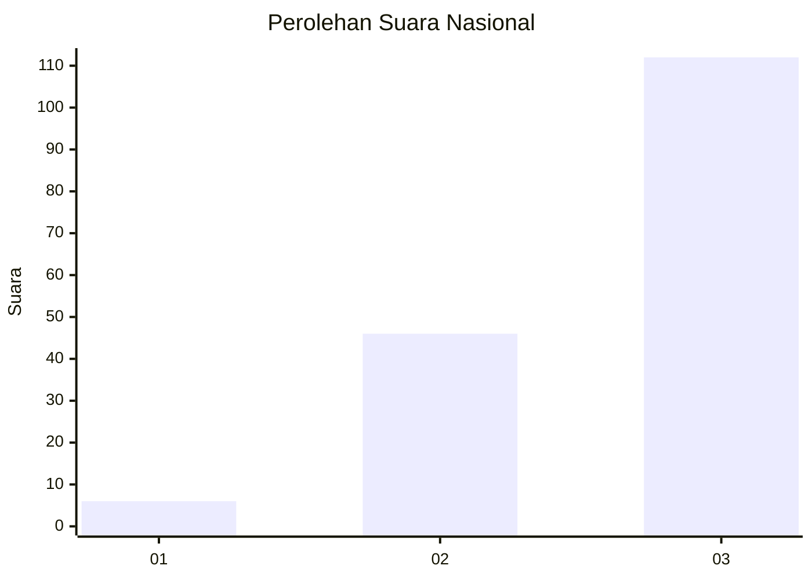
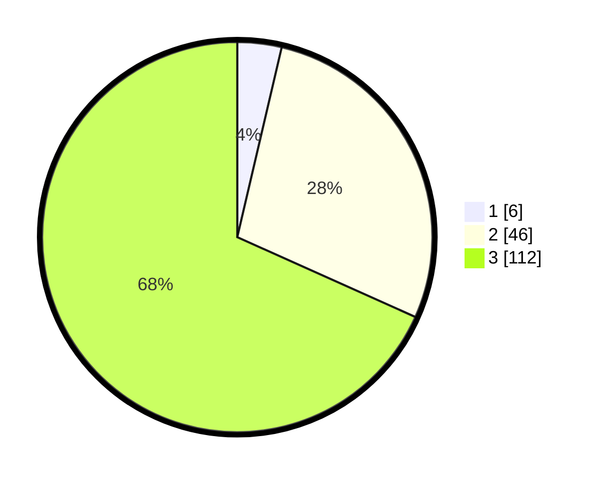

# Hasil

## Grafik

## Tabel

| No. | Nama Paslon    | Suara | Suara (raw) | Persentase |
|:--- |:-------------- | -----:| -----------:| ----------:|
| 1   | ANIES MUHAIMIN | 6     | [6][p-1]    | 3,66       |
| 2   | PRABOWO GIBRAN | 46    | [46][p-2]   | 28,05      |
| 3   | GANJAR MAHFUD  | 112   | [112][p-3]  | 68,29      |

[p-1]: https://github.com/gigit-pemilu/pemilu-2024/blob/main/pilpres/hitung-suara/sub/51-bali/sub/08-buleleng/sub/09-tejakula/sub/2006-tejakula/sub/033-tps/sub/paslon-1.txt
[p-2]: https://github.com/gigit-pemilu/pemilu-2024/blob/main/pilpres/hitung-suara/sub/51-bali/sub/08-buleleng/sub/09-tejakula/sub/2006-tejakula/sub/033-tps/sub/paslon-2.txt
[p-3]: https://github.com/gigit-pemilu/pemilu-2024/blob/main/pilpres/hitung-suara/sub/51-bali/sub/08-buleleng/sub/09-tejakula/sub/2006-tejakula/sub/033-tps/sub/paslon-3.txt

## Foto C Plano

https://sirekap-obj-formc.kpu.go.id/078d/pemilu/ppwp/51/08/09/20/06/5108092006033-20240214-212355--8562b8a0-1f64-4371-b439-0fc521be4903.jpg

https://sirekap-obj-formc.kpu.go.id/078d/pemilu/ppwp/51/08/09/20/06/5108092006033-20240214-212157--59df0e01-aa4f-499c-b740-477af657c67d.jpg

https://sirekap-obj-formc.kpu.go.id/078d/pemilu/ppwp/51/08/09/20/06/5108092006033-20240214-212227--a66a44c0-3570-47df-888e-1075c6e5e6f3.jpg

## Metadata

| Key        | Value               |
| ---------- | ------------------- |
| Time Stamp | 2024-02-24 22:31:28 |

