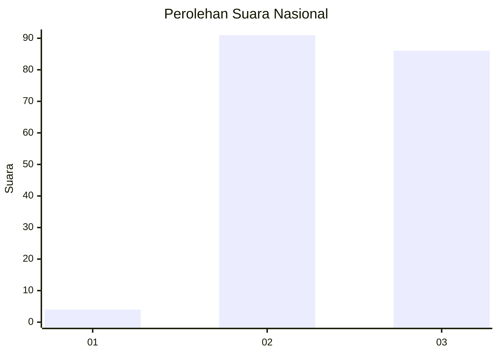
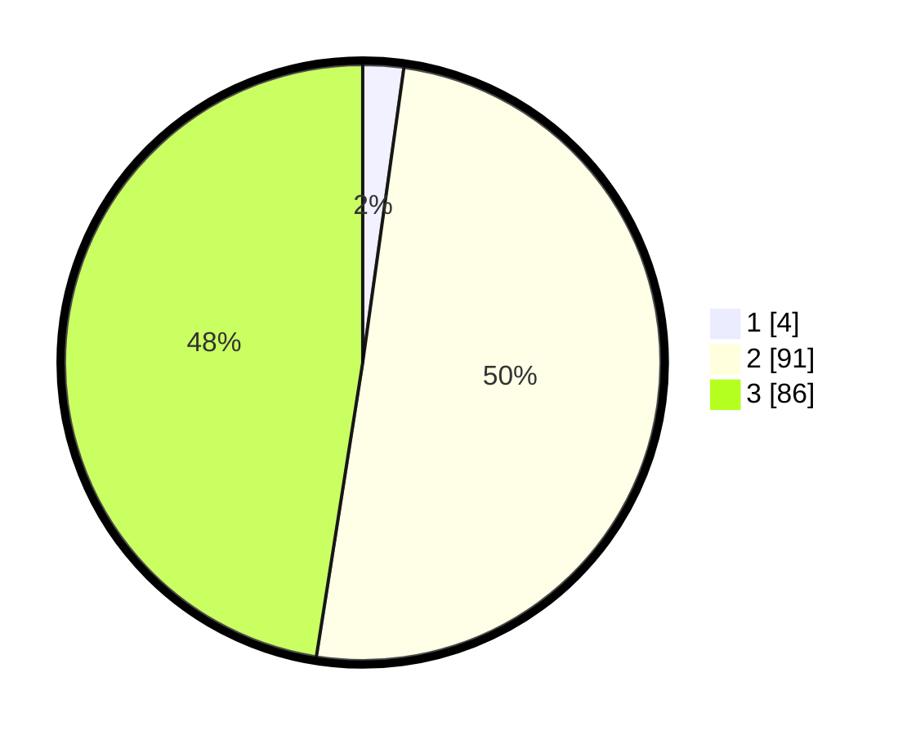

# Hasil

## Grafik

## Tabel

| No. | Nama Paslon    | Suara | Suara (raw) | Persentase |
|:--- |:-------------- | -----:| -----------:| ----------:|
| 1   | ANIES MUHAIMIN | 4     | [4][p-1]    | 2,21       |
| 2   | PRABOWO GIBRAN | 91    | [91][p-2]   | 50,28      |
| 3   | GANJAR MAHFUD  | 86    | [86][p-3]   | 47,51      |

[p-1]: https://github.com/gigit-pemilu/pemilu-2024/blob/main/pilpres/hitung-suara/sub/51-bali/sub/08-buleleng/sub/09-tejakula/sub/2006-tejakula/sub/034-tps/sub/paslon-1.txt
[p-2]: https://github.com/gigit-pemilu/pemilu-2024/blob/main/pilpres/hitung-suara/sub/51-bali/sub/08-buleleng/sub/09-tejakula/sub/2006-tejakula/sub/034-tps/sub/paslon-2.txt
[p-3]: https://github.com/gigit-pemilu/pemilu-2024/blob/main/pilpres/hitung-suara/sub/51-bali/sub/08-buleleng/sub/09-tejakula/sub/2006-tejakula/sub/034-tps/sub/paslon-3.txt

## Foto C Plano

https://sirekap-obj-formc.kpu.go.id/e97b/pemilu/ppwp/51/08/09/20/06/5108092006034-20240214-125014--26cbd0a4-d5bf-4612-8336-bdce56b5222c.jpg

https://sirekap-obj-formc.kpu.go.id/e97b/pemilu/ppwp/51/08/09/20/06/5108092006034-20240214-130437--df7a1ebd-1eda-4832-a917-5fcb8abfe05b.jpg

https://sirekap-obj-formc.kpu.go.id/e97b/pemilu/ppwp/51/08/09/20/06/5108092006034-20240214-131806--c0782355-6afb-4a19-b7cb-1a8ae3b03ff4.jpg

## Metadata

| Key        | Value               |
| ---------- | ------------------- |
| Time Stamp | 2024-02-14 21:46:01 |

