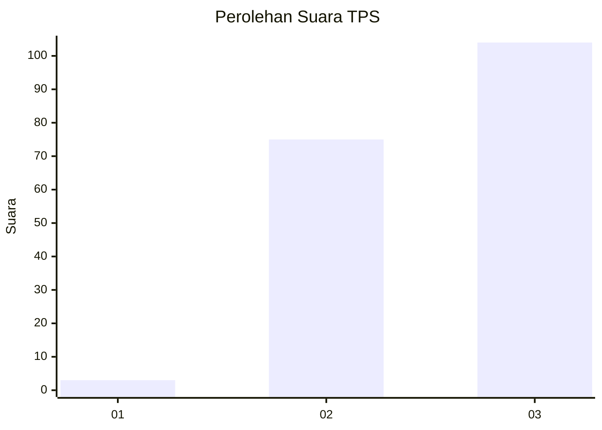
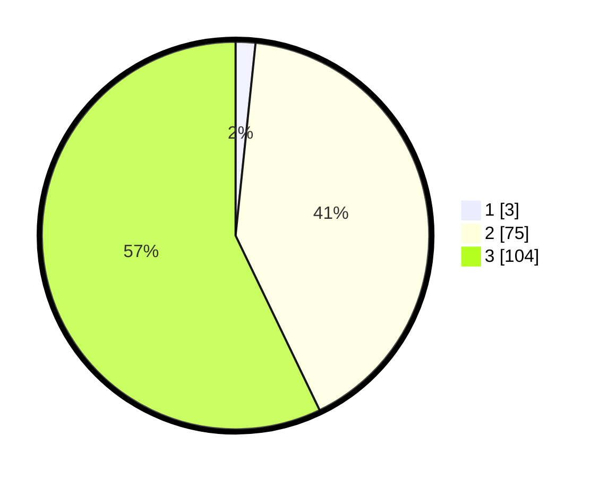

# Hasil

## Grafik

## Tabel

| No. | Nama Paslon    | Suara | Suara (raw) | Persentase |
|:--- |:-------------- | -----:| -----------:| ----------:|
| 1   | ANIES MUHAIMIN | 3     | [3][p-1]    | 1,65       |
| 2   | PRABOWO GIBRAN | 75    | [75][p-2]   | 41,21      |
| 3   | GANJAR MAHFUD  | 104   | [104][p-3]  | 57,14      |

[p-1]: https://github.com/gigit-pemilu/pemilu-2024-51-bali/blob/main/pilpres/hitung-suara/sub/51-bali/sub/08-buleleng/sub/09-tejakula/sub/2006-tejakula/sub/037-tps/sub/paslon-1.txt
[p-2]: https://github.com/gigit-pemilu/pemilu-2024-51-bali/blob/main/pilpres/hitung-suara/sub/51-bali/sub/08-buleleng/sub/09-tejakula/sub/2006-tejakula/sub/037-tps/sub/paslon-2.txt
[p-3]: https://github.com/gigit-pemilu/pemilu-2024-51-bali/blob/main/pilpres/hitung-suara/sub/51-bali/sub/08-buleleng/sub/09-tejakula/sub/2006-tejakula/sub/037-tps/sub/paslon-3.txt

## Foto C Plano

https://sirekap-obj-formc.kpu.go.id/e32e/pemilu/ppwp/51/08/09/20/06/5108092006037-20240214-201839--739a3c41-bc54-43d9-a052-734fbe38b9a1.jpg

https://sirekap-obj-formc.kpu.go.id/e32e/pemilu/ppwp/51/08/09/20/06/5108092006037-20240214-200412--bb782bff-f16f-42df-a7d1-6ad4a95bb981.jpg

https://sirekap-obj-formc.kpu.go.id/e32e/pemilu/ppwp/51/08/09/20/06/5108092006037-20240214-194532--296c1598-139b-4f36-9366-ad175aac44ae.jpg

## Metadata

| Key        | Value               |
| ---------- | ------------------- |
| Time Stamp | 2024-02-24 22:31:28 |

