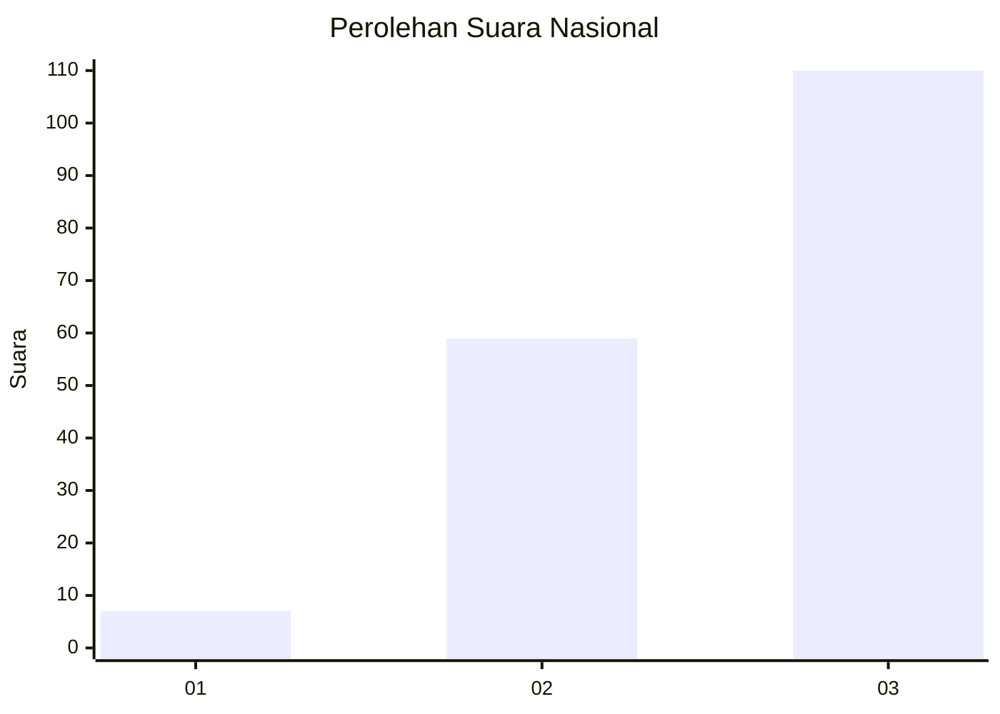
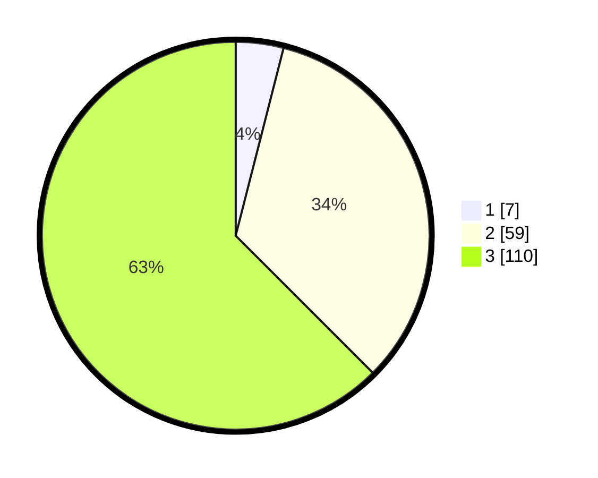

# Hasil

## Grafik

## Tabel

| No. | Nama Paslon    | Suara | Suara (raw) | Persentase |
|:--- |:-------------- | -----:| -----------:| ----------:|
| 1   | ANIES MUHAIMIN | 7     | [7][p-1]    | 3,98       |
| 2   | PRABOWO GIBRAN | 59    | [59][p-2]   | 33,52      |
| 3   | GANJAR MAHFUD  | 110   | [110][p-3]  | 62,50      |

[p-1]: https://github.com/gigit-pemilu/pemilu-2024/blob/main/pilpres/hitung-suara/sub/51-bali/sub/08-buleleng/sub/09-tejakula/sub/2007-les/sub/001-tps/sub/paslon-1.txt
[p-2]: https://github.com/gigit-pemilu/pemilu-2024/blob/main/pilpres/hitung-suara/sub/51-bali/sub/08-buleleng/sub/09-tejakula/sub/2007-les/sub/001-tps/sub/paslon-2.txt
[p-3]: https://github.com/gigit-pemilu/pemilu-2024/blob/main/pilpres/hitung-suara/sub/51-bali/sub/08-buleleng/sub/09-tejakula/sub/2007-les/sub/001-tps/sub/paslon-3.txt

## Foto C Plano

https://sirekap-obj-formc.kpu.go.id/d4cd/pemilu/ppwp/51/08/09/20/07/5108092007001-20240214-213901--fd9fdc68-301c-4432-9faa-297c62d58602.jpg

https://sirekap-obj-formc.kpu.go.id/d4cd/pemilu/ppwp/51/08/09/20/07/5108092007001-20240214-213037--87b331f7-c462-4a7b-8c6c-1845b03a53bb.jpg

https://sirekap-obj-formc.kpu.go.id/d4cd/pemilu/ppwp/51/08/09/20/07/5108092007001-20240214-213423--a0db0f69-930e-4372-93cc-7ad33713fd45.jpg

## Metadata

| Key        | Value               |
| ---------- | ------------------- |
| Time Stamp | 2024-02-24 22:31:28 |

