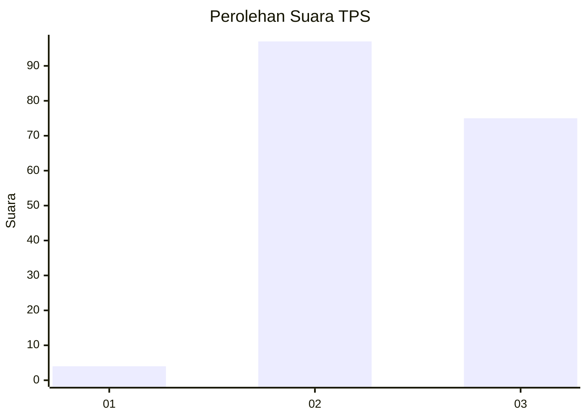
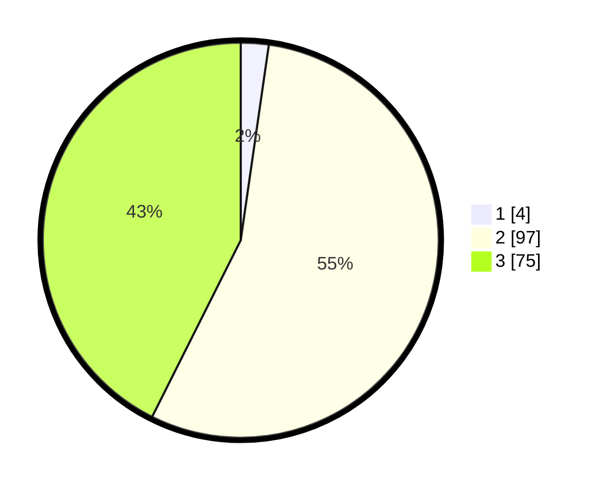

# Hasil

## Grafik

## Tabel

| No. | Nama Paslon    | Suara | Suara (raw) | Persentase |
|:--- |:-------------- | -----:| -----------:| ----------:|
| 1   | ANIES MUHAIMIN | 4     | [4][p-1]    | 2,27       |
| 2   | PRABOWO GIBRAN | 97    | [97][p-2]   | 55,11      |
| 3   | GANJAR MAHFUD  | 75    | [75][p-3]   | 42,61      |

[p-1]: https://github.com/gigit-pemilu/pemilu-2024-51-bali/blob/main/pilpres/hitung-suara/sub/51-bali/sub/08-buleleng/sub/09-tejakula/sub/2007-les/sub/005-tps/sub/paslon-1.txt
[p-2]: https://github.com/gigit-pemilu/pemilu-2024-51-bali/blob/main/pilpres/hitung-suara/sub/51-bali/sub/08-buleleng/sub/09-tejakula/sub/2007-les/sub/005-tps/sub/paslon-2.txt
[p-3]: https://github.com/gigit-pemilu/pemilu-2024-51-bali/blob/main/pilpres/hitung-suara/sub/51-bali/sub/08-buleleng/sub/09-tejakula/sub/2007-les/sub/005-tps/sub/paslon-3.txt

## Foto C Plano

https://sirekap-obj-formc.kpu.go.id/62e3/pemilu/ppwp/51/08/09/20/07/5108092007005-20240214-220054--7dbcc90f-383f-4dbf-84a9-671afae8f7ee.jpg

https://sirekap-obj-formc.kpu.go.id/62e3/pemilu/ppwp/51/08/09/20/07/5108092007005-20240214-220342--115d5800-c312-4b12-9eb2-fdb78986893b.jpg

https://sirekap-obj-formc.kpu.go.id/62e3/pemilu/ppwp/51/08/09/20/07/5108092007005-20240214-220718--876527a1-83dd-478f-b5e5-cc56e3f43012.jpg

## Metadata

| Key        | Value               |
| ---------- | ------------------- |
| Time Stamp | 2024-02-24 22:31:28 |

