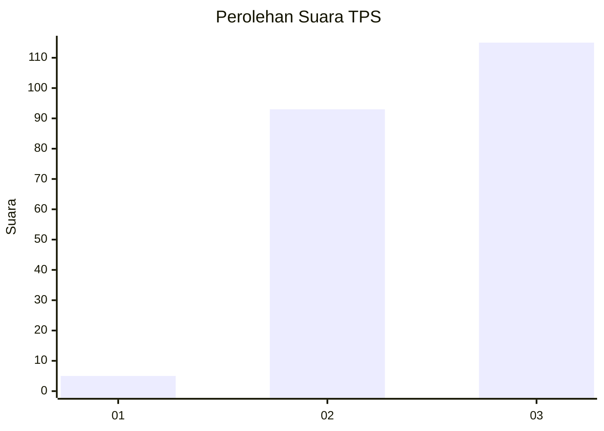
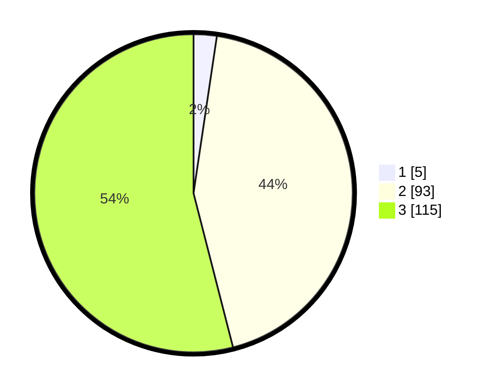

# Hasil

## Grafik

## Tabel

| No. | Nama Paslon    | Suara | Suara (raw) | Persentase |
|:--- |:-------------- | -----:| -----------:| ----------:|
| 1   | ANIES MUHAIMIN | 5     | [5][p-1]    | 2,35       |
| 2   | PRABOWO GIBRAN | 93    | [93][p-2]   | 43,66      |
| 3   | GANJAR MAHFUD  | 115   | [115][p-3]  | 53,99      |

[p-1]: https://github.com/gigit-pemilu/pemilu-2024-51-bali/blob/main/pilpres/hitung-suara/sub/51-bali/sub/08-buleleng/sub/09-tejakula/sub/2007-les/sub/009-tps/sub/paslon-1.txt
[p-2]: https://github.com/gigit-pemilu/pemilu-2024-51-bali/blob/main/pilpres/hitung-suara/sub/51-bali/sub/08-buleleng/sub/09-tejakula/sub/2007-les/sub/009-tps/sub/paslon-2.txt
[p-3]: https://github.com/gigit-pemilu/pemilu-2024-51-bali/blob/main/pilpres/hitung-suara/sub/51-bali/sub/08-buleleng/sub/09-tejakula/sub/2007-les/sub/009-tps/sub/paslon-3.txt

## Foto C Plano

https://sirekap-obj-formc.kpu.go.id/6261/pemilu/ppwp/51/08/09/20/07/5108092007009-20240214-232735--4d9c7172-7234-4a02-bf4b-c44a9e5035e5.jpg

https://sirekap-obj-formc.kpu.go.id/6261/pemilu/ppwp/51/08/09/20/07/5108092007009-20240214-232927--c68c66db-3d0d-40d8-a636-8d12157b817f.jpg

https://sirekap-obj-formc.kpu.go.id/6261/pemilu/ppwp/51/08/09/20/07/5108092007009-20240214-233125--75a5ea96-e6ef-4cd5-bc49-11bb8862f5cb.jpg

## Metadata

| Key        | Value               |
| ---------- | ------------------- |
| Time Stamp | 2024-02-25 15:00:00 |

