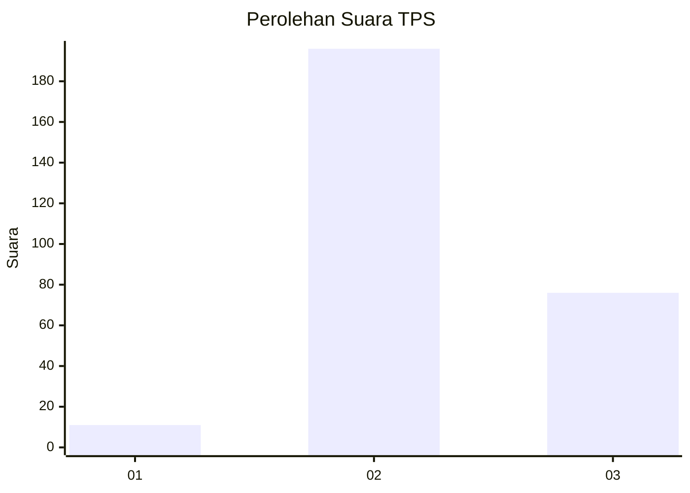

# Hasil

## Grafik

## Tabel

| No. | Nama Paslon    | Suara | Suara (raw) | Persentase |
|:--- |:-------------- | -----:| -----------:| ----------:|
| 1   | ANIES MUHAIMIN | 11    | [11][p-1]   | 3,89       |
| 2   | PRABOWO GIBRAN | 196   | [196][p-2]  | 69,26      |
| 3   | GANJAR MAHFUD  | 76    | [76][p-3]   | 26,86      |

[p-1]: https://github.com/gigit-pemilu/pemilu-2024-51-bali/blob/main/pilpres/hitung-suara/sub/51-bali/sub/08-buleleng/sub/09-tejakula/sub/2007-les/sub/010-tps/sub/paslon-1.txt
[p-2]: https://github.com/gigit-pemilu/pemilu-2024-51-bali/blob/main/pilpres/hitung-suara/sub/51-bali/sub/08-buleleng/sub/09-tejakula/sub/2007-les/sub/010-tps/sub/paslon-2.txt
[p-3]: https://github.com/gigit-pemilu/pemilu-2024-51-bali/blob/main/pilpres/hitung-suara/sub/51-bali/sub/08-buleleng/sub/09-tejakula/sub/2007-les/sub/010-tps/sub/paslon-3.txt

## Foto C Plano

https://sirekap-obj-formc.kpu.go.id/edc9/pemilu/ppwp/51/08/09/20/07/5108092007010-20240214-131851--9c6b8098-aa95-4f45-9453-bf5b2459e0f9.jpg

https://sirekap-obj-formc.kpu.go.id/edc9/pemilu/ppwp/51/08/09/20/07/5108092007010-20240214-200059--98756457-4c97-420a-abeb-9efd9bf84f28.jpg

https://sirekap-obj-formc.kpu.go.id/edc9/pemilu/ppwp/51/08/09/20/07/5108092007010-20240214-131813--2d6ed76c-979e-4cef-a006-41bdce609097.jpg

## Metadata

| Key        | Value               |
| ---------- | ------------------- |
| Time Stamp | 2024-02-24 22:31:28 |

