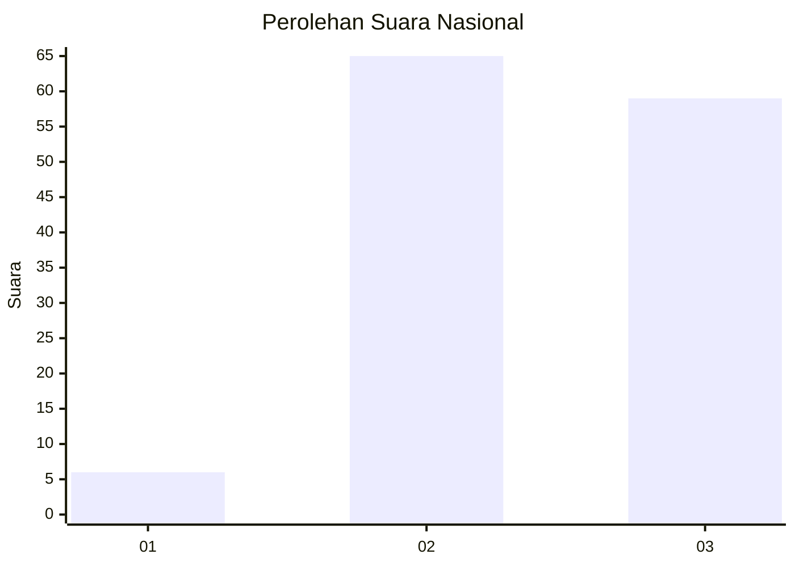
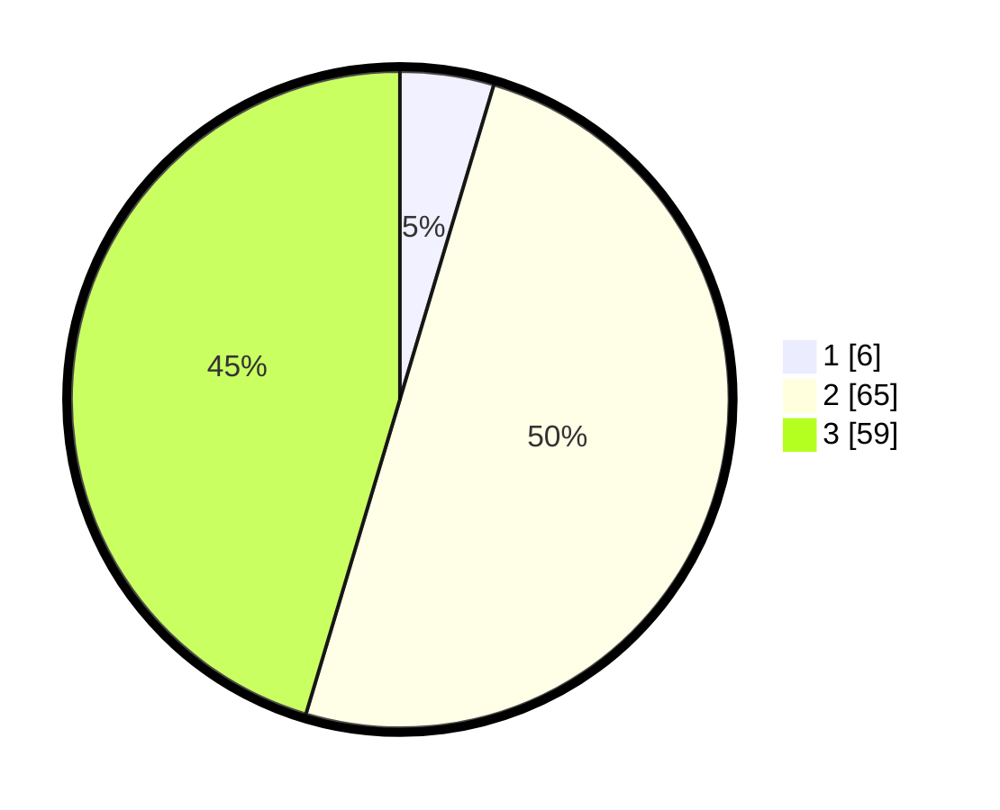

# Hasil

## Grafik

## Tabel

| No. | Nama Paslon    | Suara | Suara (raw) | Persentase |
|:--- |:-------------- | -----:| -----------:| ----------:|
| 1   | ANIES MUHAIMIN | 6     | [6][p-1]    | 4,62       |
| 2   | PRABOWO GIBRAN | 65    | [65][p-2]   | 50,00      |
| 3   | GANJAR MAHFUD  | 59    | [59][p-3]   | 45,38      |

[p-1]: https://github.com/gigit-pemilu/pemilu-2024/blob/main/pilpres/hitung-suara/sub/51-bali/sub/08-buleleng/sub/09-tejakula/sub/2007-les/sub/011-tps/sub/paslon-1.txt
[p-2]: https://github.com/gigit-pemilu/pemilu-2024/blob/main/pilpres/hitung-suara/sub/51-bali/sub/08-buleleng/sub/09-tejakula/sub/2007-les/sub/011-tps/sub/paslon-2.txt
[p-3]: https://github.com/gigit-pemilu/pemilu-2024/blob/main/pilpres/hitung-suara/sub/51-bali/sub/08-buleleng/sub/09-tejakula/sub/2007-les/sub/011-tps/sub/paslon-3.txt

## Foto C Plano

https://sirekap-obj-formc.kpu.go.id/728c/pemilu/ppwp/51/08/09/20/07/5108092007011-20240214-213307--7d2ad41b-812c-4eec-be02-69442cf74fa9.jpg

https://sirekap-obj-formc.kpu.go.id/728c/pemilu/ppwp/51/08/09/20/07/5108092007011-20240214-215728--50be2660-3dd7-43be-b8ee-bc8981a6bb4e.jpg

https://sirekap-obj-formc.kpu.go.id/728c/pemilu/ppwp/51/08/09/20/07/5108092007011-20240214-213709--8c49540e-58e9-4e98-b674-13d74a157cb9.jpg

## Metadata

| Key        | Value               |
| ---------- | ------------------- |
| Time Stamp | 2024-02-24 22:31:28 |

