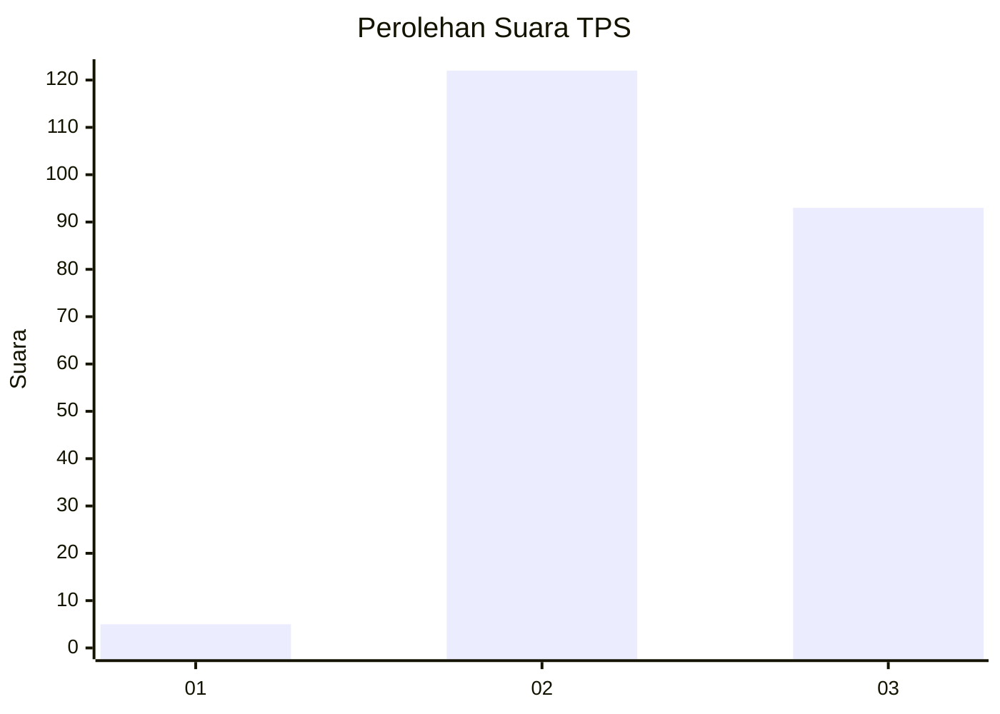
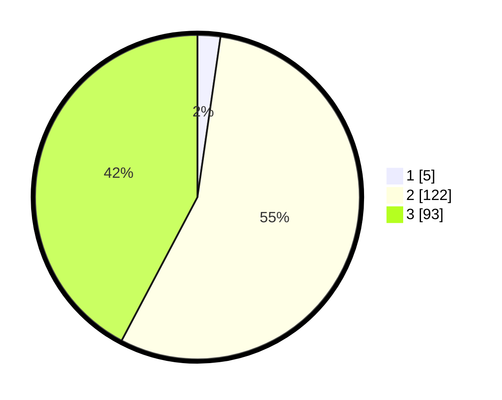

# Hasil

## Grafik

## Tabel

| No. | Nama Paslon    | Suara | Suara (raw) | Persentase |
|:--- |:-------------- | -----:| -----------:| ----------:|
| 1   | ANIES MUHAIMIN | 5     | [5][p-1]    | 2,27       |
| 2   | PRABOWO GIBRAN | 122   | [122][p-2]  | 55,45      |
| 3   | GANJAR MAHFUD  | 93    | [93][p-3]   | 42,27      |

[p-1]: https://github.com/gigit-pemilu/pemilu-2024-51-bali/blob/main/pilpres/hitung-suara/sub/51-bali/sub/08-buleleng/sub/09-tejakula/sub/2007-les/sub/020-tps/sub/paslon-1.txt
[p-2]: https://github.com/gigit-pemilu/pemilu-2024-51-bali/blob/main/pilpres/hitung-suara/sub/51-bali/sub/08-buleleng/sub/09-tejakula/sub/2007-les/sub/020-tps/sub/paslon-2.txt
[p-3]: https://github.com/gigit-pemilu/pemilu-2024-51-bali/blob/main/pilpres/hitung-suara/sub/51-bali/sub/08-buleleng/sub/09-tejakula/sub/2007-les/sub/020-tps/sub/paslon-3.txt

## Foto C Plano

https://sirekap-obj-formc.kpu.go.id/2fcf/pemilu/ppwp/51/08/09/20/07/5108092007020-20240214-234231--fc9fad9f-5929-4ebd-85e6-0099d5e4e54b.jpg

https://sirekap-obj-formc.kpu.go.id/2fcf/pemilu/ppwp/51/08/09/20/07/5108092007020-20240214-234326--85a753c9-a2ea-4623-a60d-74effa7a1c8b.jpg

https://sirekap-obj-formc.kpu.go.id/2fcf/pemilu/ppwp/51/08/09/20/07/5108092007020-20240214-234416--e159f032-add7-4c3f-8cab-c0e4a9f21a9a.jpg

## Metadata

| Key        | Value               |
| ---------- | ------------------- |
| Time Stamp | 2024-02-24 22:31:28 |

