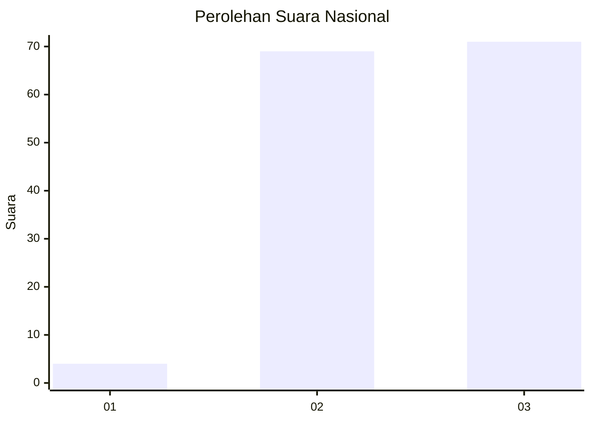
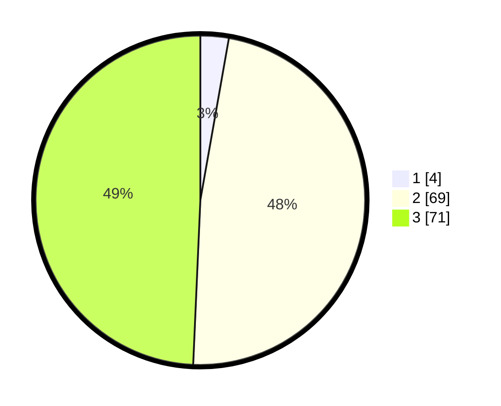

# Hasil

## Grafik

## Tabel

| No. | Nama Paslon    | Suara | Suara (raw) | Persentase |
|:--- |:-------------- | -----:| -----------:| ----------:|
| 1   | ANIES MUHAIMIN | 4     | [4][p-1]    | 2,78       |
| 2   | PRABOWO GIBRAN | 69    | [69][p-2]   | 47,92      |
| 3   | GANJAR MAHFUD  | 71    | [71][p-3]   | 49,31      |

[p-1]: https://github.com/gigit-pemilu/pemilu-2024/blob/main/pilpres/hitung-suara/sub/51-bali/sub/08-buleleng/sub/09-tejakula/sub/2007-les/sub/022-tps/sub/paslon-1.txt
[p-2]: https://github.com/gigit-pemilu/pemilu-2024/blob/main/pilpres/hitung-suara/sub/51-bali/sub/08-buleleng/sub/09-tejakula/sub/2007-les/sub/022-tps/sub/paslon-2.txt
[p-3]: https://github.com/gigit-pemilu/pemilu-2024/blob/main/pilpres/hitung-suara/sub/51-bali/sub/08-buleleng/sub/09-tejakula/sub/2007-les/sub/022-tps/sub/paslon-3.txt

## Foto C Plano

https://sirekap-obj-formc.kpu.go.id/24ac/pemilu/ppwp/51/08/09/20/07/5108092007022-20240214-232400--67f95603-a78f-47e9-9858-7920c9105517.jpg

https://sirekap-obj-formc.kpu.go.id/24ac/pemilu/ppwp/51/08/09/20/07/5108092007022-20240214-232642--ccdf73b0-db32-4532-8a54-2905c7662462.jpg

https://sirekap-obj-formc.kpu.go.id/24ac/pemilu/ppwp/51/08/09/20/07/5108092007022-20240215-000558--7dce52e3-8c7a-4c0c-8d1c-0462f6903399.jpg

## Metadata

| Key        | Value               |
| ---------- | ------------------- |
| Time Stamp | 2024-02-26 11:00:00 |

