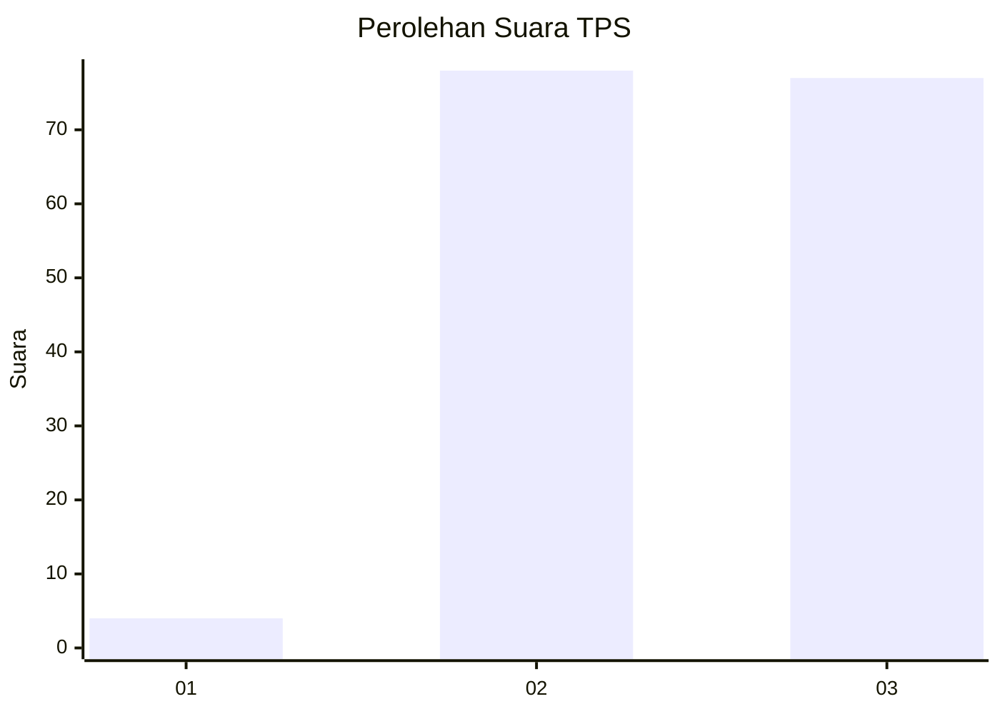
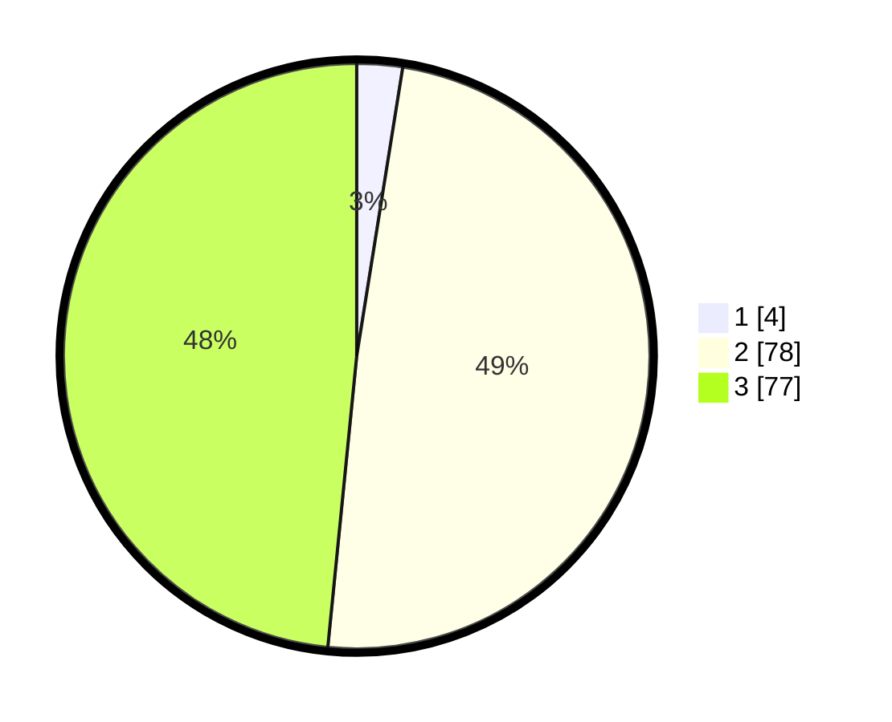

# Hasil

## Grafik

## Tabel

| No. | Nama Paslon    | Suara | Suara (raw) | Persentase |
|:--- |:-------------- | -----:| -----------:| ----------:|
| 1   | ANIES MUHAIMIN | 4     | [4][p-1]    | 2,52       |
| 2   | PRABOWO GIBRAN | 78    | [78][p-2]   | 49,06      |
| 3   | GANJAR MAHFUD  | 77    | [77][p-3]   | 48,43      |

[p-1]: https://github.com/gigit-pemilu/pemilu-2024-51-bali/blob/main/pilpres/hitung-suara/sub/51-bali/sub/08-buleleng/sub/09-tejakula/sub/2007-les/sub/024-tps/sub/paslon-1.txt
[p-2]: https://github.com/gigit-pemilu/pemilu-2024-51-bali/blob/main/pilpres/hitung-suara/sub/51-bali/sub/08-buleleng/sub/09-tejakula/sub/2007-les/sub/024-tps/sub/paslon-2.txt
[p-3]: https://github.com/gigit-pemilu/pemilu-2024-51-bali/blob/main/pilpres/hitung-suara/sub/51-bali/sub/08-buleleng/sub/09-tejakula/sub/2007-les/sub/024-tps/sub/paslon-3.txt

## Foto C Plano

https://sirekap-obj-formc.kpu.go.id/6df1/pemilu/ppwp/51/08/09/20/07/5108092007024-20240214-210031--ac81a94b-a5f1-407a-a76d-ad139d0a224d.jpg

https://sirekap-obj-formc.kpu.go.id/6df1/pemilu/ppwp/51/08/09/20/07/5108092007024-20240214-210356--af6baeaf-ad0d-4272-9535-237a808369b0.jpg

https://sirekap-obj-formc.kpu.go.id/6df1/pemilu/ppwp/51/08/09/20/07/5108092007024-20240214-210502--279be5eb-b49e-4e87-acbd-7d9613e8b92c.jpg

## Metadata

| Key        | Value               |
| ---------- | ------------------- |
| Time Stamp | 2024-02-24 22:31:28 |

