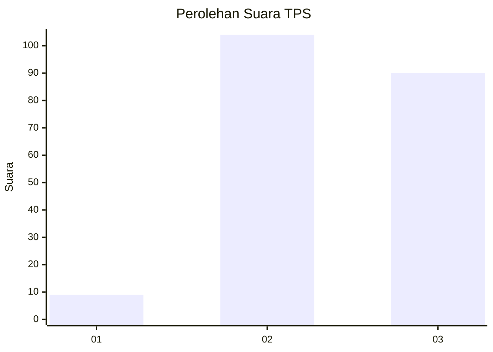
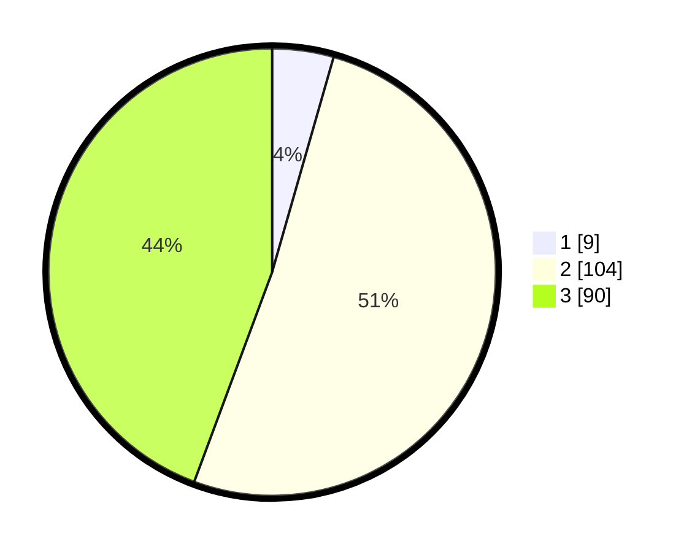

# Hasil

## Grafik

## Tabel

| No. | Nama Paslon    | Suara | Suara (raw) | Persentase |
|:--- |:-------------- | -----:| -----------:| ----------:|
| 1   | ANIES MUHAIMIN | 9     | [9][p-1]    | 4,43       |
| 2   | PRABOWO GIBRAN | 104   | [104][p-2]  | 51,23      |
| 3   | GANJAR MAHFUD  | 90    | [90][p-3]   | 44,33      |

[p-1]: https://github.com/gigit-pemilu/pemilu-2024-51-bali/blob/main/pilpres/hitung-suara/sub/51-bali/sub/08-buleleng/sub/09-tejakula/sub/2008-penuktukan/sub/002-tps/sub/paslon-1.txt
[p-2]: https://github.com/gigit-pemilu/pemilu-2024-51-bali/blob/main/pilpres/hitung-suara/sub/51-bali/sub/08-buleleng/sub/09-tejakula/sub/2008-penuktukan/sub/002-tps/sub/paslon-2.txt
[p-3]: https://github.com/gigit-pemilu/pemilu-2024-51-bali/blob/main/pilpres/hitung-suara/sub/51-bali/sub/08-buleleng/sub/09-tejakula/sub/2008-penuktukan/sub/002-tps/sub/paslon-3.txt

## Foto C Plano

https://sirekap-obj-formc.kpu.go.id/5974/pemilu/ppwp/51/08/09/20/08/5108092008002-20240214-233054--fc9d6d2a-4892-4385-92db-94e388d043cd.jpg

https://sirekap-obj-formc.kpu.go.id/5974/pemilu/ppwp/51/08/09/20/08/5108092008002-20240214-233315--8c49ed8e-3780-47e0-8dd3-46f8408b8f75.jpg

https://sirekap-obj-formc.kpu.go.id/5974/pemilu/ppwp/51/08/09/20/08/5108092008002-20240214-233435--49930627-3e17-4c73-85e0-ecf1eaba95b6.jpg

## Metadata

| Key        | Value               |
| ---------- | ------------------- |
| Time Stamp | 2024-02-24 22:31:28 |

