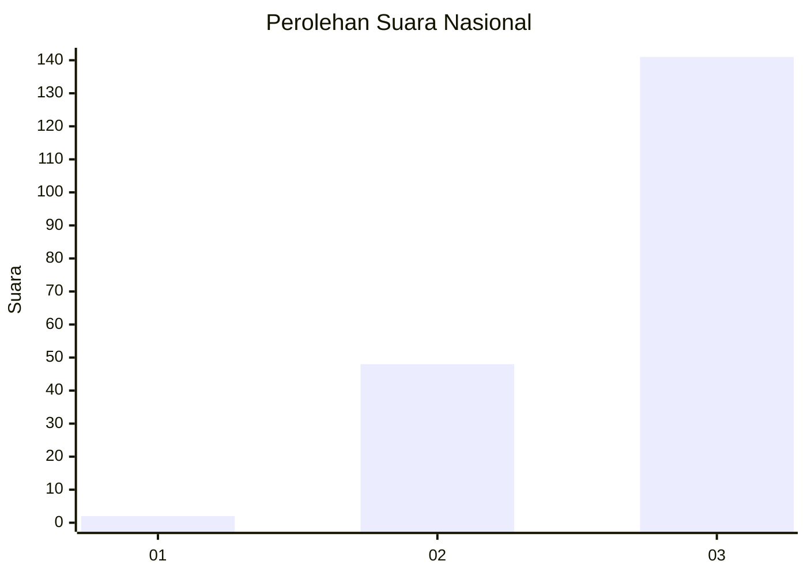
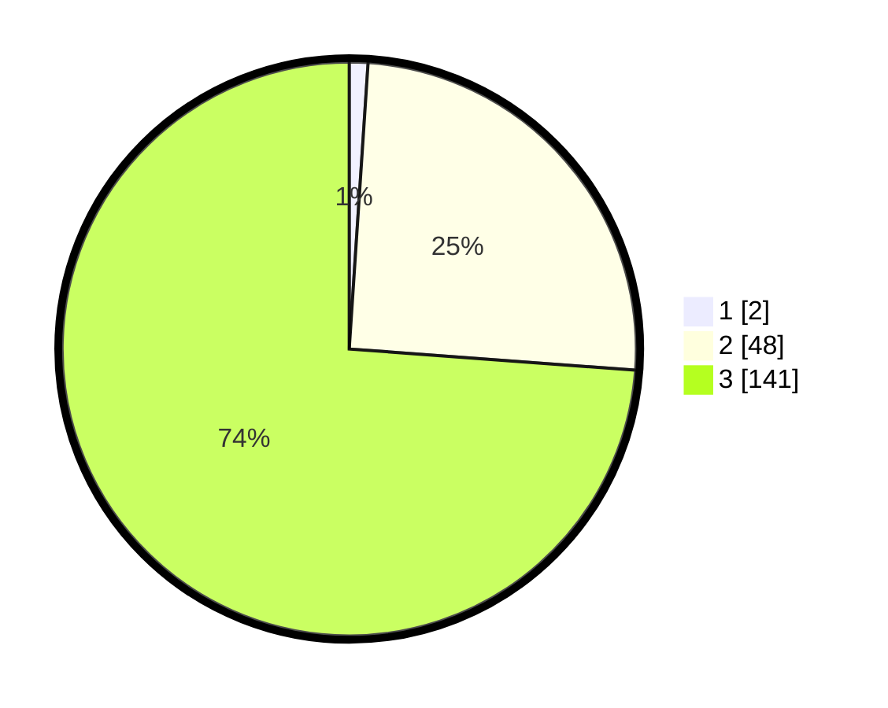

# Hasil

## Grafik

## Tabel

| No. | Nama Paslon    | Suara | Suara (raw) | Persentase |
|:--- |:-------------- | -----:| -----------:| ----------:|
| 1   | ANIES MUHAIMIN | 2     | [2][p-1]    | 1,05       |
| 2   | PRABOWO GIBRAN | 48    | [48][p-2]   | 25,13      |
| 3   | GANJAR MAHFUD  | 141   | [141][p-3]  | 73,82      |

[p-1]: https://github.com/gigit-pemilu/pemilu-2024/blob/main/pilpres/hitung-suara/sub/51-bali/sub/08-buleleng/sub/09-tejakula/sub/2008-penuktukan/sub/006-tps/sub/paslon-1.txt
[p-2]: https://github.com/gigit-pemilu/pemilu-2024/blob/main/pilpres/hitung-suara/sub/51-bali/sub/08-buleleng/sub/09-tejakula/sub/2008-penuktukan/sub/006-tps/sub/paslon-2.txt
[p-3]: https://github.com/gigit-pemilu/pemilu-2024/blob/main/pilpres/hitung-suara/sub/51-bali/sub/08-buleleng/sub/09-tejakula/sub/2008-penuktukan/sub/006-tps/sub/paslon-3.txt

## Foto C Plano

https://sirekap-obj-formc.kpu.go.id/0601/pemilu/ppwp/51/08/09/20/08/5108092008006-20240214-235017--9541a9ea-23f1-41f5-9dc6-3f2e791d729a.jpg

https://sirekap-obj-formc.kpu.go.id/0601/pemilu/ppwp/51/08/09/20/08/5108092008006-20240214-235119--26ffa1e7-f34c-455e-827e-3dea1e06dd32.jpg

https://sirekap-obj-formc.kpu.go.id/0601/pemilu/ppwp/51/08/09/20/08/5108092008006-20240214-235219--1eed5442-2c0f-4858-a36b-dc2ab09ccbe2.jpg

## Metadata

| Key        | Value               |
| ---------- | ------------------- |
| Time Stamp | 2024-02-25 15:00:00 |

