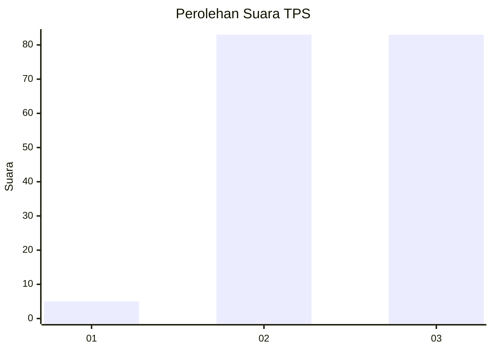
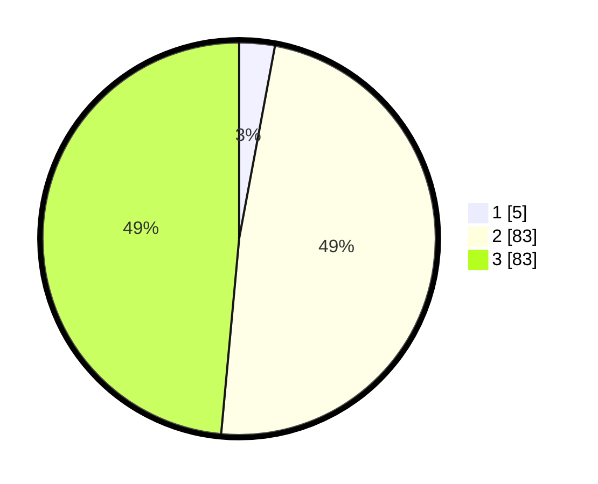

# Hasil

## Grafik

## Tabel

| No. | Nama Paslon    | Suara | Suara (raw) | Persentase |
|:--- |:-------------- | -----:| -----------:| ----------:|
| 1   | ANIES MUHAIMIN | 5     | [5][p-1]    | 2,92       |
| 2   | PRABOWO GIBRAN | 83    | [83][p-2]   | 48,54      |
| 3   | GANJAR MAHFUD  | 83    | [83][p-3]   | 48,54      |

[p-1]: https://github.com/gigit-pemilu/pemilu-2024-51-bali/blob/main/pilpres/hitung-suara/sub/51-bali/sub/08-buleleng/sub/09-tejakula/sub/2008-penuktukan/sub/007-tps/sub/paslon-1.txt
[p-2]: https://github.com/gigit-pemilu/pemilu-2024-51-bali/blob/main/pilpres/hitung-suara/sub/51-bali/sub/08-buleleng/sub/09-tejakula/sub/2008-penuktukan/sub/007-tps/sub/paslon-2.txt
[p-3]: https://github.com/gigit-pemilu/pemilu-2024-51-bali/blob/main/pilpres/hitung-suara/sub/51-bali/sub/08-buleleng/sub/09-tejakula/sub/2008-penuktukan/sub/007-tps/sub/paslon-3.txt

## Foto C Plano

https://sirekap-obj-formc.kpu.go.id/b1dd/pemilu/ppwp/51/08/09/20/08/5108092008007-20240215-002552--93149612-a516-464e-9207-b9387c20ba93.jpg

https://sirekap-obj-formc.kpu.go.id/b1dd/pemilu/ppwp/51/08/09/20/08/5108092008007-20240215-002727--d508148b-43bc-4db1-9c3a-a995dac4394f.jpg

## Metadata

| Key        | Value               |
| ---------- | ------------------- |
| Time Stamp | 2024-02-25 11:00:00 |

