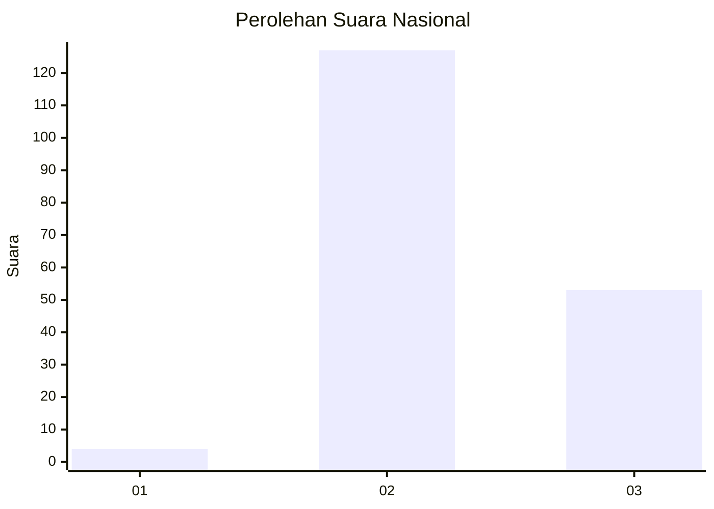

# Hasil

## Grafik

## Tabel

| No. | Nama Paslon    | Suara | Suara (raw) | Persentase |
|:--- |:-------------- | -----:| -----------:| ----------:|
| 1   | ANIES MUHAIMIN | 4     | [4][p-1]    | 2,17       |
| 2   | PRABOWO GIBRAN | 127   | [127][p-2]  | 69,02      |
| 3   | GANJAR MAHFUD  | 53    | [53][p-3]   | 28,80      |

[p-1]: https://github.com/gigit-pemilu/pemilu-2024/blob/main/pilpres/hitung-suara/sub/51-bali/sub/08-buleleng/sub/09-tejakula/sub/2008-penuktukan/sub/009-tps/sub/paslon-1.txt
[p-2]: https://github.com/gigit-pemilu/pemilu-2024/blob/main/pilpres/hitung-suara/sub/51-bali/sub/08-buleleng/sub/09-tejakula/sub/2008-penuktukan/sub/009-tps/sub/paslon-2.txt
[p-3]: https://github.com/gigit-pemilu/pemilu-2024/blob/main/pilpres/hitung-suara/sub/51-bali/sub/08-buleleng/sub/09-tejakula/sub/2008-penuktukan/sub/009-tps/sub/paslon-3.txt

## Foto C Plano

https://sirekap-obj-formc.kpu.go.id/0e00/pemilu/ppwp/51/08/09/20/08/5108092008009-20240215-003230--e861cf83-5a53-4030-8e86-81f1f78b7ef6.jpg

https://sirekap-obj-formc.kpu.go.id/0e00/pemilu/ppwp/51/08/09/20/08/5108092008009-20240215-003446--11a85a00-e6d2-4683-a748-fc44c42bc665.jpg

https://sirekap-obj-formc.kpu.go.id/0e00/pemilu/ppwp/51/08/09/20/08/5108092008009-20240215-003631--fc8b2c6c-3feb-4bd1-b37d-3ab062e515e6.jpg

## Metadata

| Key        | Value               |
| ---------- | ------------------- |
| Time Stamp | 2024-02-25 11:00:00 |

