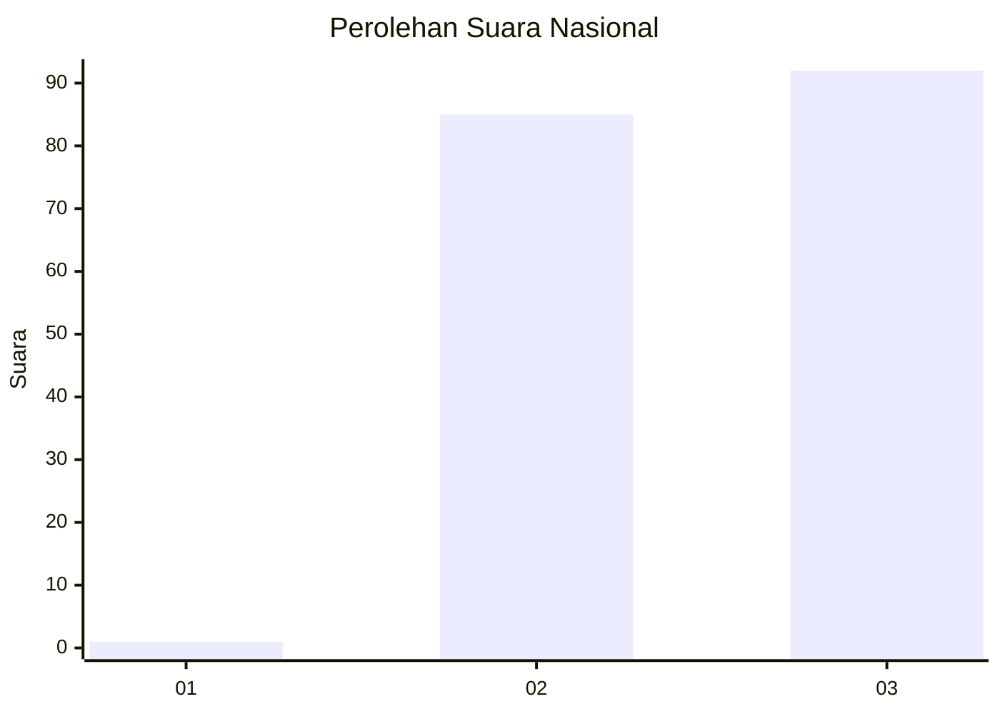
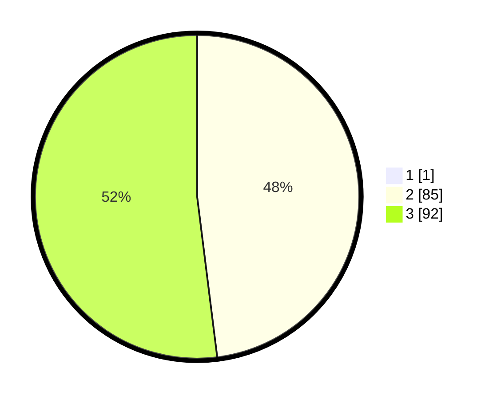

# Hasil

## Grafik

## Tabel

| No. | Nama Paslon    | Suara | Suara (raw) | Persentase |
|:--- |:-------------- | -----:| -----------:| ----------:|
| 1   | ANIES MUHAIMIN | 1     | [1][p-1]    | 0,56       |
| 2   | PRABOWO GIBRAN | 85    | [85][p-2]   | 47,75      |
| 3   | GANJAR MAHFUD  | 92    | [92][p-3]   | 51,69      |

[p-1]: https://github.com/gigit-pemilu/pemilu-2024/blob/main/pilpres/hitung-suara/sub/51-bali/sub/08-buleleng/sub/09-tejakula/sub/2008-penuktukan/sub/010-tps/sub/paslon-1.txt
[p-2]: https://github.com/gigit-pemilu/pemilu-2024/blob/main/pilpres/hitung-suara/sub/51-bali/sub/08-buleleng/sub/09-tejakula/sub/2008-penuktukan/sub/010-tps/sub/paslon-2.txt
[p-3]: https://github.com/gigit-pemilu/pemilu-2024/blob/main/pilpres/hitung-suara/sub/51-bali/sub/08-buleleng/sub/09-tejakula/sub/2008-penuktukan/sub/010-tps/sub/paslon-3.txt

## Foto C Plano

https://sirekap-obj-formc.kpu.go.id/79de/pemilu/ppwp/51/08/09/20/08/5108092008010-20240215-003954--c2129eaa-dd83-4f79-97d3-4d3bd7b62e77.jpg

https://sirekap-obj-formc.kpu.go.id/79de/pemilu/ppwp/51/08/09/20/08/5108092008010-20240215-004329--f78d967f-0e35-4d21-8999-97d4f0dd33ea.jpg

https://sirekap-obj-formc.kpu.go.id/79de/pemilu/ppwp/51/08/09/20/08/5108092008010-20240215-004639--003fa7cc-7458-412a-8c48-386059a3083f.jpg

## Metadata

| Key        | Value               |
| ---------- | ------------------- |
| Time Stamp | 2024-02-24 22:31:28 |

