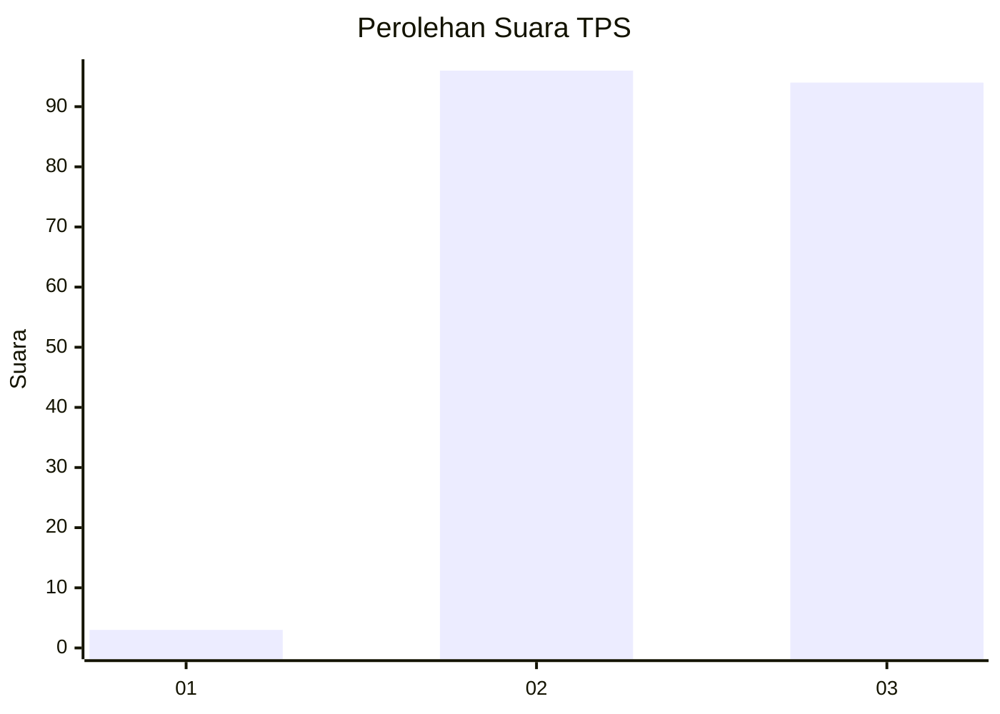
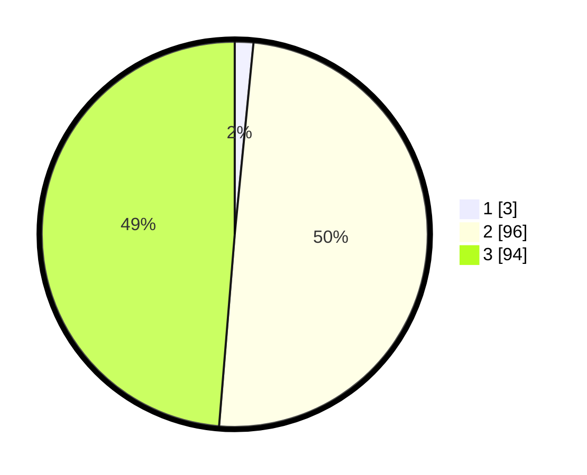

# Hasil

## Grafik

## Tabel

| No. | Nama Paslon    | Suara | Suara (raw) | Persentase |
|:--- |:-------------- | -----:| -----------:| ----------:|
| 1   | ANIES MUHAIMIN | 3     | [3][p-1]    | 1,55       |
| 2   | PRABOWO GIBRAN | 96    | [96][p-2]   | 49,74      |
| 3   | GANJAR MAHFUD  | 94    | [94][p-3]   | 48,70      |

[p-1]: https://github.com/gigit-pemilu/pemilu-2024-51-bali/blob/main/pilpres/hitung-suara/sub/51-bali/sub/08-buleleng/sub/09-tejakula/sub/2008-penuktukan/sub/011-tps/sub/paslon-1.txt
[p-2]: https://github.com/gigit-pemilu/pemilu-2024-51-bali/blob/main/pilpres/hitung-suara/sub/51-bali/sub/08-buleleng/sub/09-tejakula/sub/2008-penuktukan/sub/011-tps/sub/paslon-2.txt
[p-3]: https://github.com/gigit-pemilu/pemilu-2024-51-bali/blob/main/pilpres/hitung-suara/sub/51-bali/sub/08-buleleng/sub/09-tejakula/sub/2008-penuktukan/sub/011-tps/sub/paslon-3.txt

## Foto C Plano

https://sirekap-obj-formc.kpu.go.id/bf96/pemilu/ppwp/51/08/09/20/08/5108092008011-20240214-212044--310f52e5-91e4-4729-9e5a-af25a2ff09ee.jpg

https://sirekap-obj-formc.kpu.go.id/bf96/pemilu/ppwp/51/08/09/20/08/5108092008011-20240214-233527--155482d3-ba52-4334-bf51-35761e9d2a49.jpg

https://sirekap-obj-formc.kpu.go.id/bf96/pemilu/ppwp/51/08/09/20/08/5108092008011-20240214-233825--51075072-3bb4-4aff-a860-bad883331bf7.jpg

## Metadata

| Key        | Value               |
| ---------- | ------------------- |
| Time Stamp | 2024-02-24 22:31:28 |

