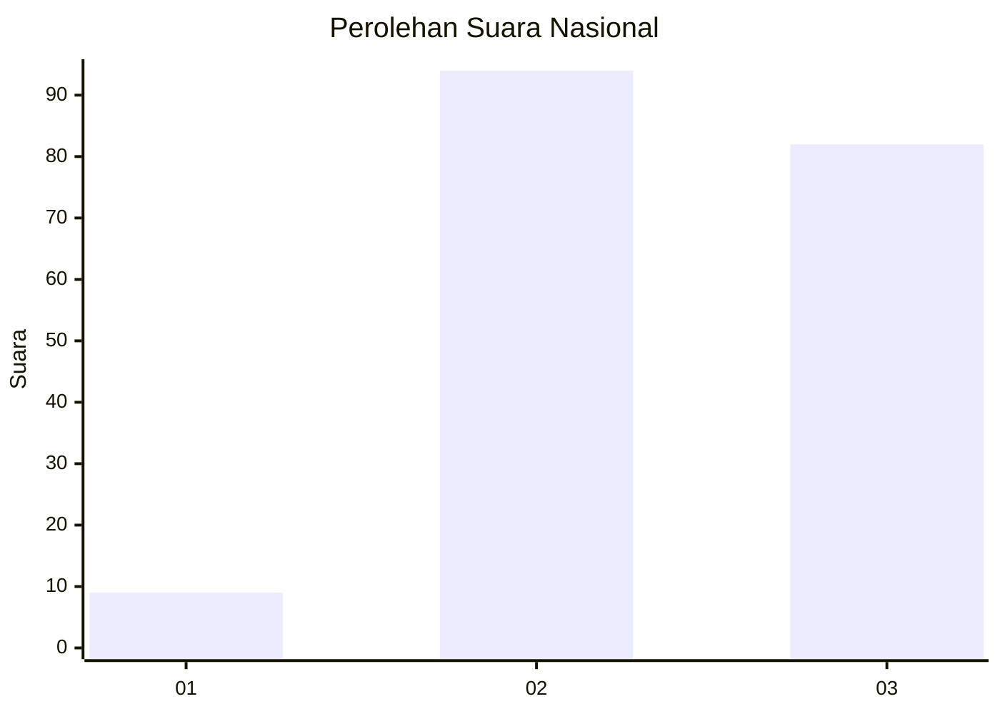
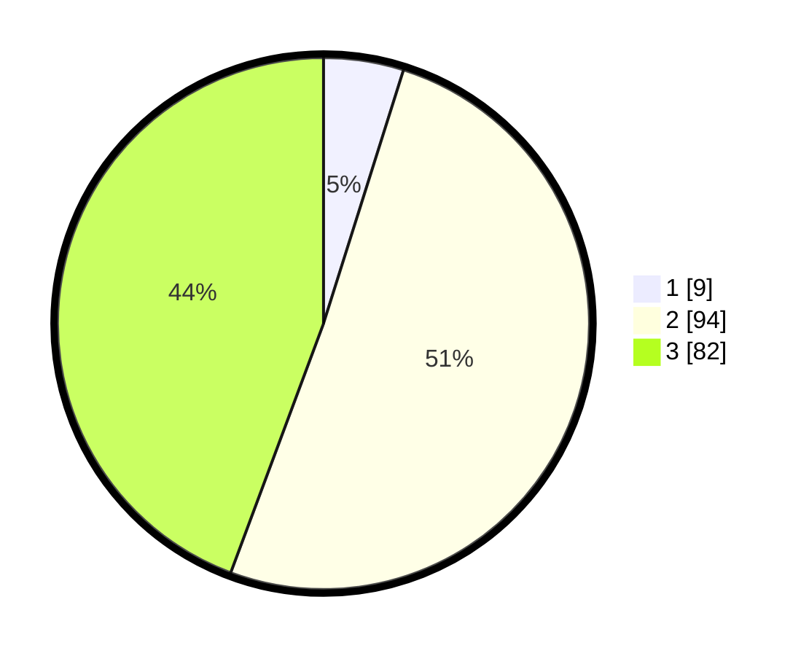

# Hasil

## Grafik

## Tabel

| No. | Nama Paslon    | Suara | Suara (raw) | Persentase |
|:--- |:-------------- | -----:| -----------:| ----------:|
| 1   | ANIES MUHAIMIN | 9     | [9][p-1]    | 4,86       |
| 2   | PRABOWO GIBRAN | 94    | [94][p-2]   | 50,81      |
| 3   | GANJAR MAHFUD  | 82    | [82][p-3]   | 44,32      |

[p-1]: https://github.com/gigit-pemilu/pemilu-2024/blob/main/pilpres/hitung-suara/sub/51-bali/sub/08-buleleng/sub/09-tejakula/sub/2008-penuktukan/sub/012-tps/sub/paslon-1.txt
[p-2]: https://github.com/gigit-pemilu/pemilu-2024/blob/main/pilpres/hitung-suara/sub/51-bali/sub/08-buleleng/sub/09-tejakula/sub/2008-penuktukan/sub/012-tps/sub/paslon-2.txt
[p-3]: https://github.com/gigit-pemilu/pemilu-2024/blob/main/pilpres/hitung-suara/sub/51-bali/sub/08-buleleng/sub/09-tejakula/sub/2008-penuktukan/sub/012-tps/sub/paslon-3.txt

## Foto C Plano

https://sirekap-obj-formc.kpu.go.id/8ba5/pemilu/ppwp/51/08/09/20/08/5108092008012-20240214-220933--9921cb92-3d07-42df-b305-2af9ddf9e3c3.jpg

https://sirekap-obj-formc.kpu.go.id/8ba5/pemilu/ppwp/51/08/09/20/08/5108092008012-20240214-221245--3a0c203e-5c49-4b3a-b127-52071f4d314f.jpg

https://sirekap-obj-formc.kpu.go.id/8ba5/pemilu/ppwp/51/08/09/20/08/5108092008012-20240214-221340--cf19b0cb-f935-4134-a2a7-b913ff8e7649.jpg

## Metadata

| Key        | Value               |
| ---------- | ------------------- |
| Time Stamp | 2024-02-24 22:31:28 |

