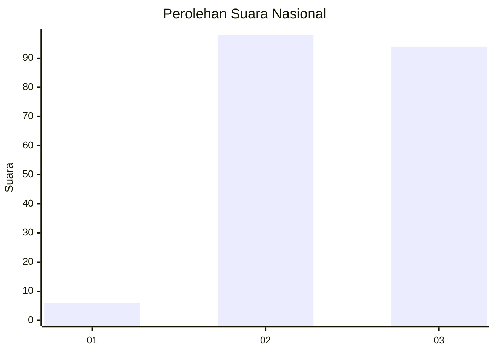
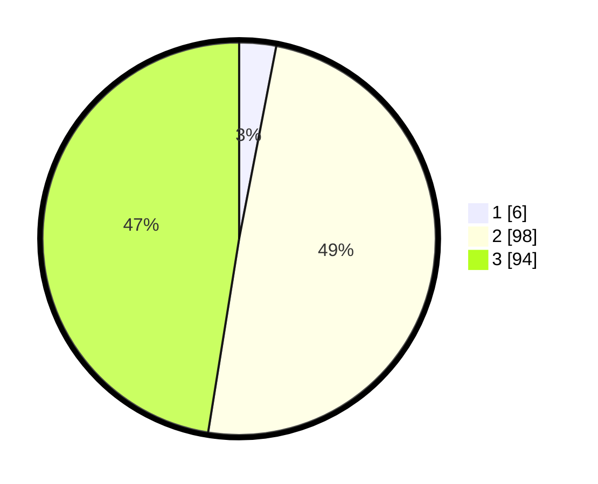

# Hasil

## Grafik

## Tabel

| No. | Nama Paslon    | Suara | Suara (raw) | Persentase |
|:--- |:-------------- | -----:| -----------:| ----------:|
| 1   | ANIES MUHAIMIN | 6     | [6][p-1]    | 3,03       |
| 2   | PRABOWO GIBRAN | 98    | [98][p-2]   | 49,49      |
| 3   | GANJAR MAHFUD  | 94    | [94][p-3]   | 47,47      |

[p-1]: https://github.com/gigit-pemilu/pemilu-2024/blob/main/pilpres/hitung-suara/sub/51-bali/sub/08-buleleng/sub/09-tejakula/sub/2009-sambirenteng/sub/003-tps/sub/paslon-1.txt
[p-2]: https://github.com/gigit-pemilu/pemilu-2024/blob/main/pilpres/hitung-suara/sub/51-bali/sub/08-buleleng/sub/09-tejakula/sub/2009-sambirenteng/sub/003-tps/sub/paslon-2.txt
[p-3]: https://github.com/gigit-pemilu/pemilu-2024/blob/main/pilpres/hitung-suara/sub/51-bali/sub/08-buleleng/sub/09-tejakula/sub/2009-sambirenteng/sub/003-tps/sub/paslon-3.txt

## Foto C Plano

https://sirekap-obj-formc.kpu.go.id/2fe3/pemilu/ppwp/51/08/09/20/09/5108092009003-20240214-230847--16e1f9a3-e675-4f6a-a389-3cec26bc3582.jpg

https://sirekap-obj-formc.kpu.go.id/2fe3/pemilu/ppwp/51/08/09/20/09/5108092009003-20240214-230915--9e1af134-9822-4e0e-802e-ecd4ee1aa0e3.jpg

https://sirekap-obj-formc.kpu.go.id/2fe3/pemilu/ppwp/51/08/09/20/09/5108092009003-20240214-230930--7e1e0d8e-9295-422d-b9ee-f6107409af33.jpg

## Metadata

| Key        | Value               |
| ---------- | ------------------- |
| Time Stamp | 2024-02-24 22:31:28 |

