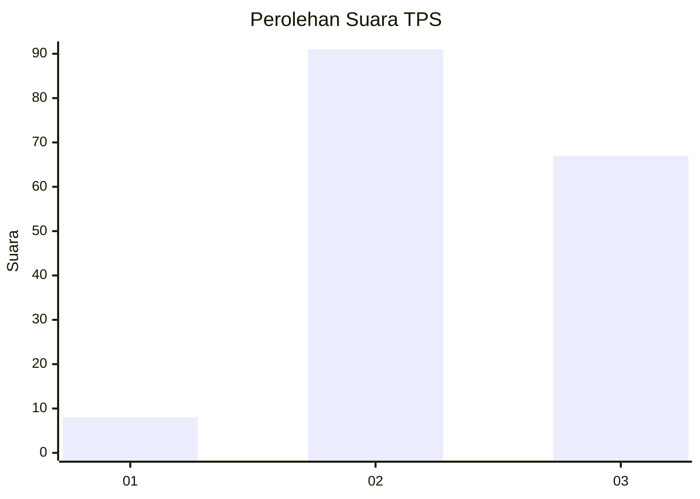
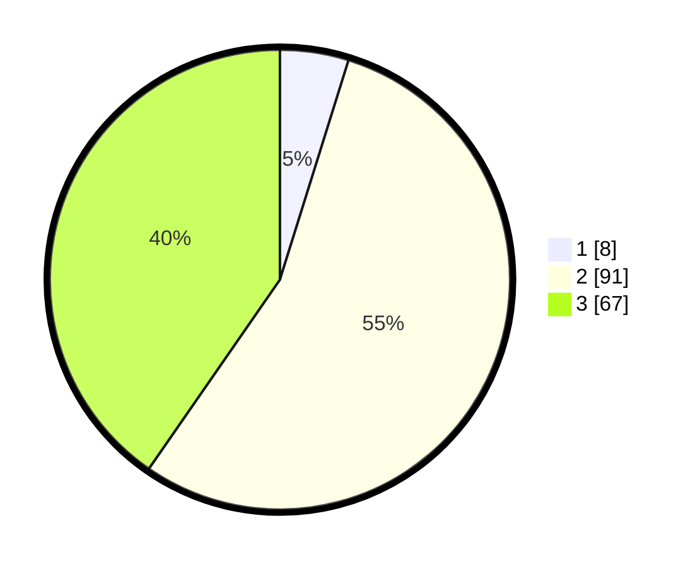

# Hasil

## Grafik

## Tabel

| No. | Nama Paslon    | Suara | Suara (raw) | Persentase |
|:--- |:-------------- | -----:| -----------:| ----------:|
| 1   | ANIES MUHAIMIN | 8     | [8][p-1]    | 4,82       |
| 2   | PRABOWO GIBRAN | 91    | [91][p-2]   | 54,82      |
| 3   | GANJAR MAHFUD  | 67    | [67][p-3]   | 40,36      |

[p-1]: https://github.com/gigit-pemilu/pemilu-2024-51-bali/blob/main/pilpres/hitung-suara/sub/51-bali/sub/08-buleleng/sub/09-tejakula/sub/2009-sambirenteng/sub/013-tps/sub/paslon-1.txt
[p-2]: https://github.com/gigit-pemilu/pemilu-2024-51-bali/blob/main/pilpres/hitung-suara/sub/51-bali/sub/08-buleleng/sub/09-tejakula/sub/2009-sambirenteng/sub/013-tps/sub/paslon-2.txt
[p-3]: https://github.com/gigit-pemilu/pemilu-2024-51-bali/blob/main/pilpres/hitung-suara/sub/51-bali/sub/08-buleleng/sub/09-tejakula/sub/2009-sambirenteng/sub/013-tps/sub/paslon-3.txt

## Foto C Plano

https://sirekap-obj-formc.kpu.go.id/7998/pemilu/ppwp/51/08/09/20/09/5108092009013-20240214-231640--9dad9249-e71d-4c12-b7fe-b7847432de32.jpg

https://sirekap-obj-formc.kpu.go.id/7998/pemilu/ppwp/51/08/09/20/09/5108092009013-20240214-231706--e811803b-8afb-4dbd-8f4b-53a6b4e5898d.jpg

https://sirekap-obj-formc.kpu.go.id/7998/pemilu/ppwp/51/08/09/20/09/5108092009013-20240214-231720--aefbce28-6029-4689-ae54-091fccd7496a.jpg

## Metadata

| Key        | Value               |
| ---------- | ------------------- |
| Time Stamp | 2024-02-24 22:31:28 |

