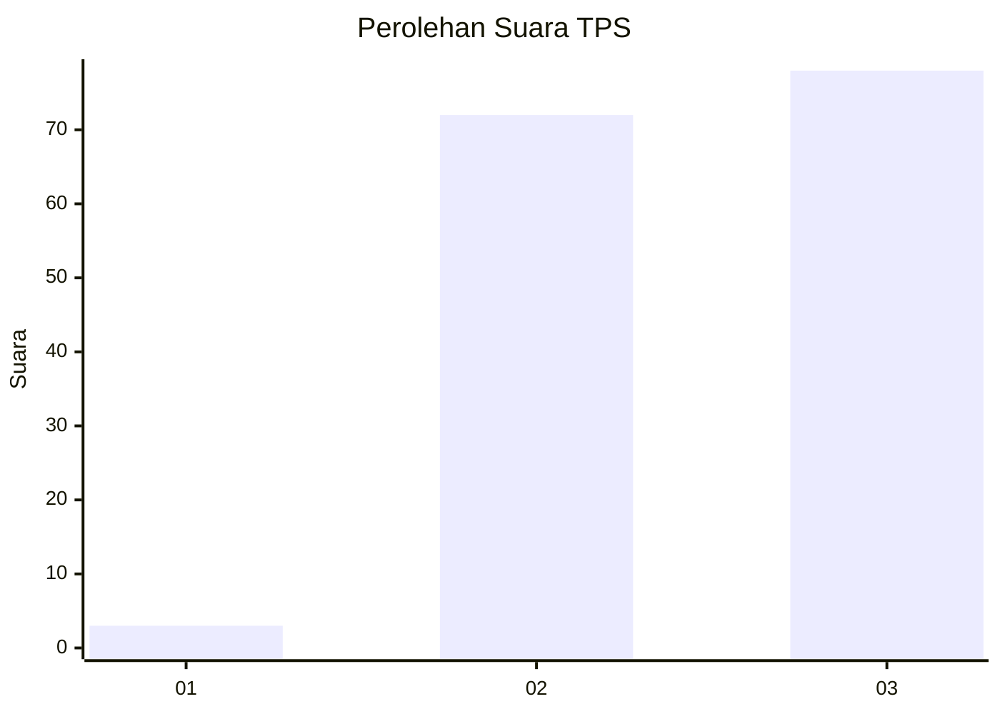
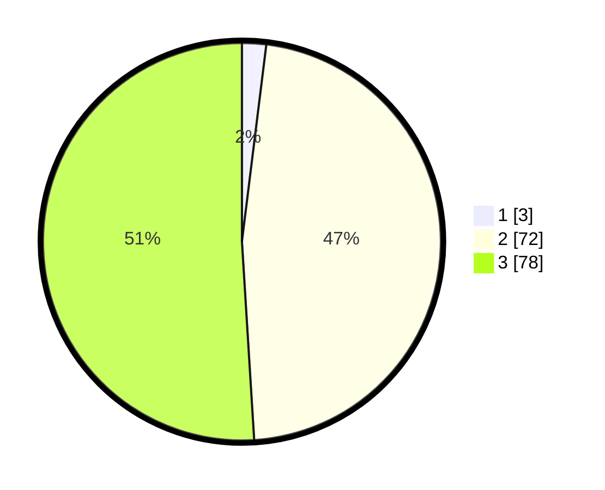

# Hasil

## Grafik

## Tabel

| No. | Nama Paslon    | Suara | Suara (raw) | Persentase |
|:--- |:-------------- | -----:| -----------:| ----------:|
| 1   | ANIES MUHAIMIN | 3     | [3][p-1]    | 1,96       |
| 2   | PRABOWO GIBRAN | 72    | [72][p-2]   | 47,06      |
| 3   | GANJAR MAHFUD  | 78    | [78][p-3]   | 50,98      |

[p-1]: https://github.com/gigit-pemilu/pemilu-2024-51-bali/blob/main/pilpres/hitung-suara/sub/51-bali/sub/08-buleleng/sub/09-tejakula/sub/2009-sambirenteng/sub/015-tps/sub/paslon-1.txt
[p-2]: https://github.com/gigit-pemilu/pemilu-2024-51-bali/blob/main/pilpres/hitung-suara/sub/51-bali/sub/08-buleleng/sub/09-tejakula/sub/2009-sambirenteng/sub/015-tps/sub/paslon-2.txt
[p-3]: https://github.com/gigit-pemilu/pemilu-2024-51-bali/blob/main/pilpres/hitung-suara/sub/51-bali/sub/08-buleleng/sub/09-tejakula/sub/2009-sambirenteng/sub/015-tps/sub/paslon-3.txt

## Foto C Plano

https://sirekap-obj-formc.kpu.go.id/9cab/pemilu/ppwp/51/08/09/20/09/5108092009015-20240214-130559--9a242980-53df-44b0-bf7f-395644840ea9.jpg

https://sirekap-obj-formc.kpu.go.id/9cab/pemilu/ppwp/51/08/09/20/09/5108092009015-20240214-130648--795d60fe-481c-460f-8172-91c97b7b8b61.jpg

https://sirekap-obj-formc.kpu.go.id/9cab/pemilu/ppwp/51/08/09/20/09/5108092009015-20240214-130722--fc3da68c-7fb1-475f-8ab7-b3c78e020ca1.jpg

## Metadata

| Key        | Value               |
| ---------- | ------------------- |
| Time Stamp | 2024-02-24 22:31:28 |

