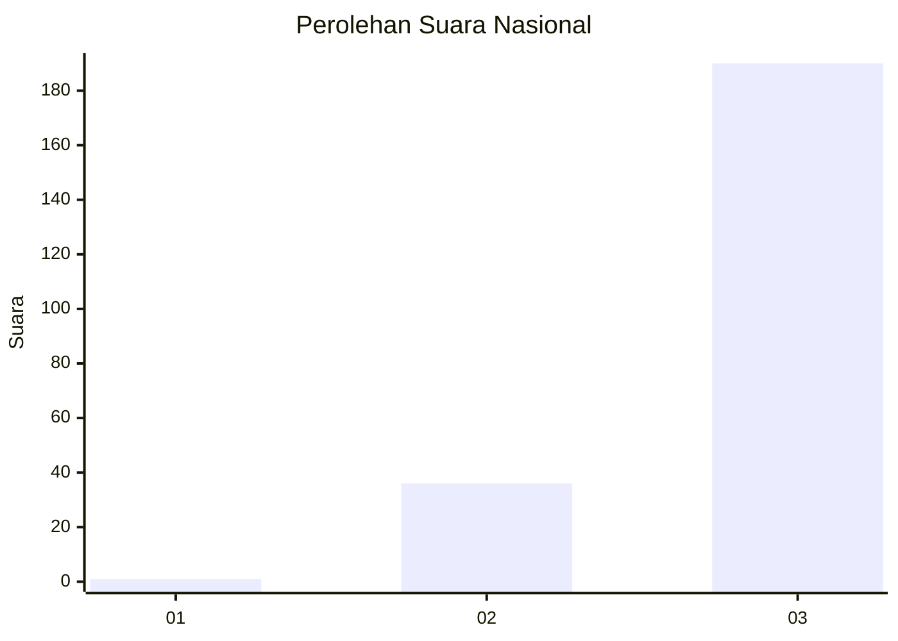
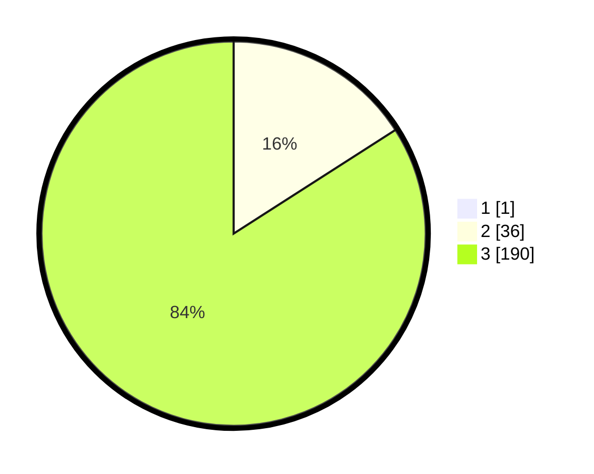

# Hasil

## Grafik

## Tabel

| No. | Nama Paslon    | Suara | Suara (raw) | Persentase |
|:--- |:-------------- | -----:| -----------:| ----------:|
| 1   | ANIES MUHAIMIN | 1     | [1][p-1]    | 0,44       |
| 2   | PRABOWO GIBRAN | 36    | [36][p-2]   | 15,86      |
| 3   | GANJAR MAHFUD  | 190   | [190][p-3]  | 83,70      |

[p-1]: https://github.com/gigit-pemilu/pemilu-2024/blob/main/pilpres/hitung-suara/sub/51-bali/sub/08-buleleng/sub/09-tejakula/sub/2010-tembok/sub/001-tps/sub/paslon-1.txt
[p-2]: https://github.com/gigit-pemilu/pemilu-2024/blob/main/pilpres/hitung-suara/sub/51-bali/sub/08-buleleng/sub/09-tejakula/sub/2010-tembok/sub/001-tps/sub/paslon-2.txt
[p-3]: https://github.com/gigit-pemilu/pemilu-2024/blob/main/pilpres/hitung-suara/sub/51-bali/sub/08-buleleng/sub/09-tejakula/sub/2010-tembok/sub/001-tps/sub/paslon-3.txt

## Foto C Plano

https://sirekap-obj-formc.kpu.go.id/64cd/pemilu/ppwp/51/08/09/20/10/5108092010001-20240214-200230--7dd979be-2d9e-4322-a129-d7750fb3e76b.jpg

https://sirekap-obj-formc.kpu.go.id/64cd/pemilu/ppwp/51/08/09/20/10/5108092010001-20240214-200236--e6f30654-cc82-4d87-844c-0caecf3b044d.jpg

https://sirekap-obj-formc.kpu.go.id/64cd/pemilu/ppwp/51/08/09/20/10/5108092010001-20240214-200241--d2c9e1b0-5975-4e50-af35-1ea513c6ae24.jpg

## Metadata

| Key        | Value               |
| ---------- | ------------------- |
| Time Stamp | 2024-02-24 22:31:28 |

