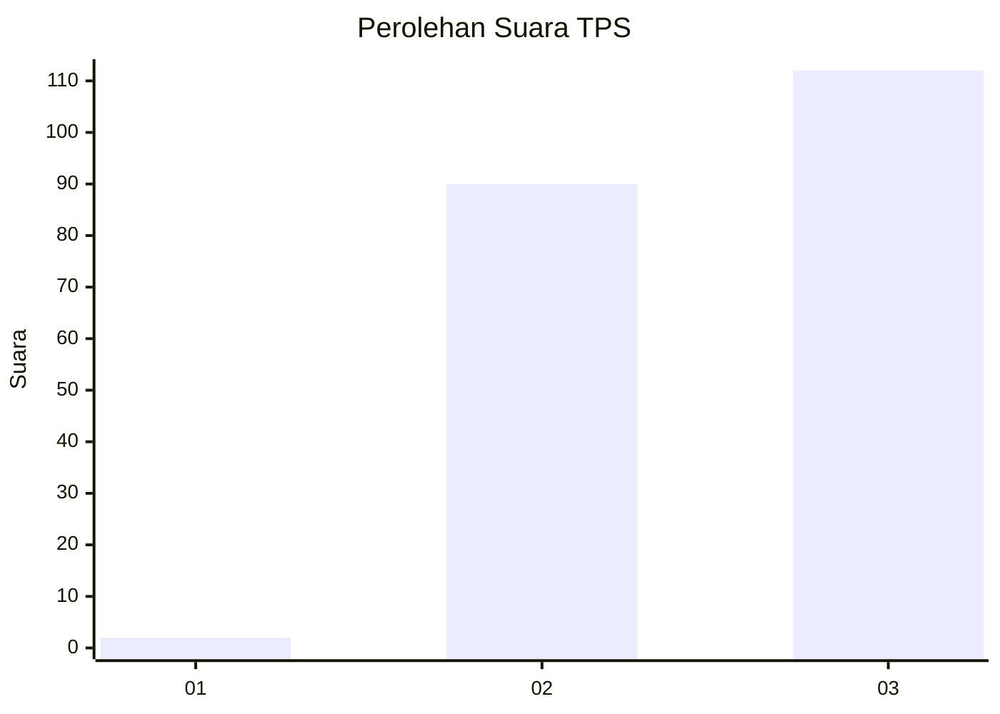
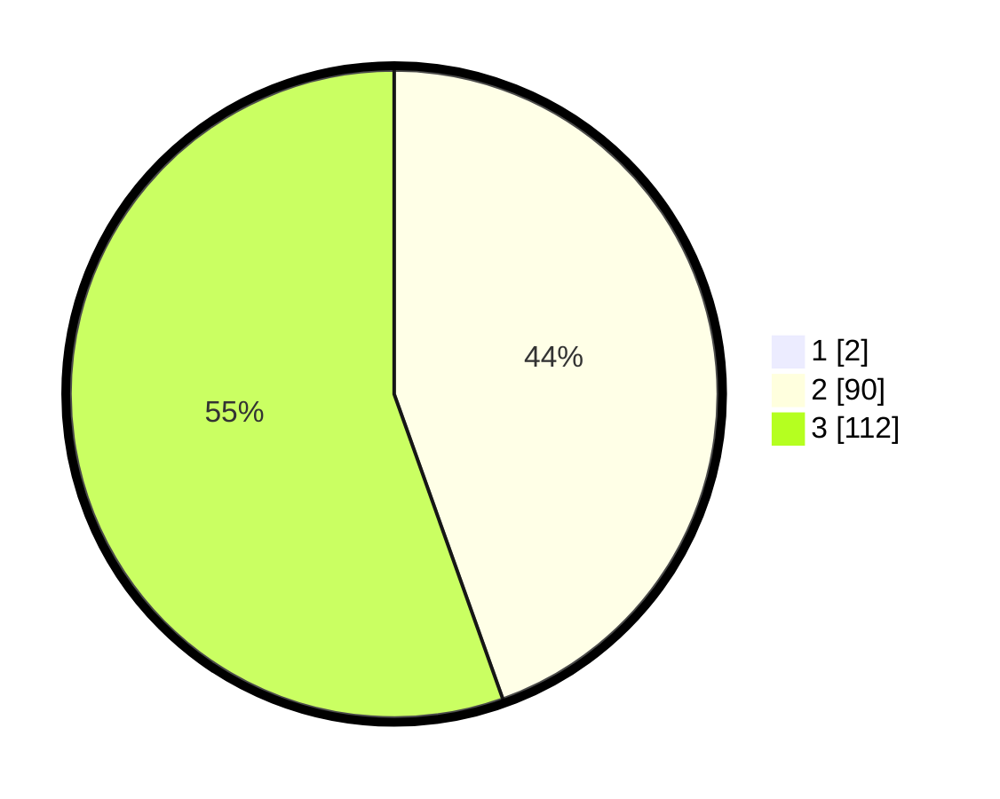

# Hasil

## Grafik

## Tabel

| No. | Nama Paslon    | Suara | Suara (raw) | Persentase |
|:--- |:-------------- | -----:| -----------:| ----------:|
| 1   | ANIES MUHAIMIN | 2     | [2][p-1]    | 0,98       |
| 2   | PRABOWO GIBRAN | 90    | [90][p-2]   | 44,12      |
| 3   | GANJAR MAHFUD  | 112   | [112][p-3]  | 54,90      |

[p-1]: https://github.com/gigit-pemilu/pemilu-2024-51-bali/blob/main/pilpres/hitung-suara/sub/51-bali/sub/08-buleleng/sub/09-tejakula/sub/2010-tembok/sub/011-tps/sub/paslon-1.txt
[p-2]: https://github.com/gigit-pemilu/pemilu-2024-51-bali/blob/main/pilpres/hitung-suara/sub/51-bali/sub/08-buleleng/sub/09-tejakula/sub/2010-tembok/sub/011-tps/sub/paslon-2.txt
[p-3]: https://github.com/gigit-pemilu/pemilu-2024-51-bali/blob/main/pilpres/hitung-suara/sub/51-bali/sub/08-buleleng/sub/09-tejakula/sub/2010-tembok/sub/011-tps/sub/paslon-3.txt

## Foto C Plano

https://sirekap-obj-formc.kpu.go.id/a81f/pemilu/ppwp/51/08/09/20/10/5108092010011-20240214-130842--dd6070a1-0706-464d-aab2-46ae55a9a0f5.jpg

https://sirekap-obj-formc.kpu.go.id/a81f/pemilu/ppwp/51/08/09/20/10/5108092010011-20240214-130815--15f1d7f7-12c0-4d13-a80a-04cbea034260.jpg

https://sirekap-obj-formc.kpu.go.id/a81f/pemilu/ppwp/51/08/09/20/10/5108092010011-20240214-131721--e2d5d6c1-a047-4609-9371-7dfe276b25ab.jpg

## Metadata

| Key        | Value               |
| ---------- | ------------------- |
| Time Stamp | 2024-02-24 22:31:28 |

