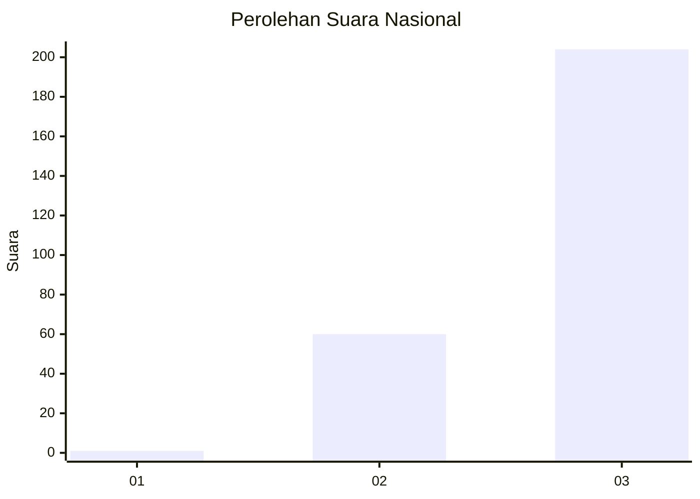
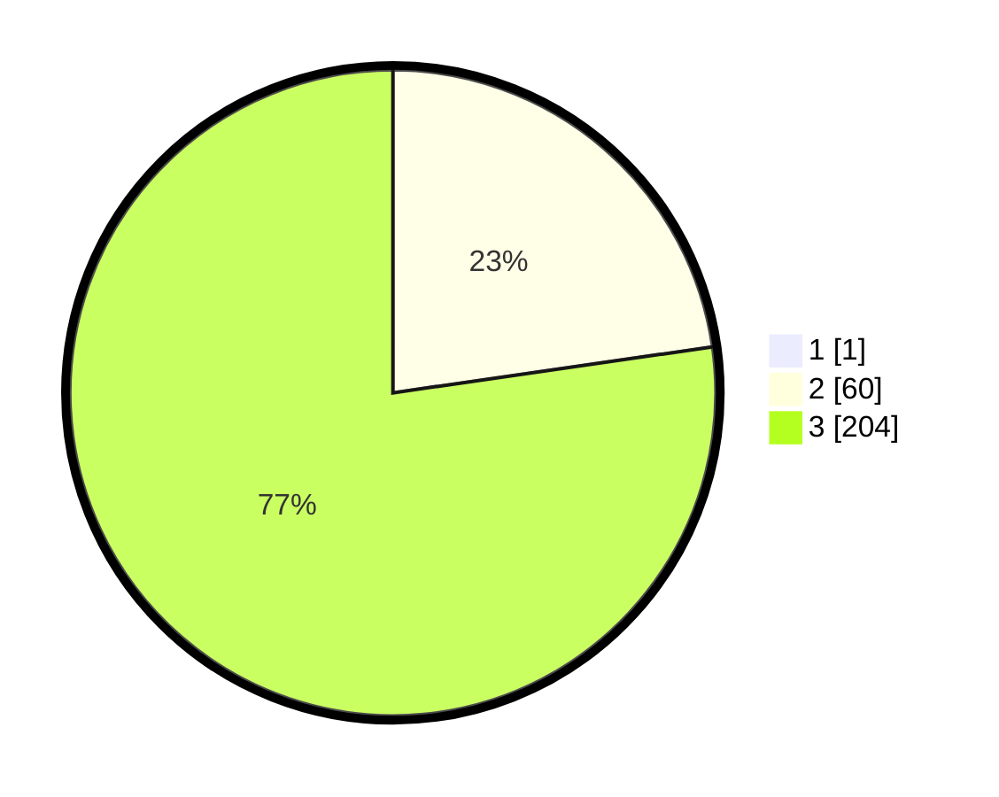

# Hasil

## Grafik

## Tabel

| No. | Nama Paslon    | Suara | Suara (raw) | Persentase |
|:--- |:-------------- | -----:| -----------:| ----------:|
| 1   | ANIES MUHAIMIN | 1     | [1][p-1]    | 0,38       |
| 2   | PRABOWO GIBRAN | 60    | [60][p-2]   | 22,64      |
| 3   | GANJAR MAHFUD  | 204   | [204][p-3]  | 76,98      |

[p-1]: https://github.com/gigit-pemilu/pemilu-2024/blob/main/pilpres/hitung-suara/sub/51-bali/sub/08-buleleng/sub/09-tejakula/sub/2010-tembok/sub/019-tps/sub/paslon-1.txt
[p-2]: https://github.com/gigit-pemilu/pemilu-2024/blob/main/pilpres/hitung-suara/sub/51-bali/sub/08-buleleng/sub/09-tejakula/sub/2010-tembok/sub/019-tps/sub/paslon-2.txt
[p-3]: https://github.com/gigit-pemilu/pemilu-2024/blob/main/pilpres/hitung-suara/sub/51-bali/sub/08-buleleng/sub/09-tejakula/sub/2010-tembok/sub/019-tps/sub/paslon-3.txt

## Foto C Plano

https://sirekap-obj-formc.kpu.go.id/b6dd/pemilu/ppwp/51/08/09/20/10/5108092010019-20240214-200443--27797699-11a5-47db-a133-e8534026bf5c.jpg

https://sirekap-obj-formc.kpu.go.id/b6dd/pemilu/ppwp/51/08/09/20/10/5108092010019-20240214-200545--7bcce597-b556-47db-a40c-a23df2dafe26.jpg

https://sirekap-obj-formc.kpu.go.id/b6dd/pemilu/ppwp/51/08/09/20/10/5108092010019-20240214-200636--bccdfe41-0efa-44d3-b434-575dd7068d3a.jpg

## Metadata

| Key        | Value               |
| ---------- | ------------------- |
| Time Stamp | 2024-02-24 22:31:28 |

