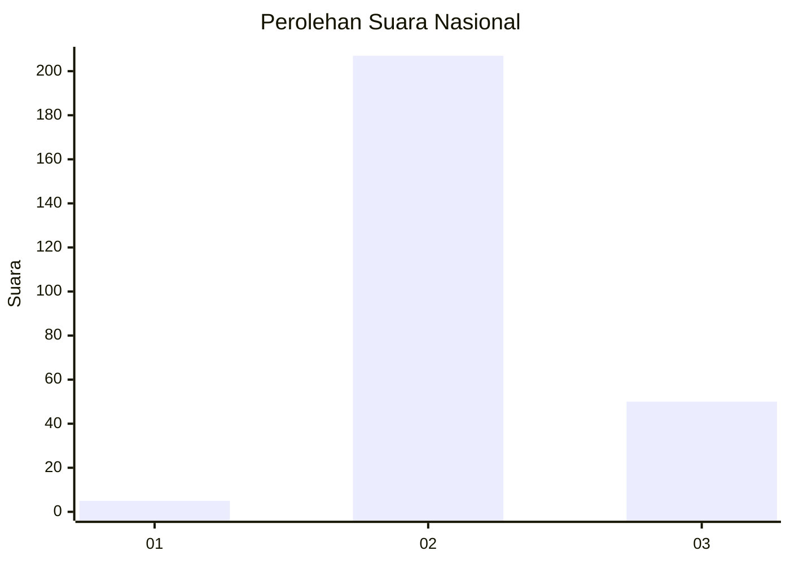
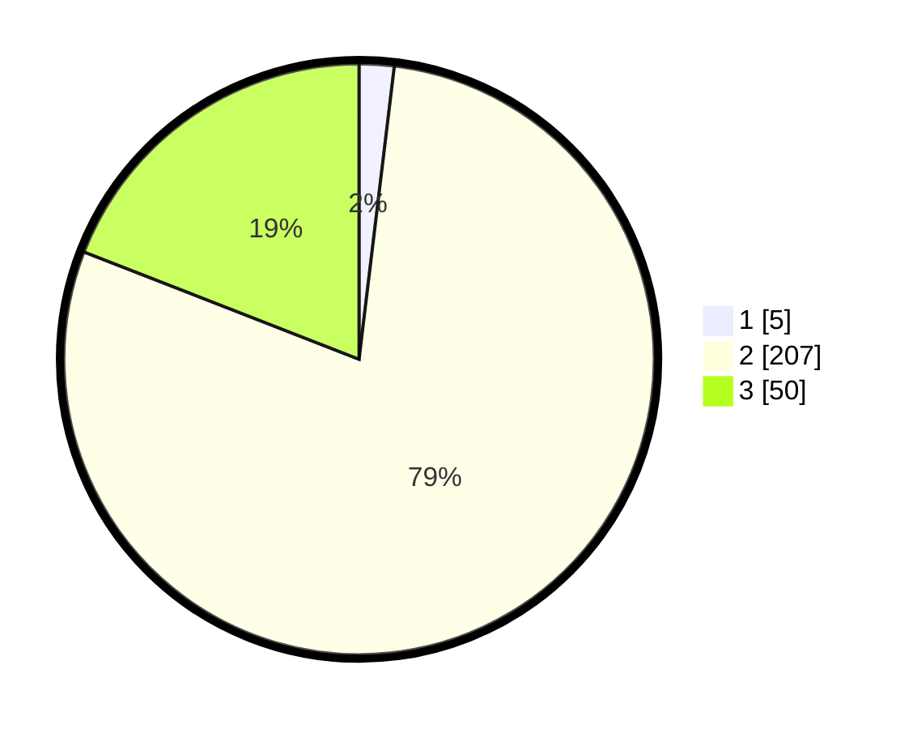

# Hasil

## Grafik

## Tabel

| No. | Nama Paslon    | Suara | Suara (raw) | Persentase |
|:--- |:-------------- | -----:| -----------:| ----------:|
| 1   | ANIES MUHAIMIN | 5     | [5][p-1]    | 1,91       |
| 2   | PRABOWO GIBRAN | 207   | [207][p-2]  | 79,01      |
| 3   | GANJAR MAHFUD  | 50    | [50][p-3]   | 19,08      |

[p-1]: https://github.com/gigit-pemilu/pemilu-2024/blob/main/pilpres/hitung-suara/sub/51-bali/sub/71-kota-denpasar/sub/01-denpasar-selatan/sub/1001-serangan/sub/001-tps/sub/paslon-1.txt
[p-2]: https://github.com/gigit-pemilu/pemilu-2024/blob/main/pilpres/hitung-suara/sub/51-bali/sub/71-kota-denpasar/sub/01-denpasar-selatan/sub/1001-serangan/sub/001-tps/sub/paslon-2.txt
[p-3]: https://github.com/gigit-pemilu/pemilu-2024/blob/main/pilpres/hitung-suara/sub/51-bali/sub/71-kota-denpasar/sub/01-denpasar-selatan/sub/1001-serangan/sub/001-tps/sub/paslon-3.txt

## Foto C Plano

https://sirekap-obj-formc.kpu.go.id/2217/pemilu/ppwp/51/71/01/10/01/5171011001001-20240223-125417--d82de215-5937-4aca-8f65-b21a5b12312d.jpg

https://sirekap-obj-formc.kpu.go.id/2217/pemilu/ppwp/51/71/01/10/01/5171011001001-20240223-125131--7fbefe05-db94-4380-aba2-03b8e3ab8554.jpg

https://sirekap-obj-formc.kpu.go.id/2217/pemilu/ppwp/51/71/01/10/01/5171011001001-20240223-125251--6c79de15-91ec-4e94-85df-c9826c167127.jpg

## Metadata

| Key        | Value               |
| ---------- | ------------------- |
| Time Stamp | 2024-02-24 22:31:28 |

## DATA PEMILIH TETAP

Jumlah pemilih dalam DPT: **260**.
 * L: **141**.
 * P: **119**.

## DATA PENGGUNA HAK PILIH

Jumlah pengguna hak pilih dalam DPT: **260**.
 * L: **141**.
 * P: **119**.

Jumlah pengguna hak pilih dalam DPTb: **5**.
 * L: **3**.
 * P: **2**.

Jumlah pengguna hak pilih dalam DPK: **0**.
 * L: **0**.
 * P: **0**.

Jumlah pengguna hak pilih: **265**.
 * L: **144**.
 * P: **121**.

## JUMLAH SUARA SAH DAN TIDAK SAH

JUMLAH SELURUH SUARA SAH: **262**.

JUMLAH SUARA TIDAK SAH: **3**.

JUMLAH SELURUH SUARA SAH DAN SUARA TIDAK SAH: **265**.

