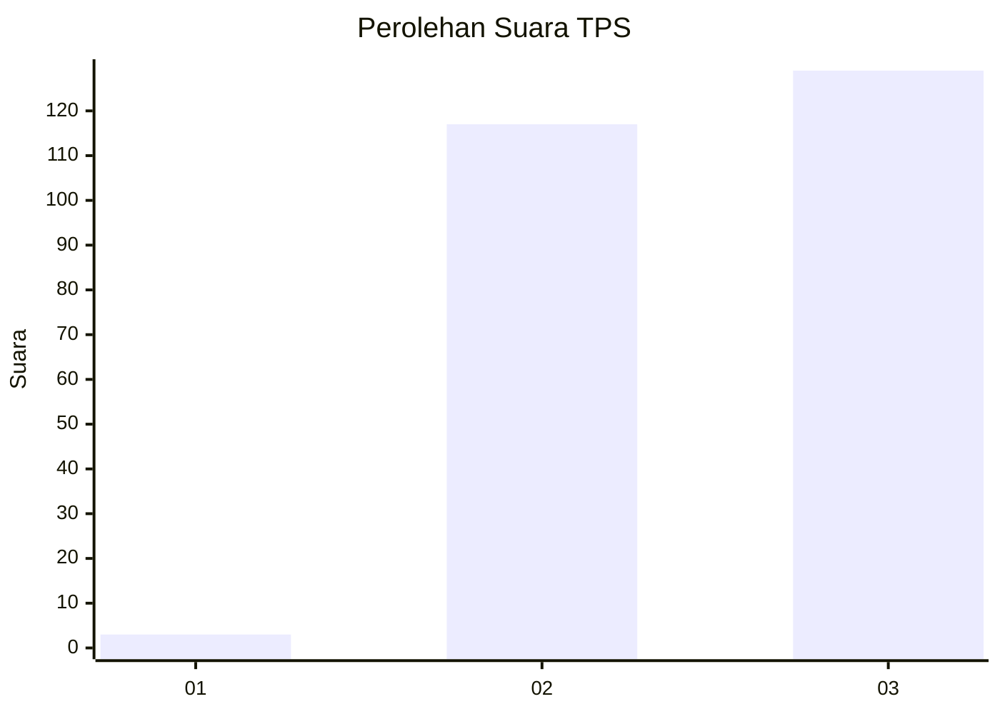
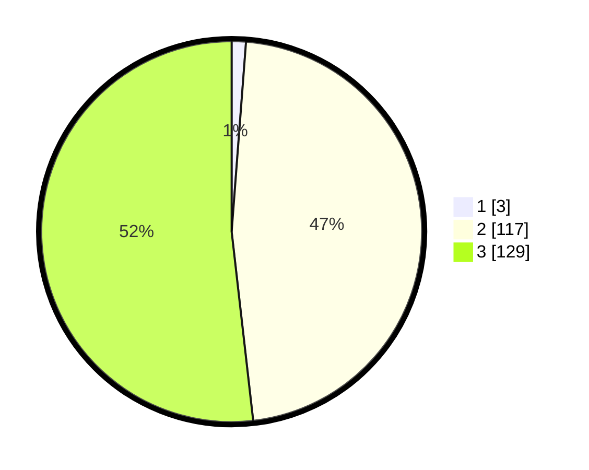

# Hasil

## Grafik

## Tabel

| No. | Nama Paslon    | Suara | Suara (raw) | Persentase |
|:--- |:-------------- | -----:| -----------:| ----------:|
| 1   | ANIES MUHAIMIN | 3     | [3][p-1]    | 1,20       |
| 2   | PRABOWO GIBRAN | 117   | [117][p-2]  | 46,99      |
| 3   | GANJAR MAHFUD  | 129   | [129][p-3]  | 51,81      |

[p-1]: https://github.com/gigit-pemilu/pemilu-2024-51-bali/blob/main/pilpres/hitung-suara/sub/51-bali/sub/71-kota-denpasar/sub/01-denpasar-selatan/sub/1001-serangan/sub/002-tps/sub/paslon-1.txt
[p-2]: https://github.com/gigit-pemilu/pemilu-2024-51-bali/blob/main/pilpres/hitung-suara/sub/51-bali/sub/71-kota-denpasar/sub/01-denpasar-selatan/sub/1001-serangan/sub/002-tps/sub/paslon-2.txt
[p-3]: https://github.com/gigit-pemilu/pemilu-2024-51-bali/blob/main/pilpres/hitung-suara/sub/51-bali/sub/71-kota-denpasar/sub/01-denpasar-selatan/sub/1001-serangan/sub/002-tps/sub/paslon-3.txt

## Foto C Plano

https://sirekap-obj-formc.kpu.go.id/d29c/pemilu/ppwp/51/71/01/10/01/5171011001002-20240223-125807--5b35d525-cdbe-4f8b-a9b2-c99ad00fbcfe.jpg

https://sirekap-obj-formc.kpu.go.id/d29c/pemilu/ppwp/51/71/01/10/01/5171011001002-20240223-125822--f607b3ab-511b-4233-9c65-bb1c620c5686.jpg

https://sirekap-obj-formc.kpu.go.id/d29c/pemilu/ppwp/51/71/01/10/01/5171011001002-20240223-125837--d8d67fa6-1b28-4f89-8c2e-fcfcb7582652.jpg

## Metadata

| Key        | Value               |
| ---------- | ------------------- |
| Time Stamp | 2024-02-24 22:31:28 |

