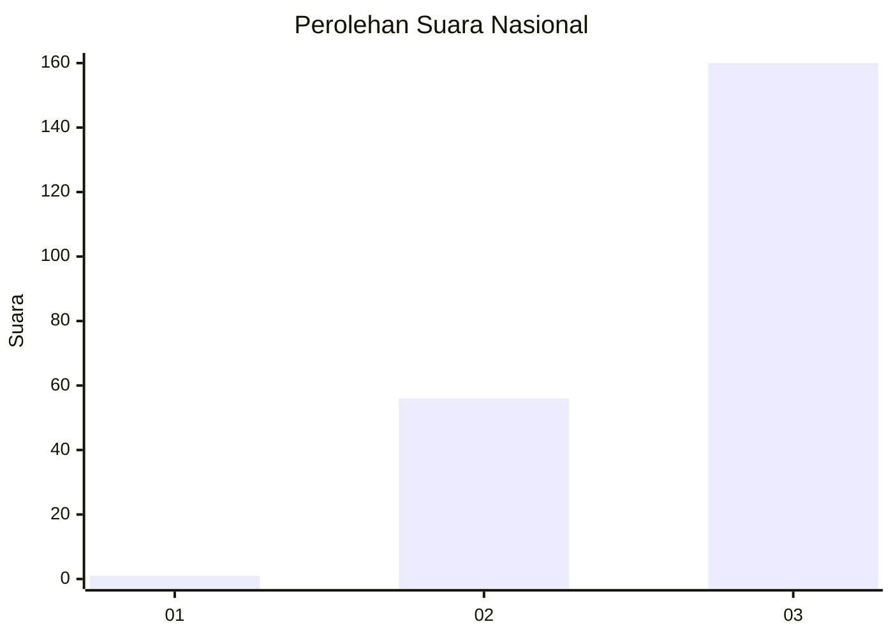
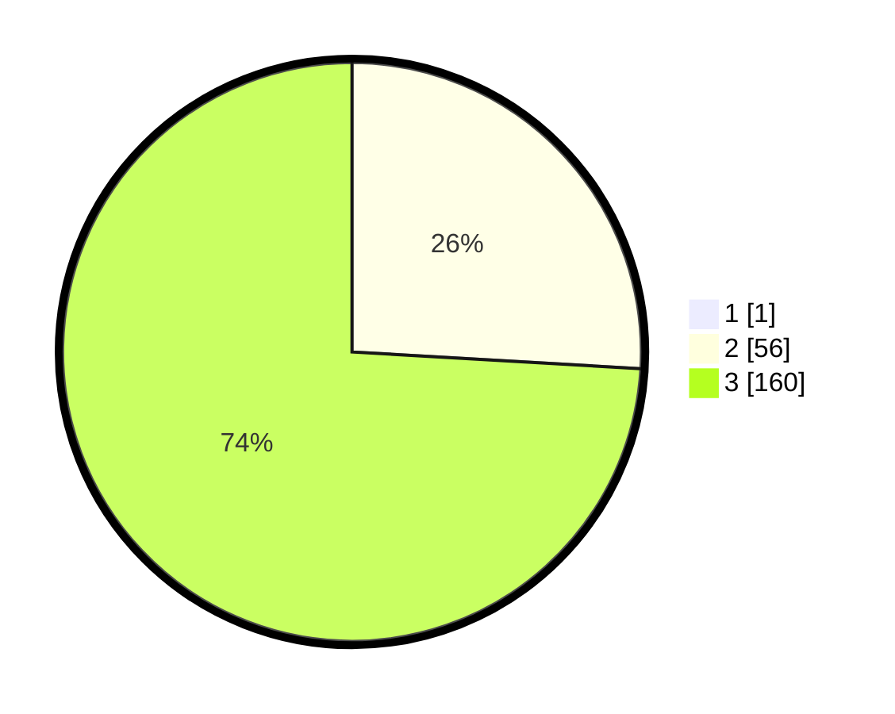

# Hasil

## Grafik

## Tabel

| No. | Nama Paslon    | Suara | Suara (raw) | Persentase |
|:--- |:-------------- | -----:| -----------:| ----------:|
| 1   | ANIES MUHAIMIN | 1     | [1][p-1]    | 0,46       |
| 2   | PRABOWO GIBRAN | 56    | [56][p-2]   | 25,81      |
| 3   | GANJAR MAHFUD  | 160   | [160][p-3]  | 73,73      |

[p-1]: https://github.com/gigit-pemilu/pemilu-2024/blob/main/pilpres/hitung-suara/sub/51-bali/sub/71-kota-denpasar/sub/01-denpasar-selatan/sub/1001-serangan/sub/008-tps/sub/paslon-1.txt
[p-2]: https://github.com/gigit-pemilu/pemilu-2024/blob/main/pilpres/hitung-suara/sub/51-bali/sub/71-kota-denpasar/sub/01-denpasar-selatan/sub/1001-serangan/sub/008-tps/sub/paslon-2.txt
[p-3]: https://github.com/gigit-pemilu/pemilu-2024/blob/main/pilpres/hitung-suara/sub/51-bali/sub/71-kota-denpasar/sub/01-denpasar-selatan/sub/1001-serangan/sub/008-tps/sub/paslon-3.txt

## Foto C Plano

https://sirekap-obj-formc.kpu.go.id/cabb/pemilu/ppwp/51/71/01/10/01/5171011001008-20240224-182037--e1168e76-9b53-4f39-a10e-620c78a09093.jpg

https://sirekap-obj-formc.kpu.go.id/cabb/pemilu/ppwp/51/71/01/10/01/5171011001008-20240224-182053--95e9c914-ef2f-424c-bc9c-48f40601ba45.jpg

## Metadata

| Key        | Value               |
| ---------- | ------------------- |
| Time Stamp | 2024-02-24 22:31:28 |

