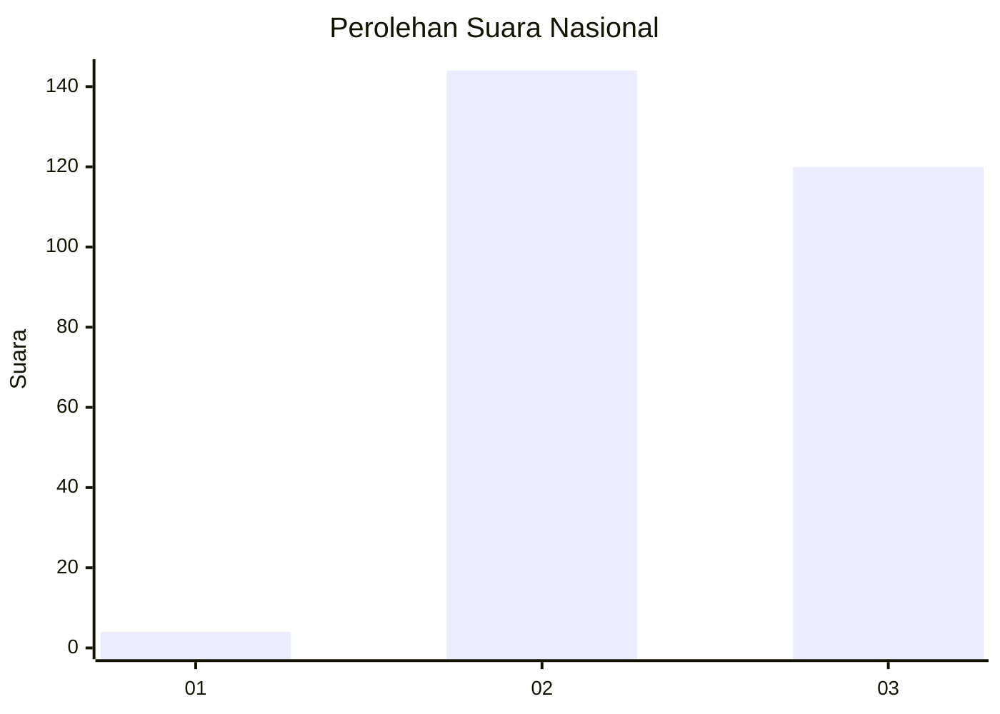
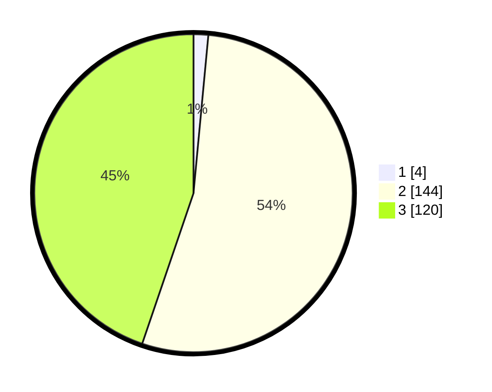

# Hasil

## Grafik

## Tabel

| No. | Nama Paslon    | Suara | Suara (raw) | Persentase |
|:--- |:-------------- | -----:| -----------:| ----------:|
| 1   | ANIES MUHAIMIN | 4     | [4][p-1]    | 1,49       |
| 2   | PRABOWO GIBRAN | 144   | [144][p-2]  | 53,73      |
| 3   | GANJAR MAHFUD  | 120   | [120][p-3]  | 44,78      |

[p-1]: https://github.com/gigit-pemilu/pemilu-2024/blob/main/pilpres/hitung-suara/sub/51-bali/sub/71-kota-denpasar/sub/01-denpasar-selatan/sub/1001-serangan/sub/009-tps/sub/paslon-1.txt
[p-2]: https://github.com/gigit-pemilu/pemilu-2024/blob/main/pilpres/hitung-suara/sub/51-bali/sub/71-kota-denpasar/sub/01-denpasar-selatan/sub/1001-serangan/sub/009-tps/sub/paslon-2.txt
[p-3]: https://github.com/gigit-pemilu/pemilu-2024/blob/main/pilpres/hitung-suara/sub/51-bali/sub/71-kota-denpasar/sub/01-denpasar-selatan/sub/1001-serangan/sub/009-tps/sub/paslon-3.txt

## Foto C Plano

https://sirekap-obj-formc.kpu.go.id/b59d/pemilu/ppwp/51/71/01/10/01/5171011001009-20240223-201732--a3ab93d9-1c83-4ef0-b3d8-6efe44043a84.jpg

## Metadata

| Key        | Value               |
| ---------- | ------------------- |
| Time Stamp | 2024-02-24 22:31:28 |

