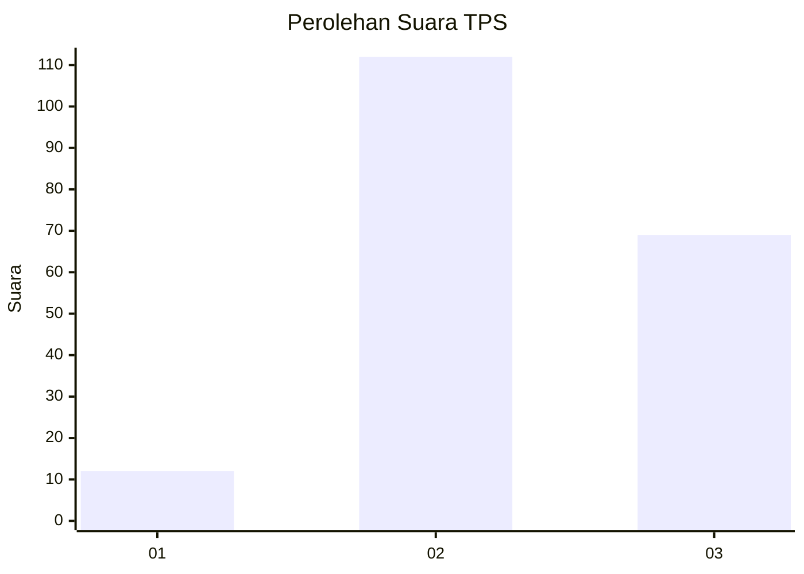
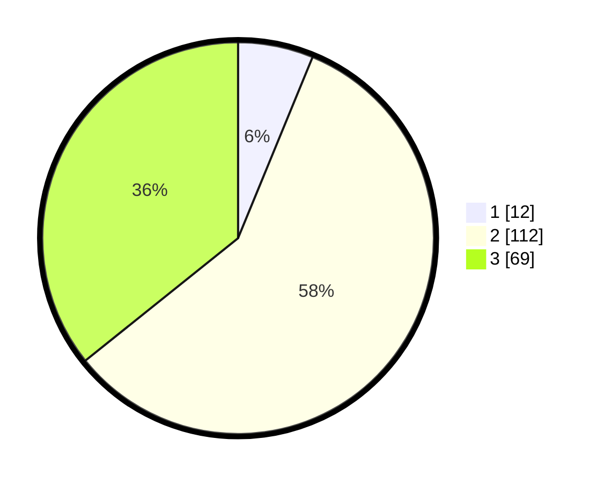

# Hasil

## Grafik

## Tabel

| No. | Nama Paslon    | Suara | Suara (raw) | Persentase |
|:--- |:-------------- | -----:| -----------:| ----------:|
| 1   | ANIES MUHAIMIN | 12    | [12][p-1]   | 6,22       |
| 2   | PRABOWO GIBRAN | 112   | [112][p-2]  | 58,03      |
| 3   | GANJAR MAHFUD  | 69    | [69][p-3]   | 35,75      |

[p-1]: https://github.com/gigit-pemilu/pemilu-2024-51-bali/blob/main/pilpres/hitung-suara/sub/51-bali/sub/71-kota-denpasar/sub/01-denpasar-selatan/sub/1003-sesetan/sub/007-tps/sub/paslon-1.txt
[p-2]: https://github.com/gigit-pemilu/pemilu-2024-51-bali/blob/main/pilpres/hitung-suara/sub/51-bali/sub/71-kota-denpasar/sub/01-denpasar-selatan/sub/1003-sesetan/sub/007-tps/sub/paslon-2.txt
[p-3]: https://github.com/gigit-pemilu/pemilu-2024-51-bali/blob/main/pilpres/hitung-suara/sub/51-bali/sub/71-kota-denpasar/sub/01-denpasar-selatan/sub/1003-sesetan/sub/007-tps/sub/paslon-3.txt

## Foto C Plano

https://sirekap-obj-formc.kpu.go.id/b9ce/pemilu/ppwp/51/71/01/10/03/5171011003007-20240215-154728--beb38ae5-2f23-4156-ab6e-d03da5e335bc.jpg

https://sirekap-obj-formc.kpu.go.id/b9ce/pemilu/ppwp/51/71/01/10/03/5171011003007-20240215-154749--d7db2661-3c70-4386-ad56-139556587e92.jpg

https://sirekap-obj-formc.kpu.go.id/b9ce/pemilu/ppwp/51/71/01/10/03/5171011003007-20240215-154738--4e3fd84c-8a85-47c0-8f58-32a1bff8e897.jpg

## Metadata

| Key        | Value               |
| ---------- | ------------------- |
| Time Stamp | 2024-02-15 19:30:26 |

## DATA PEMILIH TETAP

Jumlah pemilih dalam DPT: **252**.
 * L: **132**.
 * P: **120**.

## DATA PENGGUNA HAK PILIH

Jumlah pengguna hak pilih dalam DPT: **195**.
 * L: **99**.
 * P: **96**.

Jumlah pengguna hak pilih dalam DPTb: **3**.
 * L: **1**.
 * P: **2**.

Jumlah pengguna hak pilih dalam DPK: **0**.
 * L: **0**.
 * P: **0**.

Jumlah pengguna hak pilih: **198**.
 * L: **100**.
 * P: **98**.

## JUMLAH SUARA SAH DAN TIDAK SAH

JUMLAH SELURUH SUARA SAH: **193**.

JUMLAH SUARA TIDAK SAH: **5**.

JUMLAH SELURUH SUARA SAH DAN SUARA TIDAK SAH: **198**.

