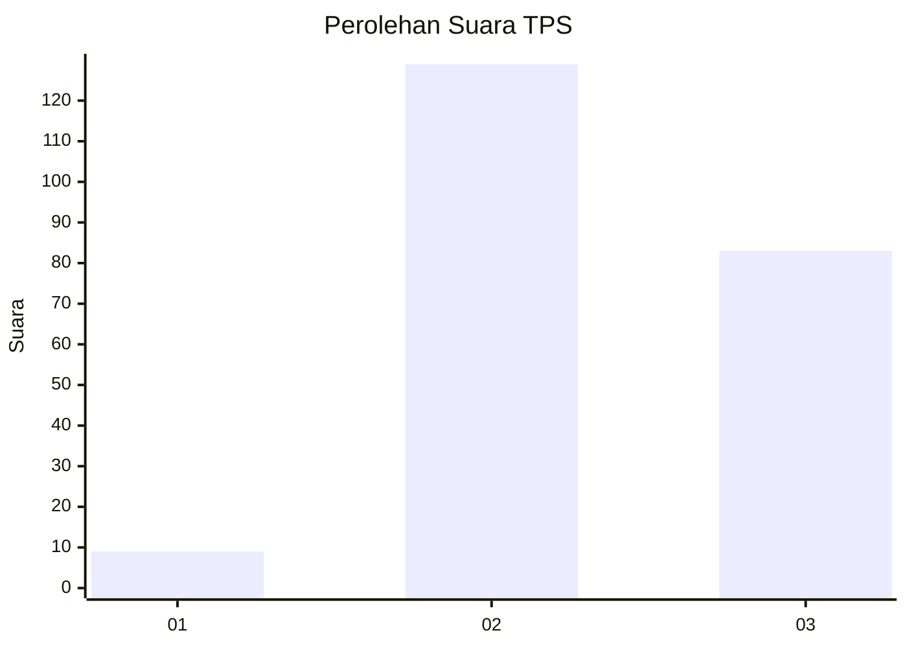
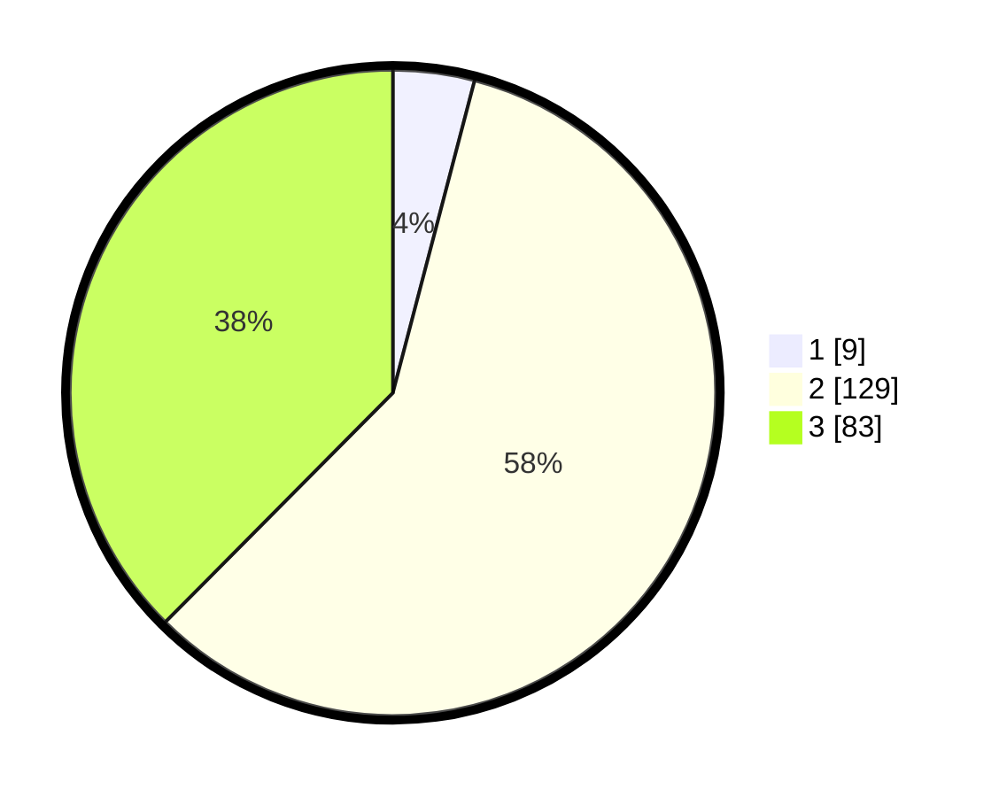

# Hasil

## Grafik

## Tabel

| No. | Nama Paslon    | Suara | Suara (raw) | Persentase |
|:--- |:-------------- | -----:| -----------:| ----------:|
| 1   | ANIES MUHAIMIN | 9     | [9][p-1]    | 4,07       |
| 2   | PRABOWO GIBRAN | 129   | [129][p-2]  | 58,37      |
| 3   | GANJAR MAHFUD  | 83    | [83][p-3]   | 37,56      |

[p-1]: https://github.com/gigit-pemilu/pemilu-2024-51-bali/blob/main/pilpres/hitung-suara/sub/51-bali/sub/71-kota-denpasar/sub/01-denpasar-selatan/sub/1003-sesetan/sub/010-tps/sub/paslon-1.txt
[p-2]: https://github.com/gigit-pemilu/pemilu-2024-51-bali/blob/main/pilpres/hitung-suara/sub/51-bali/sub/71-kota-denpasar/sub/01-denpasar-selatan/sub/1003-sesetan/sub/010-tps/sub/paslon-2.txt
[p-3]: https://github.com/gigit-pemilu/pemilu-2024-51-bali/blob/main/pilpres/hitung-suara/sub/51-bali/sub/71-kota-denpasar/sub/01-denpasar-selatan/sub/1003-sesetan/sub/010-tps/sub/paslon-3.txt

## Foto C Plano

https://sirekap-obj-formc.kpu.go.id/0f1d/pemilu/ppwp/51/71/01/10/03/5171011003010-20240214-191044--73241428-5d13-4ea4-bf9d-30601986deaf.jpg

https://sirekap-obj-formc.kpu.go.id/0f1d/pemilu/ppwp/51/71/01/10/03/5171011003010-20240214-191053--32880125-06c6-4d1c-81c4-556917286777.jpg

https://sirekap-obj-formc.kpu.go.id/0f1d/pemilu/ppwp/51/71/01/10/03/5171011003010-20240214-191057--342841d3-1a96-4f38-a847-2b4f5133cbd6.jpg

## Metadata

| Key        | Value               |
| ---------- | ------------------- |
| Time Stamp | 2024-02-24 22:31:28 |

