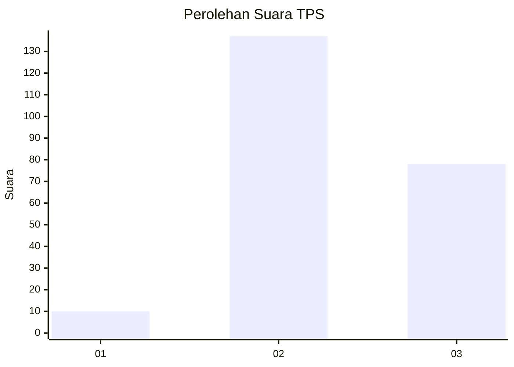
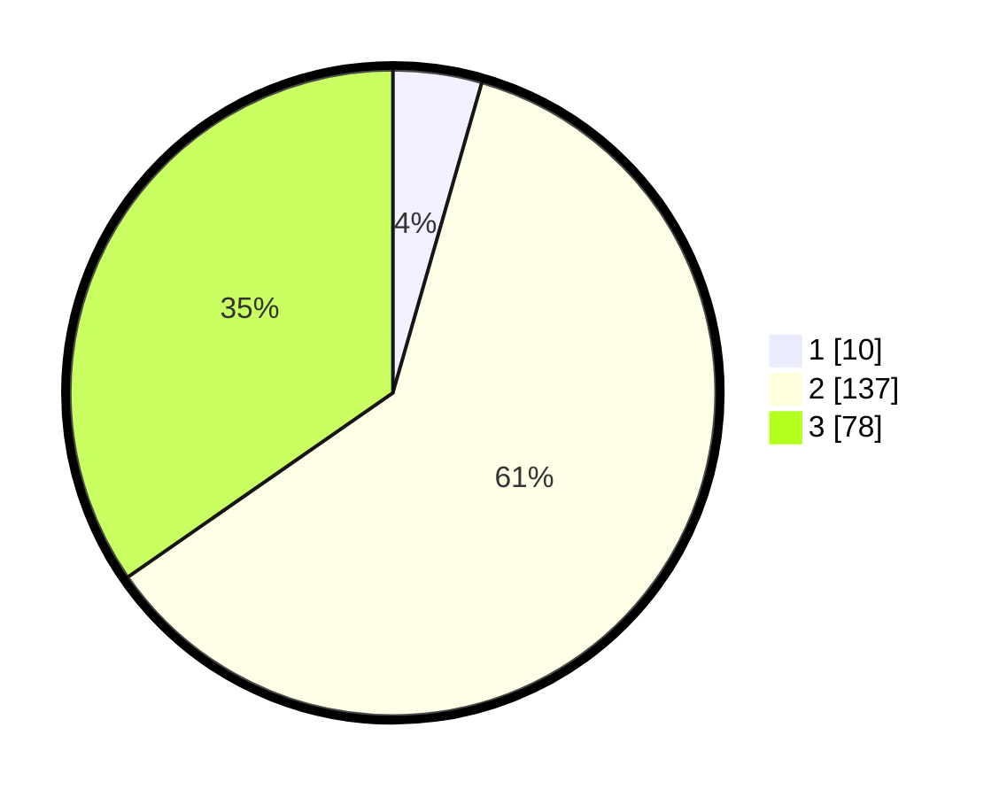

# Hasil

## Grafik

## Tabel

| No. | Nama Paslon    | Suara | Suara (raw) | Persentase |
|:--- |:-------------- | -----:| -----------:| ----------:|
| 1   | ANIES MUHAIMIN | 10    | [10][p-1]   | 4,44       |
| 2   | PRABOWO GIBRAN | 137   | [137][p-2]  | 60,89      |
| 3   | GANJAR MAHFUD  | 78    | [78][p-3]   | 34,67      |

[p-1]: https://github.com/gigit-pemilu/pemilu-2024-51-bali/blob/main/pilpres/hitung-suara/sub/51-bali/sub/71-kota-denpasar/sub/01-denpasar-selatan/sub/1003-sesetan/sub/043-tps/sub/paslon-1.txt
[p-2]: https://github.com/gigit-pemilu/pemilu-2024-51-bali/blob/main/pilpres/hitung-suara/sub/51-bali/sub/71-kota-denpasar/sub/01-denpasar-selatan/sub/1003-sesetan/sub/043-tps/sub/paslon-2.txt
[p-3]: https://github.com/gigit-pemilu/pemilu-2024-51-bali/blob/main/pilpres/hitung-suara/sub/51-bali/sub/71-kota-denpasar/sub/01-denpasar-selatan/sub/1003-sesetan/sub/043-tps/sub/paslon-3.txt

## Foto C Plano

https://sirekap-obj-formc.kpu.go.id/af99/pemilu/ppwp/51/71/01/10/03/5171011003043-20240215-010613--363fce0b-f68a-4ec3-81a8-8b05a3955067.jpg

https://sirekap-obj-formc.kpu.go.id/af99/pemilu/ppwp/51/71/01/10/03/5171011003043-20240215-010651--5f3a0a85-7f62-4867-9e72-9456953178f5.jpg

https://sirekap-obj-formc.kpu.go.id/af99/pemilu/ppwp/51/71/01/10/03/5171011003043-20240215-010723--bd9d4068-9656-4cde-abb0-5ad8bd662588.jpg

## Metadata

| Key        | Value               |
| ---------- | ------------------- |
| Time Stamp | 2024-02-24 22:31:28 |

