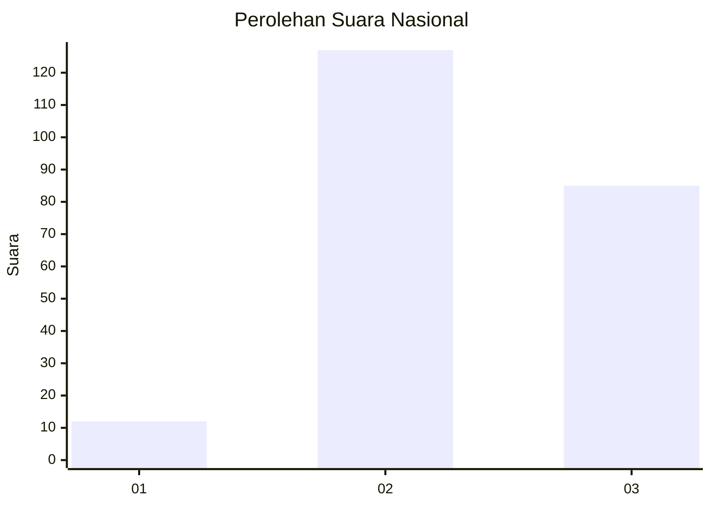
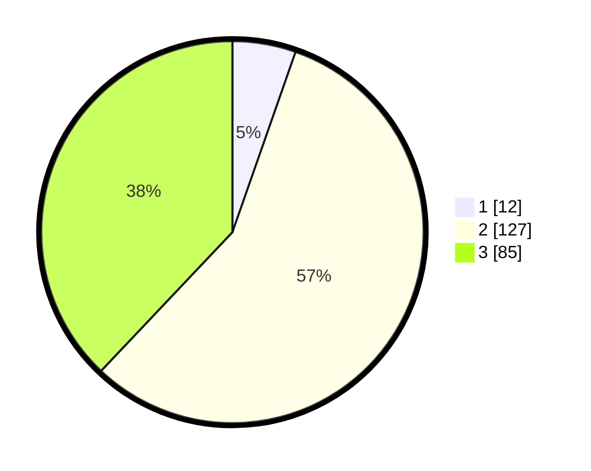

# Hasil

## Grafik

## Tabel

| No. | Nama Paslon    | Suara | Suara (raw) | Persentase |
|:--- |:-------------- | -----:| -----------:| ----------:|
| 1   | ANIES MUHAIMIN | 12    | [12][p-1]   | 5,36       |
| 2   | PRABOWO GIBRAN | 127   | [127][p-2]  | 56,70      |
| 3   | GANJAR MAHFUD  | 85    | [85][p-3]   | 37,95      |

[p-1]: https://github.com/gigit-pemilu/pemilu-2024/blob/main/pilpres/hitung-suara/sub/51-bali/sub/71-kota-denpasar/sub/01-denpasar-selatan/sub/1003-sesetan/sub/058-tps/sub/paslon-1.txt
[p-2]: https://github.com/gigit-pemilu/pemilu-2024/blob/main/pilpres/hitung-suara/sub/51-bali/sub/71-kota-denpasar/sub/01-denpasar-selatan/sub/1003-sesetan/sub/058-tps/sub/paslon-2.txt
[p-3]: https://github.com/gigit-pemilu/pemilu-2024/blob/main/pilpres/hitung-suara/sub/51-bali/sub/71-kota-denpasar/sub/01-denpasar-selatan/sub/1003-sesetan/sub/058-tps/sub/paslon-3.txt

## Foto C Plano

https://sirekap-obj-formc.kpu.go.id/9b5d/pemilu/ppwp/51/71/01/10/03/5171011003058-20240214-130701--158038ef-09d3-40ad-ae01-714bf6b862e5.jpg

https://sirekap-obj-formc.kpu.go.id/9b5d/pemilu/ppwp/51/71/01/10/03/5171011003058-20240214-130809--857b5ed3-2052-414c-a5ab-88b8a834fc34.jpg

https://sirekap-obj-formc.kpu.go.id/9b5d/pemilu/ppwp/51/71/01/10/03/5171011003058-20240214-131737--2f0f5c22-6ffa-494e-ae61-3ce20c83d539.jpg

## Metadata

| Key        | Value               |
| ---------- | ------------------- |
| Time Stamp | 2024-02-24 22:31:28 |

