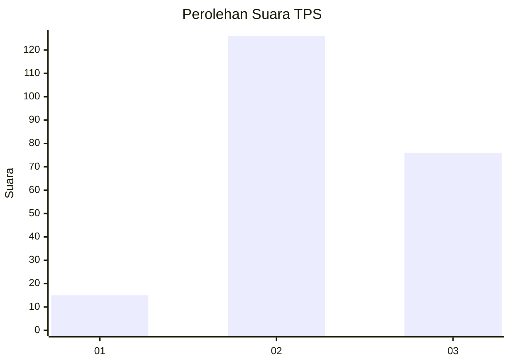
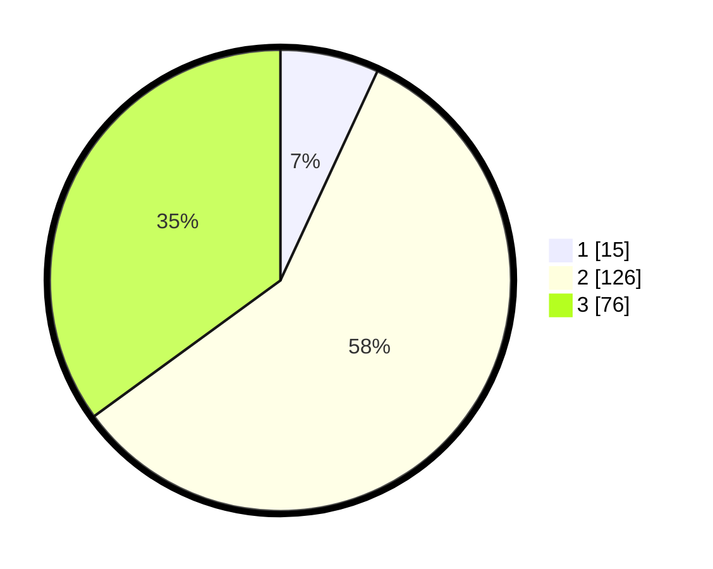

# Hasil

## Grafik

## Tabel

| No. | Nama Paslon    | Suara | Suara (raw) | Persentase |
|:--- |:-------------- | -----:| -----------:| ----------:|
| 1   | ANIES MUHAIMIN | 15    | [15][p-1]   | 6,91       |
| 2   | PRABOWO GIBRAN | 126   | [126][p-2]  | 58,06      |
| 3   | GANJAR MAHFUD  | 76    | [76][p-3]   | 35,02      |

[p-1]: https://github.com/gigit-pemilu/pemilu-2024-51-bali/blob/main/pilpres/hitung-suara/sub/51-bali/sub/71-kota-denpasar/sub/01-denpasar-selatan/sub/1003-sesetan/sub/062-tps/sub/paslon-1.txt
[p-2]: https://github.com/gigit-pemilu/pemilu-2024-51-bali/blob/main/pilpres/hitung-suara/sub/51-bali/sub/71-kota-denpasar/sub/01-denpasar-selatan/sub/1003-sesetan/sub/062-tps/sub/paslon-2.txt
[p-3]: https://github.com/gigit-pemilu/pemilu-2024-51-bali/blob/main/pilpres/hitung-suara/sub/51-bali/sub/71-kota-denpasar/sub/01-denpasar-selatan/sub/1003-sesetan/sub/062-tps/sub/paslon-3.txt

## Foto C Plano

https://sirekap-obj-formc.kpu.go.id/27b9/pemilu/ppwp/51/71/01/10/03/5171011003062-20240214-141444--aa47f572-4eb3-4668-bbea-0acc297aee17.jpg

https://sirekap-obj-formc.kpu.go.id/27b9/pemilu/ppwp/51/71/01/10/03/5171011003062-20240214-141804--7ab6e24f-1f18-4a4b-9f77-1d9354a1a5dc.jpg

https://sirekap-obj-formc.kpu.go.id/27b9/pemilu/ppwp/51/71/01/10/03/5171011003062-20240214-141719--da1eda83-a27d-4b5f-b921-1ccb29ec25d7.jpg

## Metadata

| Key        | Value               |
| ---------- | ------------------- |
| Time Stamp | 2024-02-24 22:31:28 |

