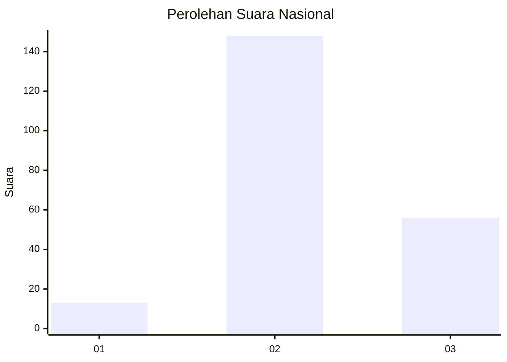

# Hasil

## Grafik

## Tabel

| No. | Nama Paslon    | Suara | Suara (raw) | Persentase |
|:--- |:-------------- | -----:| -----------:| ----------:|
| 1   | ANIES MUHAIMIN | 13    | [13][p-1]   | 5,99       |
| 2   | PRABOWO GIBRAN | 148   | [148][p-2]  | 68,20      |
| 3   | GANJAR MAHFUD  | 56    | [56][p-3]   | 25,81      |

[p-1]: https://github.com/gigit-pemilu/pemilu-2024/blob/main/pilpres/hitung-suara/sub/51-bali/sub/71-kota-denpasar/sub/01-denpasar-selatan/sub/1003-sesetan/sub/072-tps/sub/paslon-1.txt
[p-2]: https://github.com/gigit-pemilu/pemilu-2024/blob/main/pilpres/hitung-suara/sub/51-bali/sub/71-kota-denpasar/sub/01-denpasar-selatan/sub/1003-sesetan/sub/072-tps/sub/paslon-2.txt
[p-3]: https://github.com/gigit-pemilu/pemilu-2024/blob/main/pilpres/hitung-suara/sub/51-bali/sub/71-kota-denpasar/sub/01-denpasar-selatan/sub/1003-sesetan/sub/072-tps/sub/paslon-3.txt

## Foto C Plano

https://sirekap-obj-formc.kpu.go.id/74d4/pemilu/ppwp/51/71/01/10/03/5171011003072-20240214-131815--3925023b-95d2-4d22-aeaa-e1a653e2bc99.jpg

https://sirekap-obj-formc.kpu.go.id/74d4/pemilu/ppwp/51/71/01/10/03/5171011003072-20240214-131955--4357b4d3-3495-4806-ab2e-6d9a7797060b.jpg

https://sirekap-obj-formc.kpu.go.id/74d4/pemilu/ppwp/51/71/01/10/03/5171011003072-20240214-132100--cc7849e5-c373-412f-a7a3-9660d087de10.jpg

## Metadata

| Key        | Value               |
| ---------- | ------------------- |
| Time Stamp | 2024-02-24 22:31:28 |

