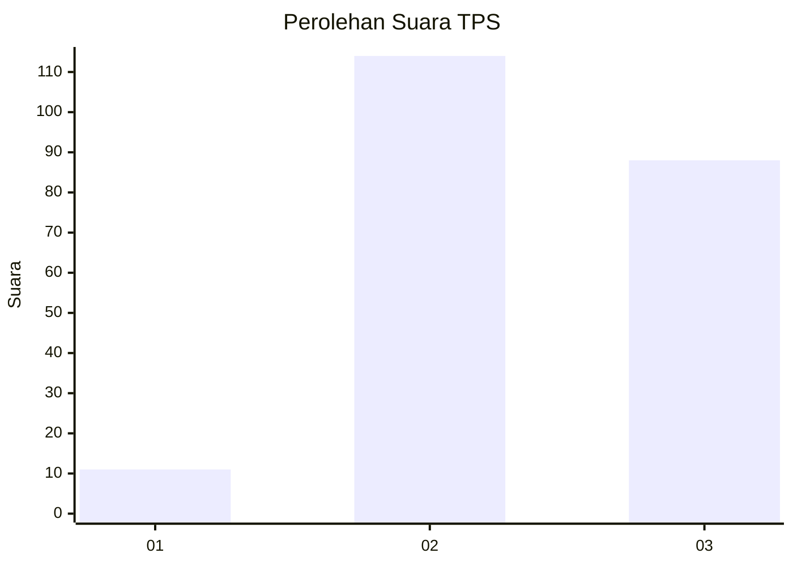
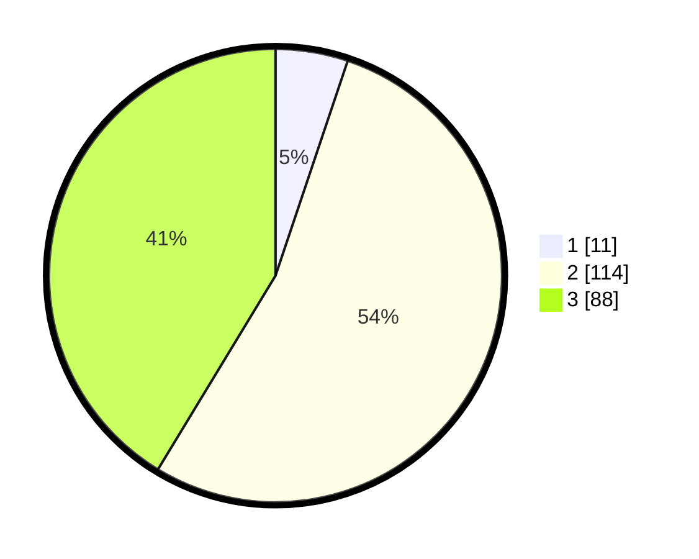

# Hasil

## Grafik

## Tabel

| No. | Nama Paslon    | Suara | Suara (raw) | Persentase |
|:--- |:-------------- | -----:| -----------:| ----------:|
| 1   | ANIES MUHAIMIN | 11    | [11][p-1]   | 5,16       |
| 2   | PRABOWO GIBRAN | 114   | [114][p-2]  | 53,52      |
| 3   | GANJAR MAHFUD  | 88    | [88][p-3]   | 41,31      |

[p-1]: https://github.com/gigit-pemilu/pemilu-2024-51-bali/blob/main/pilpres/hitung-suara/sub/51-bali/sub/71-kota-denpasar/sub/01-denpasar-selatan/sub/1003-sesetan/sub/074-tps/sub/paslon-1.txt
[p-2]: https://github.com/gigit-pemilu/pemilu-2024-51-bali/blob/main/pilpres/hitung-suara/sub/51-bali/sub/71-kota-denpasar/sub/01-denpasar-selatan/sub/1003-sesetan/sub/074-tps/sub/paslon-2.txt
[p-3]: https://github.com/gigit-pemilu/pemilu-2024-51-bali/blob/main/pilpres/hitung-suara/sub/51-bali/sub/71-kota-denpasar/sub/01-denpasar-selatan/sub/1003-sesetan/sub/074-tps/sub/paslon-3.txt

## Foto C Plano

https://sirekap-obj-formc.kpu.go.id/af2e/pemilu/ppwp/51/71/01/10/03/5171011003074-20240214-201209--a92c03ea-4525-4504-974f-1b8700248f41.jpg

https://sirekap-obj-formc.kpu.go.id/af2e/pemilu/ppwp/51/71/01/10/03/5171011003074-20240214-201113--f793744a-219a-433b-91ee-a2b780fb8bad.jpg

https://sirekap-obj-formc.kpu.go.id/af2e/pemilu/ppwp/51/71/01/10/03/5171011003074-20240214-201002--539d96ec-4cd9-4ee3-bb57-96c0260499dd.jpg

## Metadata

| Key        | Value               |
| ---------- | ------------------- |
| Time Stamp | 2024-02-24 22:31:28 |

