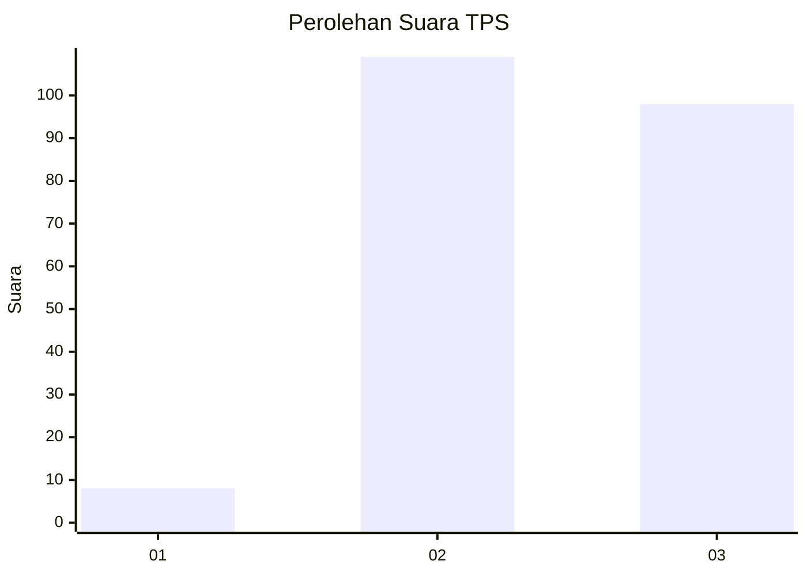
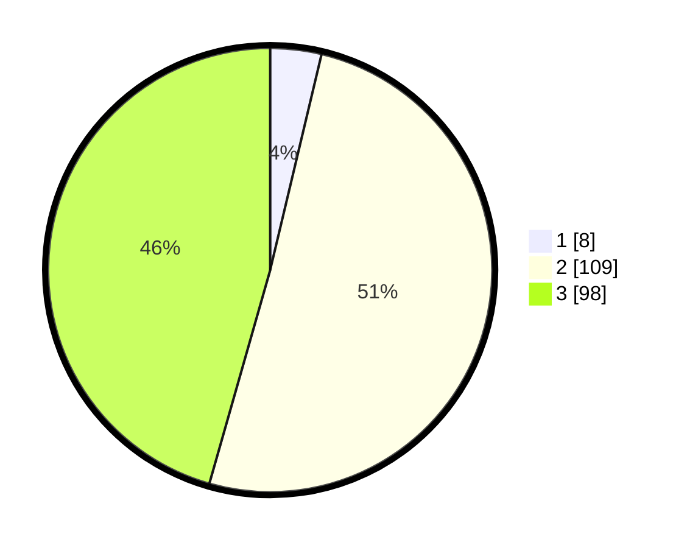

# Hasil

## Grafik

## Tabel

| No. | Nama Paslon    | Suara | Suara (raw) | Persentase |
|:--- |:-------------- | -----:| -----------:| ----------:|
| 1   | ANIES MUHAIMIN | 8     | [8][p-1]    | 3,72       |
| 2   | PRABOWO GIBRAN | 109   | [109][p-2]  | 50,70      |
| 3   | GANJAR MAHFUD  | 98    | [98][p-3]   | 45,58      |

[p-1]: https://github.com/gigit-pemilu/pemilu-2024-51-bali/blob/main/pilpres/hitung-suara/sub/51-bali/sub/71-kota-denpasar/sub/01-denpasar-selatan/sub/1003-sesetan/sub/105-tps/sub/paslon-1.txt
[p-2]: https://github.com/gigit-pemilu/pemilu-2024-51-bali/blob/main/pilpres/hitung-suara/sub/51-bali/sub/71-kota-denpasar/sub/01-denpasar-selatan/sub/1003-sesetan/sub/105-tps/sub/paslon-2.txt
[p-3]: https://github.com/gigit-pemilu/pemilu-2024-51-bali/blob/main/pilpres/hitung-suara/sub/51-bali/sub/71-kota-denpasar/sub/01-denpasar-selatan/sub/1003-sesetan/sub/105-tps/sub/paslon-3.txt

## Foto C Plano

https://sirekap-obj-formc.kpu.go.id/1e5c/pemilu/ppwp/51/71/01/10/03/5171011003105-20240214-202824--da590a31-72ba-42de-aaf4-d97e69aef23c.jpg

https://sirekap-obj-formc.kpu.go.id/1e5c/pemilu/ppwp/51/71/01/10/03/5171011003105-20240214-202927--fd1b2b43-469f-4ed4-bbdf-7e4b2b5fa6f1.jpg

https://sirekap-obj-formc.kpu.go.id/1e5c/pemilu/ppwp/51/71/01/10/03/5171011003105-20240214-203009--788d10b5-e5cc-4212-be76-451eccbe14be.jpg

## Metadata

| Key        | Value               |
| ---------- | ------------------- |
| Time Stamp | 2024-02-26 11:00:00 |

