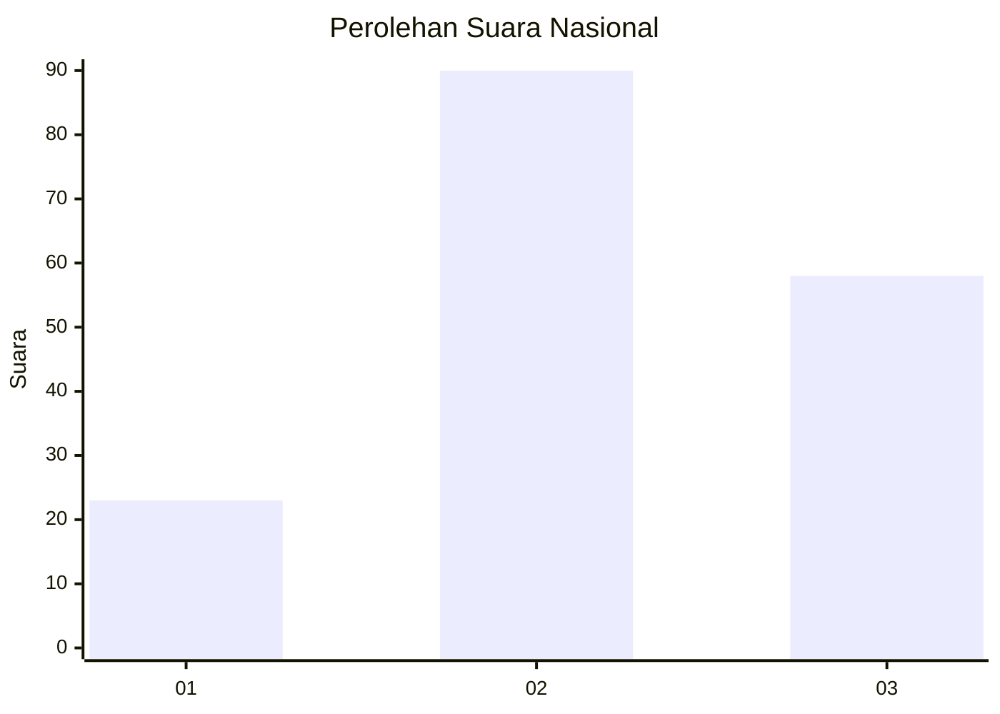
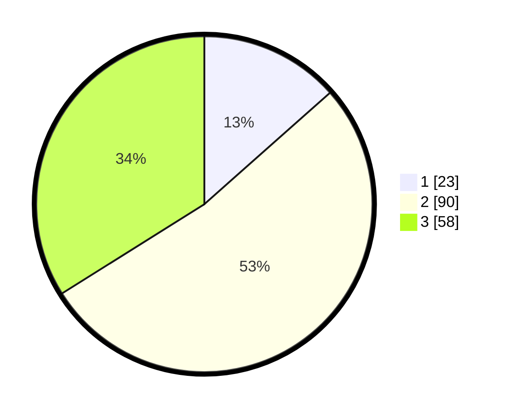

# Hasil

## Grafik

## Tabel

| No. | Nama Paslon    | Suara | Suara (raw) | Persentase |
|:--- |:-------------- | -----:| -----------:| ----------:|
| 1   | ANIES MUHAIMIN | 23    | [23][p-1]   | 13,45      |
| 2   | PRABOWO GIBRAN | 90    | [90][p-2]   | 52,63      |
| 3   | GANJAR MAHFUD  | 58    | [58][p-3]   | 33,92      |

[p-1]: https://github.com/gigit-pemilu/pemilu-2024/blob/main/pilpres/hitung-suara/sub/51-bali/sub/71-kota-denpasar/sub/01-denpasar-selatan/sub/1004-panjer/sub/002-tps/sub/paslon-1.txt
[p-2]: https://github.com/gigit-pemilu/pemilu-2024/blob/main/pilpres/hitung-suara/sub/51-bali/sub/71-kota-denpasar/sub/01-denpasar-selatan/sub/1004-panjer/sub/002-tps/sub/paslon-2.txt
[p-3]: https://github.com/gigit-pemilu/pemilu-2024/blob/main/pilpres/hitung-suara/sub/51-bali/sub/71-kota-denpasar/sub/01-denpasar-selatan/sub/1004-panjer/sub/002-tps/sub/paslon-3.txt

## Foto C Plano

https://sirekap-obj-formc.kpu.go.id/c19e/pemilu/ppwp/51/71/01/10/04/5171011004002-20240215-033204--c42464cc-28a5-4b00-9a8a-5fac1d024d90.jpg

https://sirekap-obj-formc.kpu.go.id/c19e/pemilu/ppwp/51/71/01/10/04/5171011004002-20240215-033212--ef1321cc-83a3-4c81-9337-32f8d2614379.jpg

https://sirekap-obj-formc.kpu.go.id/c19e/pemilu/ppwp/51/71/01/10/04/5171011004002-20240215-033217--68b22f49-e7e0-4afb-b03b-1ef967b532ad.jpg

## Metadata

| Key        | Value               |
| ---------- | ------------------- |
| Time Stamp | 2024-02-24 22:31:28 |

