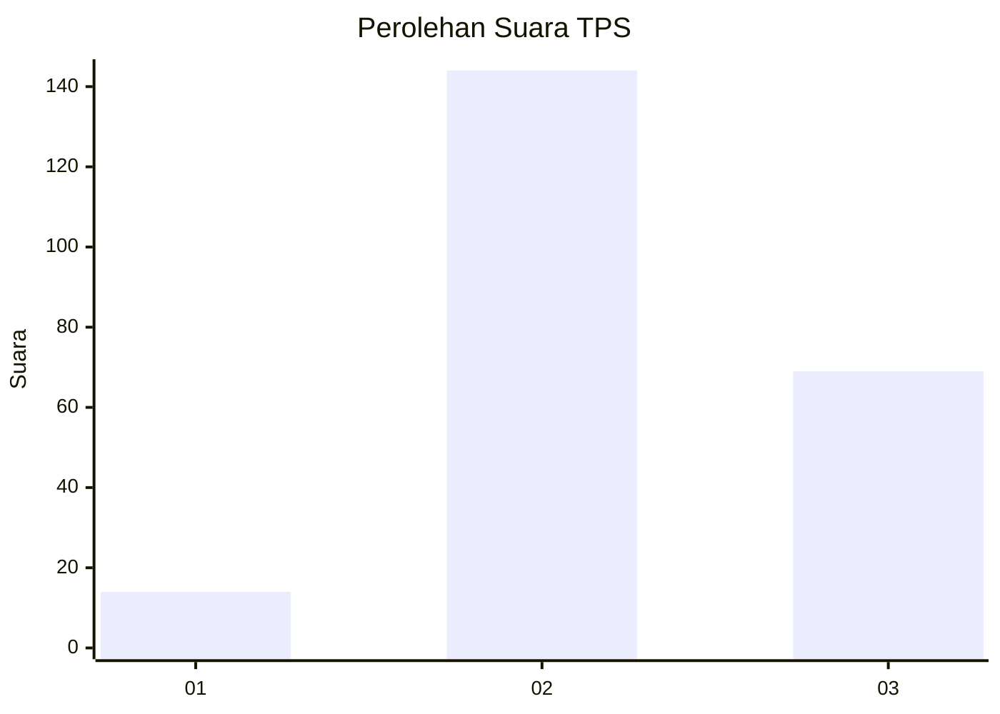
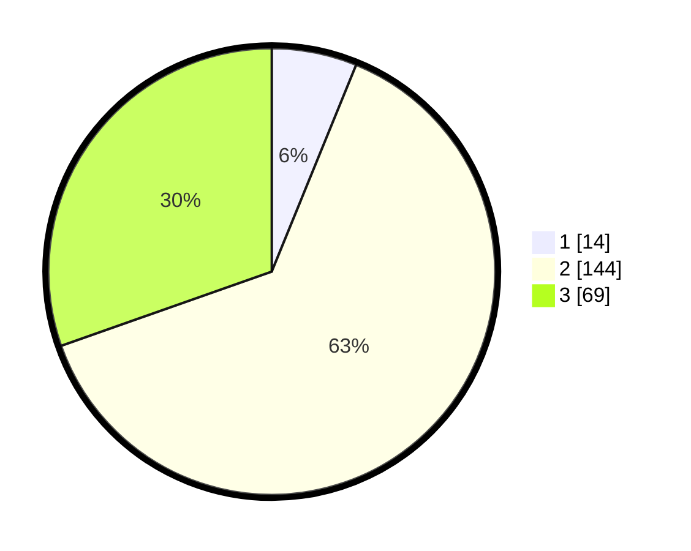

# Hasil

## Grafik

## Tabel

| No. | Nama Paslon    | Suara | Suara (raw) | Persentase |
|:--- |:-------------- | -----:| -----------:| ----------:|
| 1   | ANIES MUHAIMIN | 14    | [14][p-1]   | 6,17       |
| 2   | PRABOWO GIBRAN | 144   | [144][p-2]  | 63,44      |
| 3   | GANJAR MAHFUD  | 69    | [69][p-3]   | 30,40      |

[p-1]: https://github.com/gigit-pemilu/pemilu-2024-51-bali/blob/main/pilpres/hitung-suara/sub/51-bali/sub/71-kota-denpasar/sub/01-denpasar-selatan/sub/1004-panjer/sub/004-tps/sub/paslon-1.txt
[p-2]: https://github.com/gigit-pemilu/pemilu-2024-51-bali/blob/main/pilpres/hitung-suara/sub/51-bali/sub/71-kota-denpasar/sub/01-denpasar-selatan/sub/1004-panjer/sub/004-tps/sub/paslon-2.txt
[p-3]: https://github.com/gigit-pemilu/pemilu-2024-51-bali/blob/main/pilpres/hitung-suara/sub/51-bali/sub/71-kota-denpasar/sub/01-denpasar-selatan/sub/1004-panjer/sub/004-tps/sub/paslon-3.txt

## Foto C Plano

https://sirekap-obj-formc.kpu.go.id/bc27/pemilu/ppwp/51/71/01/10/04/5171011004004-20240214-205636--94756feb-c887-4bb5-9f51-b01094941fa9.jpg

https://sirekap-obj-formc.kpu.go.id/bc27/pemilu/ppwp/51/71/01/10/04/5171011004004-20240214-205730--3e6be126-12d5-4fae-9e52-e5f93d817cd2.jpg

https://sirekap-obj-formc.kpu.go.id/bc27/pemilu/ppwp/51/71/01/10/04/5171011004004-20240214-205851--83f54f95-3088-436d-a5af-616466c41a24.jpg

## Metadata

| Key        | Value               |
| ---------- | ------------------- |
| Time Stamp | 2024-02-25 14:00:00 |

