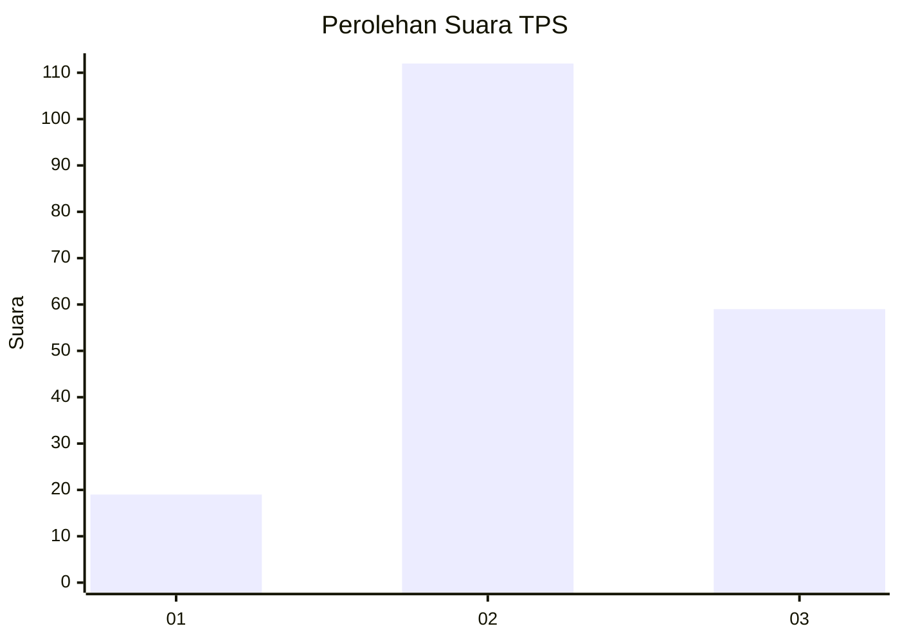
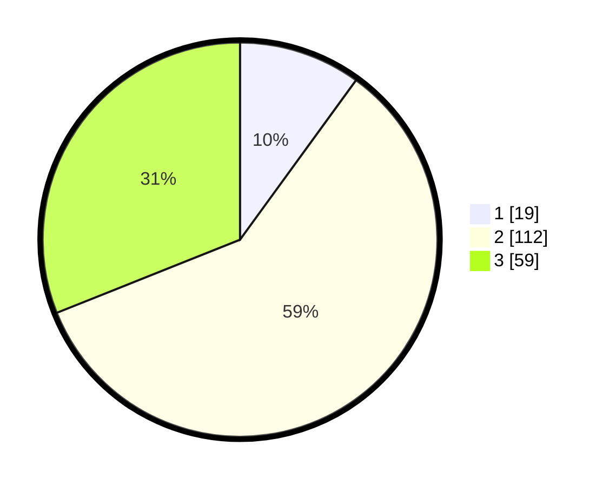

# Hasil

## Grafik

## Tabel

| No. | Nama Paslon    | Suara | Suara (raw) | Persentase |
|:--- |:-------------- | -----:| -----------:| ----------:|
| 1   | ANIES MUHAIMIN | 19    | [19][p-1]   | 10,00      |
| 2   | PRABOWO GIBRAN | 112   | [112][p-2]  | 58,95      |
| 3   | GANJAR MAHFUD  | 59    | [59][p-3]   | 31,05      |

[p-1]: https://github.com/gigit-pemilu/pemilu-2024-51-bali/blob/main/pilpres/hitung-suara/sub/51-bali/sub/71-kota-denpasar/sub/01-denpasar-selatan/sub/1004-panjer/sub/020-tps/sub/paslon-1.txt
[p-2]: https://github.com/gigit-pemilu/pemilu-2024-51-bali/blob/main/pilpres/hitung-suara/sub/51-bali/sub/71-kota-denpasar/sub/01-denpasar-selatan/sub/1004-panjer/sub/020-tps/sub/paslon-2.txt
[p-3]: https://github.com/gigit-pemilu/pemilu-2024-51-bali/blob/main/pilpres/hitung-suara/sub/51-bali/sub/71-kota-denpasar/sub/01-denpasar-selatan/sub/1004-panjer/sub/020-tps/sub/paslon-3.txt

## Foto C Plano

https://sirekap-obj-formc.kpu.go.id/cae3/pemilu/ppwp/51/71/01/10/04/5171011004020-20240214-201449--66b00eff-3d6a-44d0-95c1-d09a19c667f7.jpg

https://sirekap-obj-formc.kpu.go.id/cae3/pemilu/ppwp/51/71/01/10/04/5171011004020-20240214-200538--04074c07-8424-48f3-82e4-e7520745ef0b.jpg

https://sirekap-obj-formc.kpu.go.id/cae3/pemilu/ppwp/51/71/01/10/04/5171011004020-20240214-201549--9db9d8ed-6941-4e3a-b751-639e640b911b.jpg

## Metadata

| Key        | Value               |
| ---------- | ------------------- |
| Time Stamp | 2024-02-24 22:31:28 |

