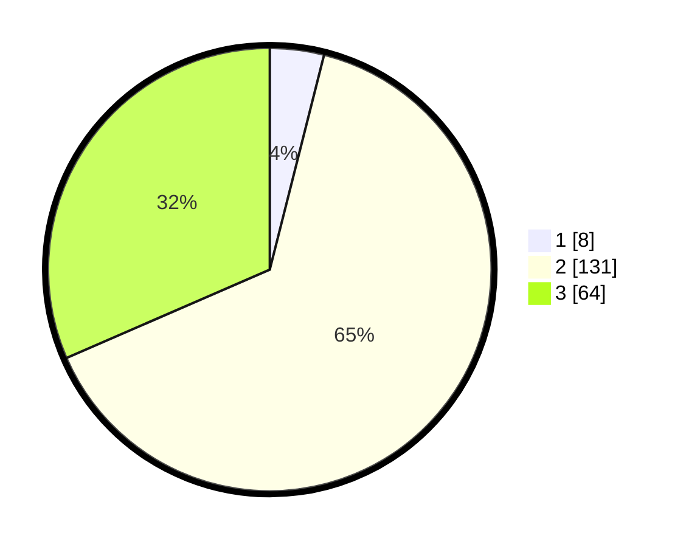

# Hasil

## Grafik

## Tabel

| No. | Nama Paslon    | Suara | Suara (raw) | Persentase |
|:--- |:-------------- | -----:| -----------:| ----------:|
| 1   | ANIES MUHAIMIN | 8     | [8][p-1]    | 3,94       |
| 2   | PRABOWO GIBRAN | 131   | [131][p-2]  | 64,53      |
| 3   | GANJAR MAHFUD  | 64    | [64][p-3]   | 31,53      |

[p-1]: https://github.com/gigit-pemilu/pemilu-2024-51-bali/blob/main/pilpres/hitung-suara/sub/51-bali/sub/71-kota-denpasar/sub/01-denpasar-selatan/sub/1004-panjer/sub/041-tps/sub/paslon-1.txt
[p-2]: https://github.com/gigit-pemilu/pemilu-2024-51-bali/blob/main/pilpres/hitung-suara/sub/51-bali/sub/71-kota-denpasar/sub/01-denpasar-selatan/sub/1004-panjer/sub/041-tps/sub/paslon-2.txt
[p-3]: https://github.com/gigit-pemilu/pemilu-2024-51-bali/blob/main/pilpres/hitung-suara/sub/51-bali/sub/71-kota-denpasar/sub/01-denpasar-selatan/sub/1004-panjer/sub/041-tps/sub/paslon-3.txt

## Foto C Plano

https://sirekap-obj-formc.kpu.go.id/13e2/pemilu/ppwp/51/71/01/10/04/5171011004041-20240214-201858--a573e966-d92f-4d58-90c3-13400861953a.jpg

https://sirekap-obj-formc.kpu.go.id/13e2/pemilu/ppwp/51/71/01/10/04/5171011004041-20240214-202320--987bc892-83a1-4370-aac3-7655d923e95d.jpg

https://sirekap-obj-formc.kpu.go.id/13e2/pemilu/ppwp/51/71/01/10/04/5171011004041-20240214-202558--53f509cf-ab48-4c2c-994d-63b82bc119a0.jpg

## Metadata

| Key        | Value               |
| ---------- | ------------------- |
| Time Stamp | 2024-02-14 21:46:01 |

## DATA PEMILIH TETAP

Jumlah pemilih dalam DPT: **279**.
 * L: **131**.
 * P: **148**.

## DATA PENGGUNA HAK PILIH

Jumlah pengguna hak pilih dalam DPT: **199**.
 * L: **93**.
 * P: **106**.

Jumlah pengguna hak pilih dalam DPTb: **3**.
 * L: **1**.
 * P: **2**.

Jumlah pengguna hak pilih dalam DPK: **6**.
 * L: **5**.
 * P: **1**.

Jumlah pengguna hak pilih: **208**.
 * L: **99**.
 * P: **109**.

## JUMLAH SUARA SAH DAN TIDAK SAH

JUMLAH SELURUH SUARA SAH: **203**.

JUMLAH SUARA TIDAK SAH: **5**.

JUMLAH SELURUH SUARA SAH DAN SUARA TIDAK SAH: **208**.

