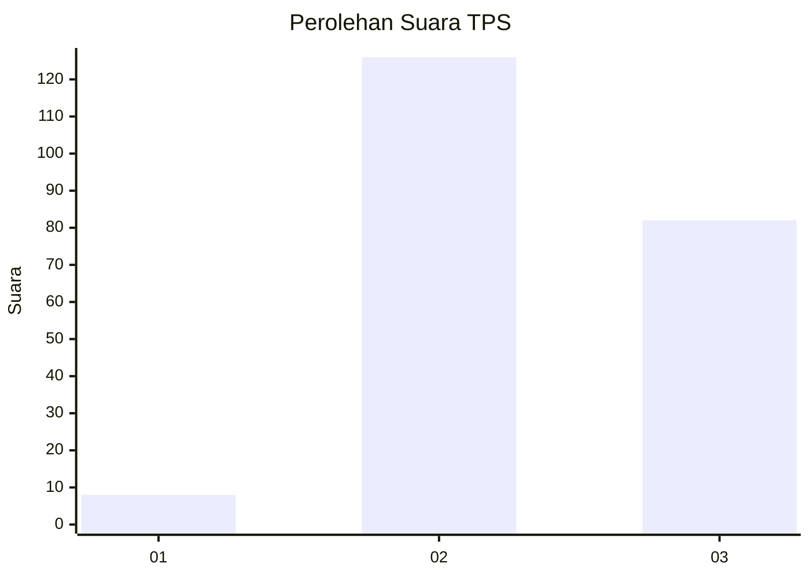
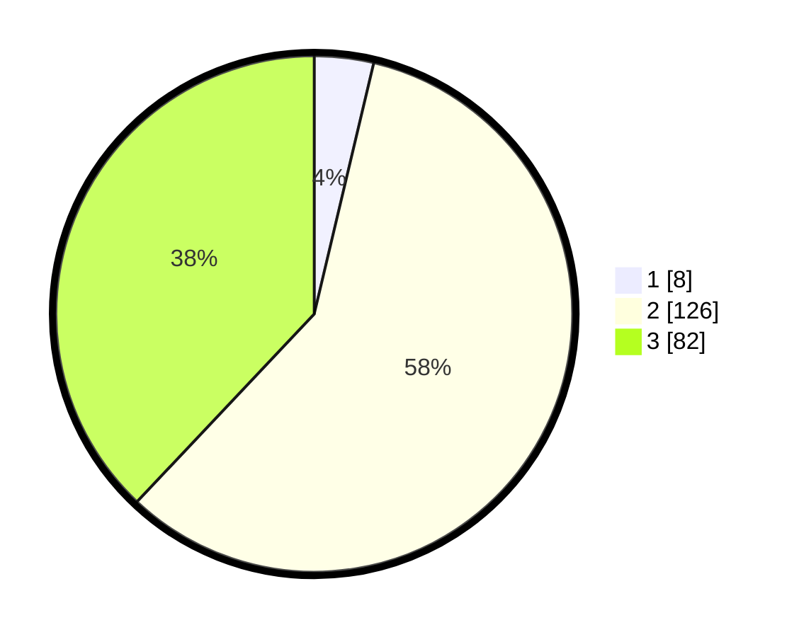

# Hasil

## Grafik

## Tabel

| No. | Nama Paslon    | Suara | Suara (raw) | Persentase |
|:--- |:-------------- | -----:| -----------:| ----------:|
| 1   | ANIES MUHAIMIN | 8     | [8][p-1]    | 3,70       |
| 2   | PRABOWO GIBRAN | 126   | [126][p-2]  | 58,33      |
| 3   | GANJAR MAHFUD  | 82    | [82][p-3]   | 37,96      |

[p-1]: https://github.com/gigit-pemilu/pemilu-2024-51-bali/blob/main/pilpres/hitung-suara/sub/51-bali/sub/71-kota-denpasar/sub/01-denpasar-selatan/sub/1004-panjer/sub/060-tps/sub/paslon-1.txt
[p-2]: https://github.com/gigit-pemilu/pemilu-2024-51-bali/blob/main/pilpres/hitung-suara/sub/51-bali/sub/71-kota-denpasar/sub/01-denpasar-selatan/sub/1004-panjer/sub/060-tps/sub/paslon-2.txt
[p-3]: https://github.com/gigit-pemilu/pemilu-2024-51-bali/blob/main/pilpres/hitung-suara/sub/51-bali/sub/71-kota-denpasar/sub/01-denpasar-selatan/sub/1004-panjer/sub/060-tps/sub/paslon-3.txt

## Foto C Plano

https://sirekap-obj-formc.kpu.go.id/7f0e/pemilu/ppwp/51/71/01/10/04/5171011004060-20240214-133025--027a2c3e-2e26-44fd-8e67-9400cd05bbfc.jpg

https://sirekap-obj-formc.kpu.go.id/7f0e/pemilu/ppwp/51/71/01/10/04/5171011004060-20240214-133423--168d677d-3ae6-496e-bfd0-c8977f603e8c.jpg

https://sirekap-obj-formc.kpu.go.id/7f0e/pemilu/ppwp/51/71/01/10/04/5171011004060-20240214-133400--4805c1f5-03f4-42c7-a19a-8d4d8a5e68db.jpg

## Metadata

| Key        | Value               |
| ---------- | ------------------- |
| Time Stamp | 2024-02-24 23:00:00 |

