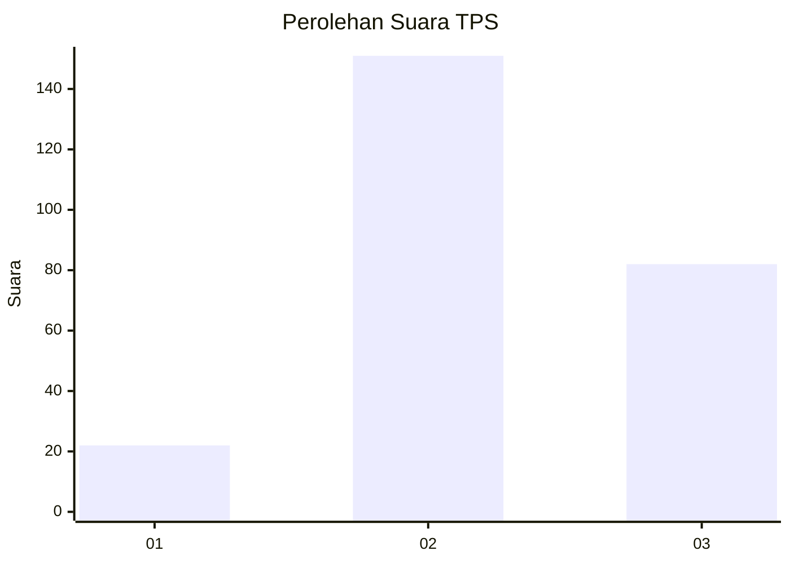
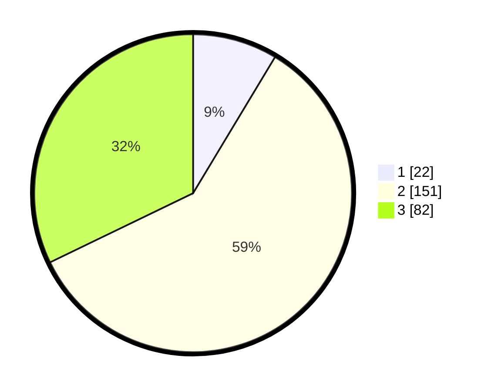

# Hasil

## Grafik

## Tabel

| No. | Nama Paslon    | Suara | Suara (raw) | Persentase |
|:--- |:-------------- | -----:| -----------:| ----------:|
| 1   | ANIES MUHAIMIN | 22    | [22][p-1]   | 8,63       |
| 2   | PRABOWO GIBRAN | 151   | [151][p-2]  | 59,22      |
| 3   | GANJAR MAHFUD  | 82    | [82][p-3]   | 32,16      |

[p-1]: https://github.com/gigit-pemilu/pemilu-2024-51-bali/blob/main/pilpres/hitung-suara/sub/51-bali/sub/71-kota-denpasar/sub/01-denpasar-selatan/sub/1005-renon/sub/001-tps/sub/paslon-1.txt
[p-2]: https://github.com/gigit-pemilu/pemilu-2024-51-bali/blob/main/pilpres/hitung-suara/sub/51-bali/sub/71-kota-denpasar/sub/01-denpasar-selatan/sub/1005-renon/sub/001-tps/sub/paslon-2.txt
[p-3]: https://github.com/gigit-pemilu/pemilu-2024-51-bali/blob/main/pilpres/hitung-suara/sub/51-bali/sub/71-kota-denpasar/sub/01-denpasar-selatan/sub/1005-renon/sub/001-tps/sub/paslon-3.txt

## Foto C Plano

https://sirekap-obj-formc.kpu.go.id/6b84/pemilu/ppwp/51/71/01/10/05/5171011005001-20240214-221855--ad8b0d96-b5ce-4e19-81ff-bc4636488cb2.jpg

https://sirekap-obj-formc.kpu.go.id/6b84/pemilu/ppwp/51/71/01/10/05/5171011005001-20240214-222240--2f4fe4ce-218c-4492-b236-7f14ec41d437.jpg

https://sirekap-obj-formc.kpu.go.id/6b84/pemilu/ppwp/51/71/01/10/05/5171011005001-20240214-222319--efd193df-179b-4a5a-9874-241aa365cff7.jpg

## Metadata

| Key        | Value               |
| ---------- | ------------------- |
| Time Stamp | 2024-02-24 22:31:28 |

