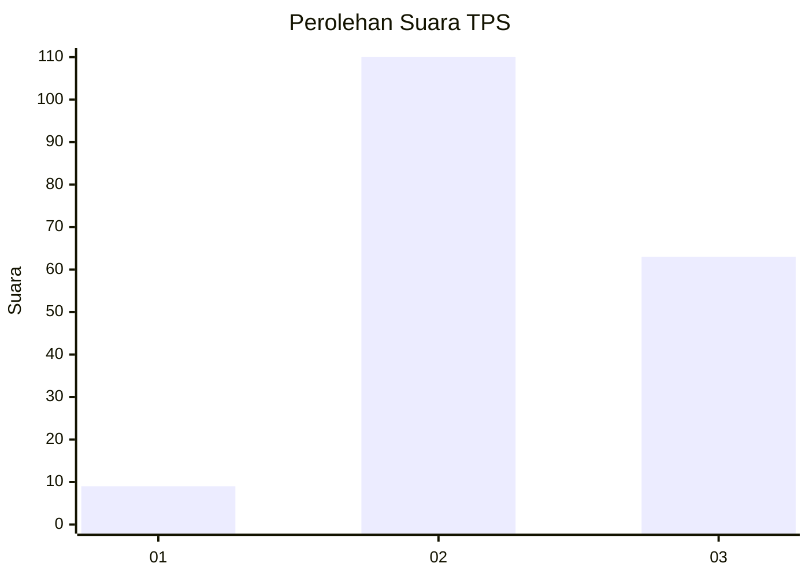
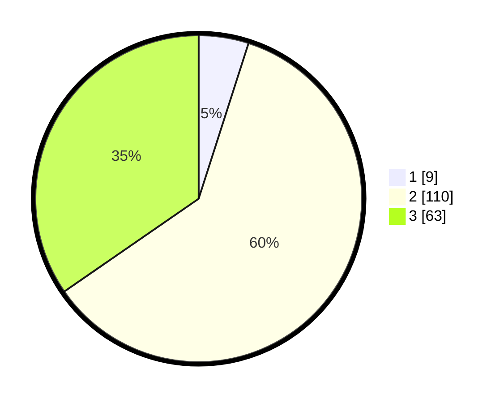

# Hasil

## Grafik

## Tabel

| No. | Nama Paslon    | Suara | Suara (raw) | Persentase |
|:--- |:-------------- | -----:| -----------:| ----------:|
| 1   | ANIES MUHAIMIN | 9     | [9][p-1]    | 4,95       |
| 2   | PRABOWO GIBRAN | 110   | [110][p-2]  | 60,44      |
| 3   | GANJAR MAHFUD  | 63    | [63][p-3]   | 34,62      |

[p-1]: https://github.com/gigit-pemilu/pemilu-2024-51-bali/blob/main/pilpres/hitung-suara/sub/51-bali/sub/71-kota-denpasar/sub/01-denpasar-selatan/sub/1005-renon/sub/015-tps/sub/paslon-1.txt
[p-2]: https://github.com/gigit-pemilu/pemilu-2024-51-bali/blob/main/pilpres/hitung-suara/sub/51-bali/sub/71-kota-denpasar/sub/01-denpasar-selatan/sub/1005-renon/sub/015-tps/sub/paslon-2.txt
[p-3]: https://github.com/gigit-pemilu/pemilu-2024-51-bali/blob/main/pilpres/hitung-suara/sub/51-bali/sub/71-kota-denpasar/sub/01-denpasar-selatan/sub/1005-renon/sub/015-tps/sub/paslon-3.txt

## Foto C Plano

https://sirekap-obj-formc.kpu.go.id/0f78/pemilu/ppwp/51/71/01/10/05/5171011005015-20240214-141346--07930473-1937-4586-82ea-d7186f871caa.jpg

https://sirekap-obj-formc.kpu.go.id/0f78/pemilu/ppwp/51/71/01/10/05/5171011005015-20240214-141459--07de63fe-5e8d-4390-a7bd-f52347f07033.jpg

https://sirekap-obj-formc.kpu.go.id/0f78/pemilu/ppwp/51/71/01/10/05/5171011005015-20240214-141549--8d09c4af-d2a2-41db-8bf7-3877522abebf.jpg

## Metadata

| Key        | Value               |
| ---------- | ------------------- |
| Time Stamp | 2024-02-14 21:46:01 |

## DATA PEMILIH TETAP

Jumlah pemilih dalam DPT: **259**.
 * L: **123**.
 * P: **136**.

## DATA PENGGUNA HAK PILIH

Jumlah pengguna hak pilih dalam DPT: **174**.
 * L: **84**.
 * P: **90**.

Jumlah pengguna hak pilih dalam DPTb: **9**.
 * L: **3**.
 * P: **6**.

Jumlah pengguna hak pilih dalam DPK: **4**.
 * L: **2**.
 * P: **2**.

Jumlah pengguna hak pilih: **187**.
 * L: **89**.
 * P: **98**.

## JUMLAH SUARA SAH DAN TIDAK SAH

JUMLAH SELURUH SUARA SAH: **182**.

JUMLAH SUARA TIDAK SAH: **5**.

JUMLAH SELURUH SUARA SAH DAN SUARA TIDAK SAH: **187**.

