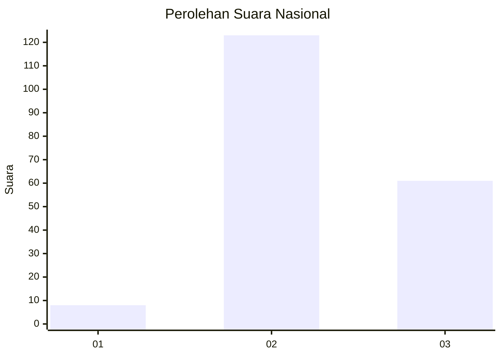
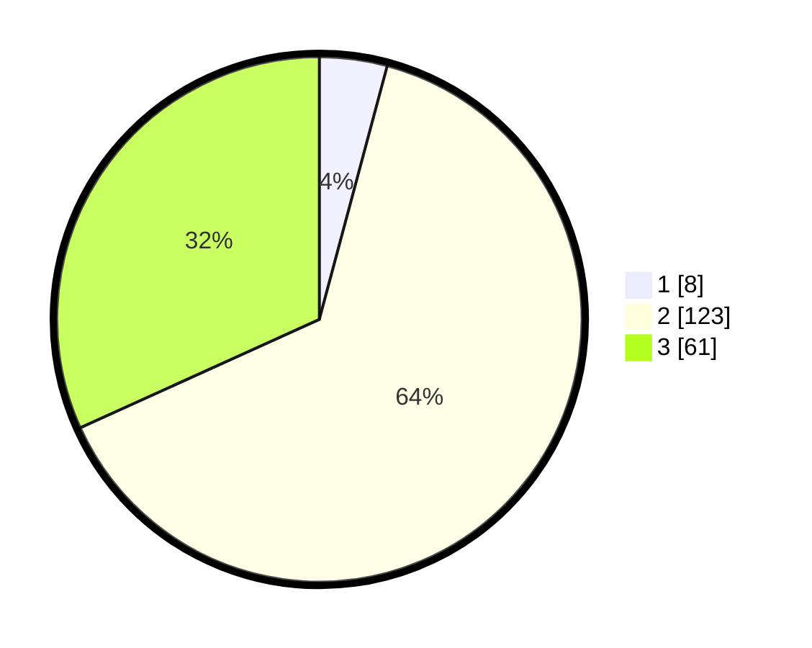

# Hasil

## Grafik

## Tabel

| No. | Nama Paslon    | Suara | Suara (raw) | Persentase |
|:--- |:-------------- | -----:| -----------:| ----------:|
| 1   | ANIES MUHAIMIN | 8     | [8][p-1]    | 4,17       |
| 2   | PRABOWO GIBRAN | 123   | [123][p-2]  | 64,06      |
| 3   | GANJAR MAHFUD  | 61    | [61][p-3]   | 31,77      |

[p-1]: https://github.com/gigit-pemilu/pemilu-2024/blob/main/pilpres/hitung-suara/sub/51-bali/sub/71-kota-denpasar/sub/01-denpasar-selatan/sub/2007-sidakarya/sub/023-tps/sub/paslon-1.txt
[p-2]: https://github.com/gigit-pemilu/pemilu-2024/blob/main/pilpres/hitung-suara/sub/51-bali/sub/71-kota-denpasar/sub/01-denpasar-selatan/sub/2007-sidakarya/sub/023-tps/sub/paslon-2.txt
[p-3]: https://github.com/gigit-pemilu/pemilu-2024/blob/main/pilpres/hitung-suara/sub/51-bali/sub/71-kota-denpasar/sub/01-denpasar-selatan/sub/2007-sidakarya/sub/023-tps/sub/paslon-3.txt

## Foto C Plano

https://sirekap-obj-formc.kpu.go.id/606c/pemilu/ppwp/51/71/01/20/07/5171012007023-20240215-003003--ed6ad3ea-6b0a-4542-817e-222d6a7e7806.jpg

https://sirekap-obj-formc.kpu.go.id/606c/pemilu/ppwp/51/71/01/20/07/5171012007023-20240215-003048--068f88c5-f8cf-48dc-a3b9-1aada3eb72f4.jpg

https://sirekap-obj-formc.kpu.go.id/606c/pemilu/ppwp/51/71/01/20/07/5171012007023-20240215-003129--9f36732e-ad74-47a3-b511-5c5fd0ffa9e2.jpg

## Metadata

| Key        | Value               |
| ---------- | ------------------- |
| Time Stamp | 2024-02-24 22:31:28 |

