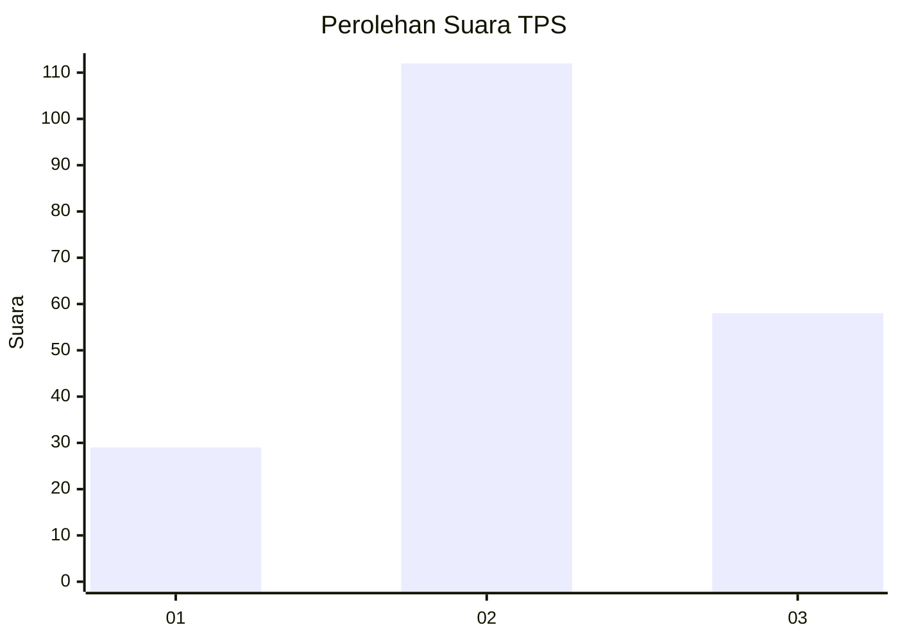
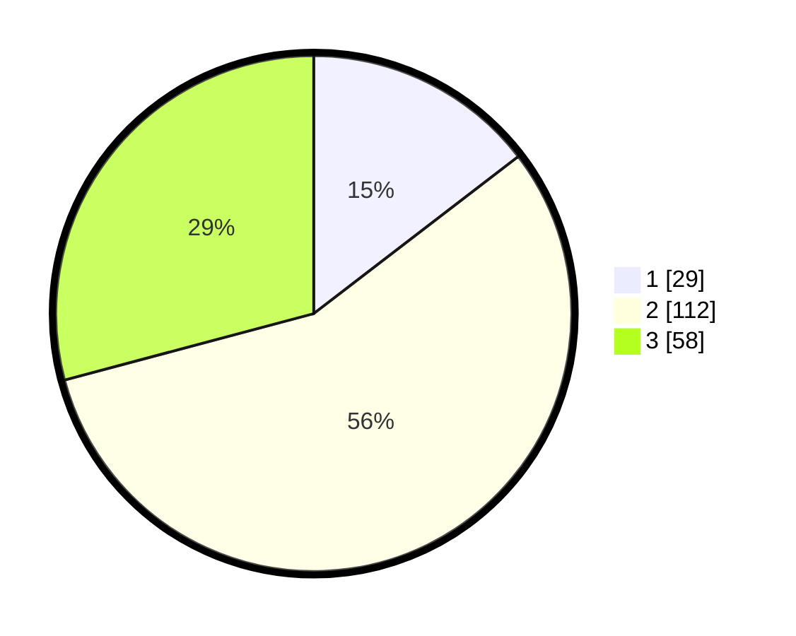

# Hasil

## Grafik

## Tabel

| No. | Nama Paslon    | Suara | Suara (raw) | Persentase |
|:--- |:-------------- | -----:| -----------:| ----------:|
| 1   | ANIES MUHAIMIN | 29    | [29][p-1]   | 14,57      |
| 2   | PRABOWO GIBRAN | 112   | [112][p-2]  | 56,28      |
| 3   | GANJAR MAHFUD  | 58    | [58][p-3]   | 29,15      |

[p-1]: https://github.com/gigit-pemilu/pemilu-2024-51-bali/blob/main/pilpres/hitung-suara/sub/51-bali/sub/71-kota-denpasar/sub/01-denpasar-selatan/sub/2007-sidakarya/sub/028-tps/sub/paslon-1.txt
[p-2]: https://github.com/gigit-pemilu/pemilu-2024-51-bali/blob/main/pilpres/hitung-suara/sub/51-bali/sub/71-kota-denpasar/sub/01-denpasar-selatan/sub/2007-sidakarya/sub/028-tps/sub/paslon-2.txt
[p-3]: https://github.com/gigit-pemilu/pemilu-2024-51-bali/blob/main/pilpres/hitung-suara/sub/51-bali/sub/71-kota-denpasar/sub/01-denpasar-selatan/sub/2007-sidakarya/sub/028-tps/sub/paslon-3.txt

## Foto C Plano

https://sirekap-obj-formc.kpu.go.id/c717/pemilu/ppwp/51/71/01/20/07/5171012007028-20240214-140928--b65db731-f7b6-4d47-a278-bb2320b88024.jpg

https://sirekap-obj-formc.kpu.go.id/c717/pemilu/ppwp/51/71/01/20/07/5171012007028-20240214-141931--9d6a8ff8-572f-49d2-b613-afdd19911f6e.jpg

https://sirekap-obj-formc.kpu.go.id/c717/pemilu/ppwp/51/71/01/20/07/5171012007028-20240214-141417--2d0886fd-6951-4a6a-a7ad-c60dab27e967.jpg

## Metadata

| Key        | Value               |
| ---------- | ------------------- |
| Time Stamp | 2024-02-24 22:31:28 |

