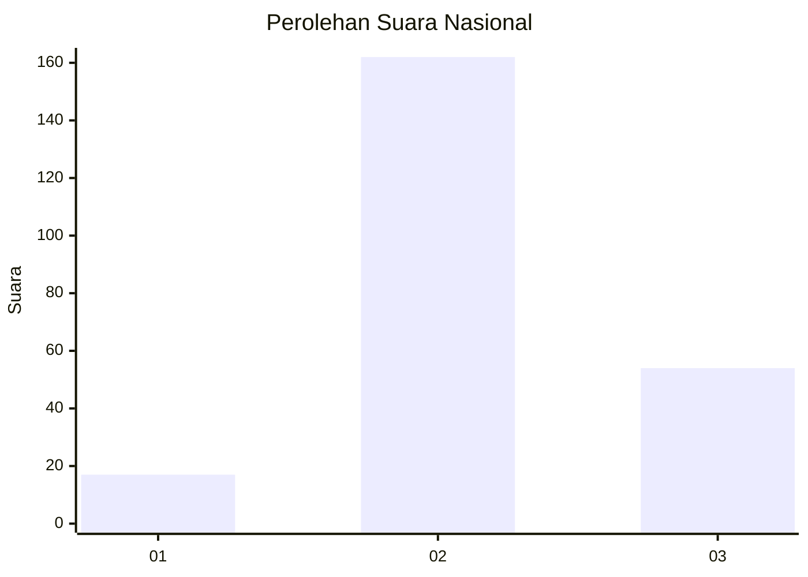
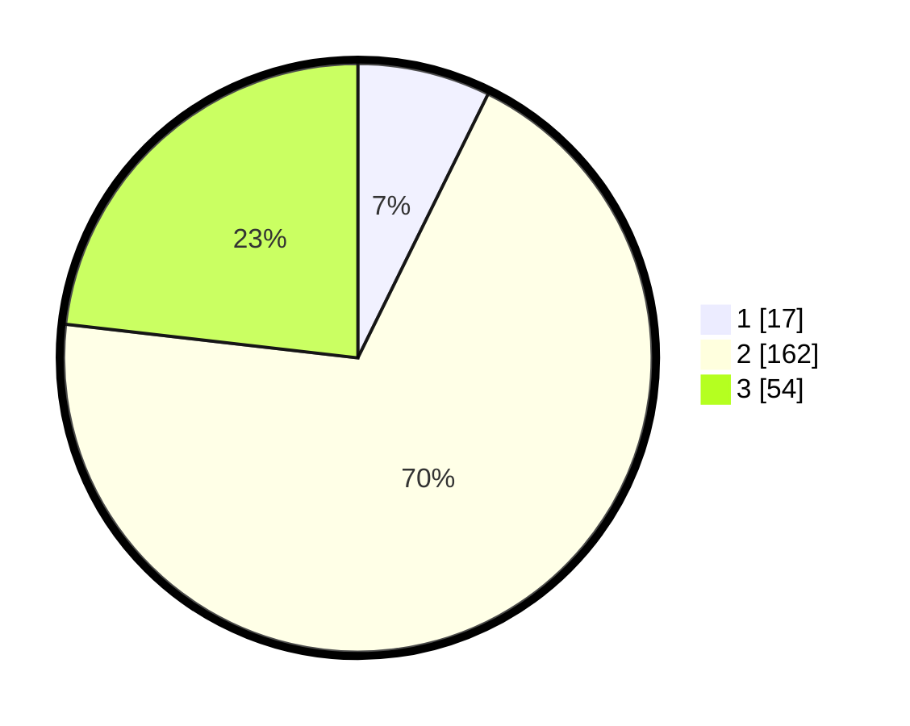

# Hasil

## Grafik

## Tabel

| No. | Nama Paslon    | Suara | Suara (raw) | Persentase |
|:--- |:-------------- | -----:| -----------:| ----------:|
| 1   | ANIES MUHAIMIN | 17    | [17][p-1]   | 7,30       |
| 2   | PRABOWO GIBRAN | 162   | [162][p-2]  | 69,53      |
| 3   | GANJAR MAHFUD  | 54    | [54][p-3]   | 23,18      |

[p-1]: https://github.com/gigit-pemilu/pemilu-2024/blob/main/pilpres/hitung-suara/sub/51-bali/sub/71-kota-denpasar/sub/01-denpasar-selatan/sub/2008-pemogan/sub/013-tps/sub/paslon-1.txt
[p-2]: https://github.com/gigit-pemilu/pemilu-2024/blob/main/pilpres/hitung-suara/sub/51-bali/sub/71-kota-denpasar/sub/01-denpasar-selatan/sub/2008-pemogan/sub/013-tps/sub/paslon-2.txt
[p-3]: https://github.com/gigit-pemilu/pemilu-2024/blob/main/pilpres/hitung-suara/sub/51-bali/sub/71-kota-denpasar/sub/01-denpasar-selatan/sub/2008-pemogan/sub/013-tps/sub/paslon-3.txt

## Foto C Plano

https://sirekap-obj-formc.kpu.go.id/6ac4/pemilu/ppwp/51/71/01/20/08/5171012008013-20240216-120117--b438e192-552f-4726-b38e-b544b9e929c3.jpg

https://sirekap-obj-formc.kpu.go.id/6ac4/pemilu/ppwp/51/71/01/20/08/5171012008013-20240214-200202--8f98421c-0d80-49ba-b0ca-3d28796f02e0.jpg

https://sirekap-obj-formc.kpu.go.id/6ac4/pemilu/ppwp/51/71/01/20/08/5171012008013-20240214-200638--e37b16e0-2412-4802-b1fb-f4ba98e49948.jpg

## Metadata

| Key        | Value               |
| ---------- | ------------------- |
| Time Stamp | 2024-02-16 12:51:22 |

