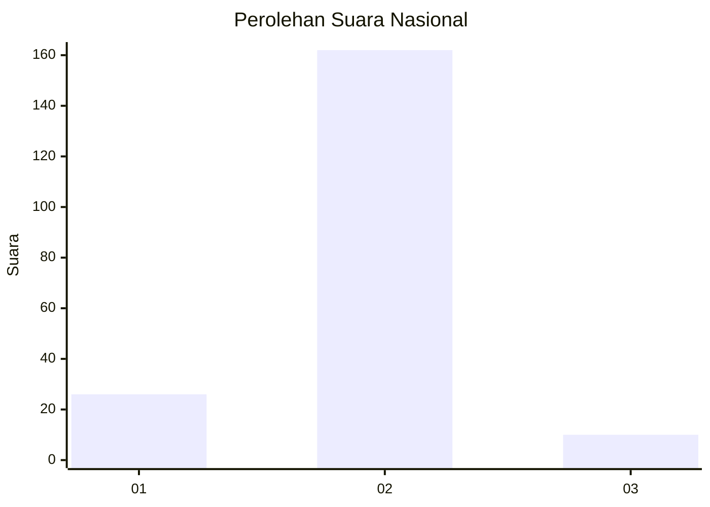
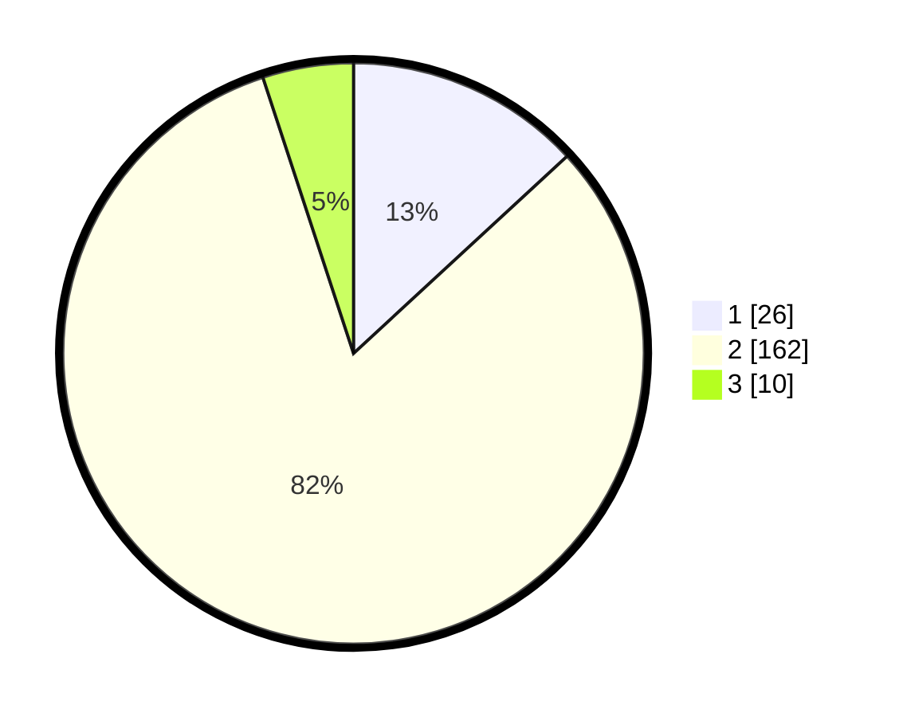

# Hasil

## Grafik

## Tabel

| No. | Nama Paslon    | Suara | Suara (raw) | Persentase |
|:--- |:-------------- | -----:| -----------:| ----------:|
| 1   | ANIES MUHAIMIN | 26    | [26][p-1]   | 13,13      |
| 2   | PRABOWO GIBRAN | 162   | [162][p-2]  | 81,82      |
| 3   | GANJAR MAHFUD  | 10    | [10][p-3]   | 5,05       |

[p-1]: https://github.com/gigit-pemilu/pemilu-2024/blob/main/pilpres/hitung-suara/sub/51-bali/sub/71-kota-denpasar/sub/01-denpasar-selatan/sub/2008-pemogan/sub/019-tps/sub/paslon-1.txt
[p-2]: https://github.com/gigit-pemilu/pemilu-2024/blob/main/pilpres/hitung-suara/sub/51-bali/sub/71-kota-denpasar/sub/01-denpasar-selatan/sub/2008-pemogan/sub/019-tps/sub/paslon-2.txt
[p-3]: https://github.com/gigit-pemilu/pemilu-2024/blob/main/pilpres/hitung-suara/sub/51-bali/sub/71-kota-denpasar/sub/01-denpasar-selatan/sub/2008-pemogan/sub/019-tps/sub/paslon-3.txt

## Foto C Plano

https://sirekap-obj-formc.kpu.go.id/b044/pemilu/ppwp/51/71/01/20/08/5171012008019-20240214-202620--0f4f21e9-767f-4cf6-b45c-997441121eea.jpg

https://sirekap-obj-formc.kpu.go.id/b044/pemilu/ppwp/51/71/01/20/08/5171012008019-20240214-205246--cdcf5141-0184-45b0-9488-71ed53f42c6a.jpg

https://sirekap-obj-formc.kpu.go.id/b044/pemilu/ppwp/51/71/01/20/08/5171012008019-20240214-205654--ff7dde42-ee55-4c6e-abd2-8f72d6d9c467.jpg

## Metadata

| Key        | Value               |
| ---------- | ------------------- |
| Time Stamp | 2024-02-24 22:31:28 |

