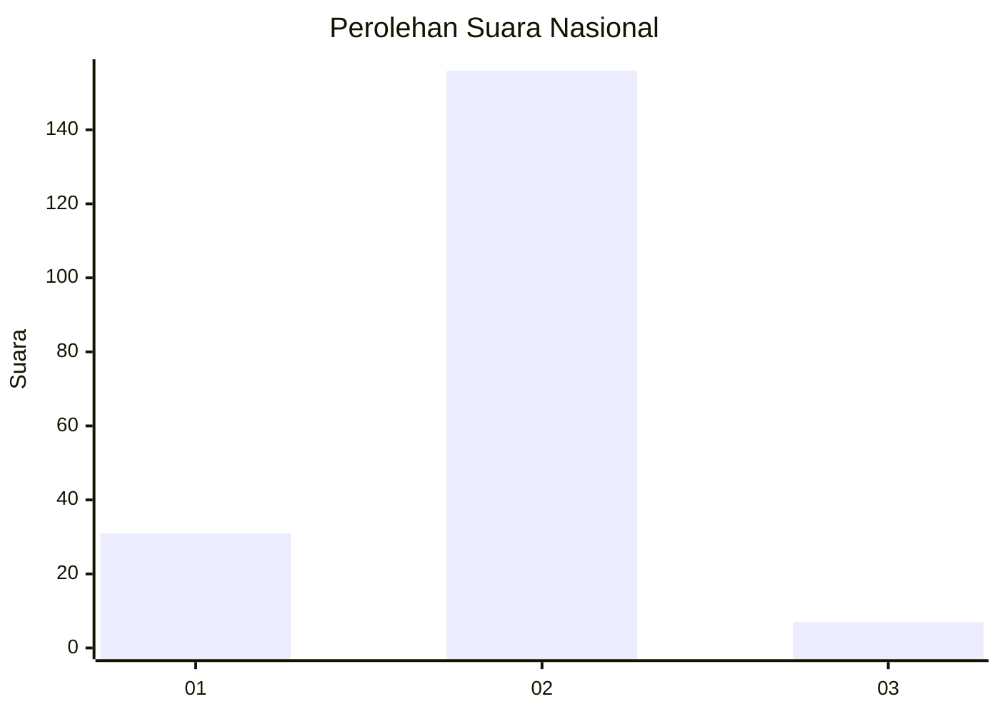
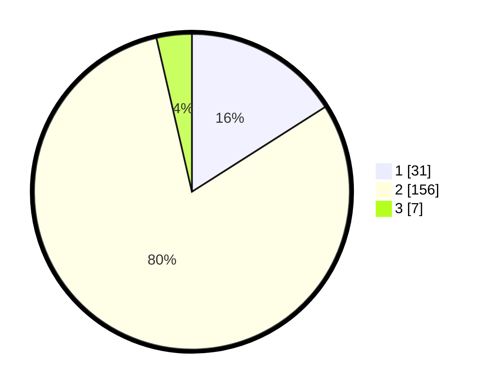

# Hasil

## Grafik

## Tabel

| No. | Nama Paslon    | Suara | Suara (raw) | Persentase |
|:--- |:-------------- | -----:| -----------:| ----------:|
| 1   | ANIES MUHAIMIN | 31    | [31][p-1]   | 15,98      |
| 2   | PRABOWO GIBRAN | 156   | [156][p-2]  | 80,41      |
| 3   | GANJAR MAHFUD  | 7     | [7][p-3]    | 3,61       |

[p-1]: https://github.com/gigit-pemilu/pemilu-2024/blob/main/pilpres/hitung-suara/sub/51-bali/sub/71-kota-denpasar/sub/01-denpasar-selatan/sub/2008-pemogan/sub/022-tps/sub/paslon-1.txt
[p-2]: https://github.com/gigit-pemilu/pemilu-2024/blob/main/pilpres/hitung-suara/sub/51-bali/sub/71-kota-denpasar/sub/01-denpasar-selatan/sub/2008-pemogan/sub/022-tps/sub/paslon-2.txt
[p-3]: https://github.com/gigit-pemilu/pemilu-2024/blob/main/pilpres/hitung-suara/sub/51-bali/sub/71-kota-denpasar/sub/01-denpasar-selatan/sub/2008-pemogan/sub/022-tps/sub/paslon-3.txt

## Foto C Plano

https://sirekap-obj-formc.kpu.go.id/4d04/pemilu/ppwp/51/71/01/20/08/5171012008022-20240214-221831--8a6da323-a66c-40db-b6ec-6498e1e98bc3.jpg

https://sirekap-obj-formc.kpu.go.id/4d04/pemilu/ppwp/51/71/01/20/08/5171012008022-20240214-222112--81c70f7e-d2c5-4fd1-99b3-027734b7ebe8.jpg

https://sirekap-obj-formc.kpu.go.id/4d04/pemilu/ppwp/51/71/01/20/08/5171012008022-20240214-222348--ad4e39d8-a17a-43a2-bec3-6ca89945030d.jpg

## Metadata

| Key        | Value               |
| ---------- | ------------------- |
| Time Stamp | 2024-02-24 22:31:28 |

