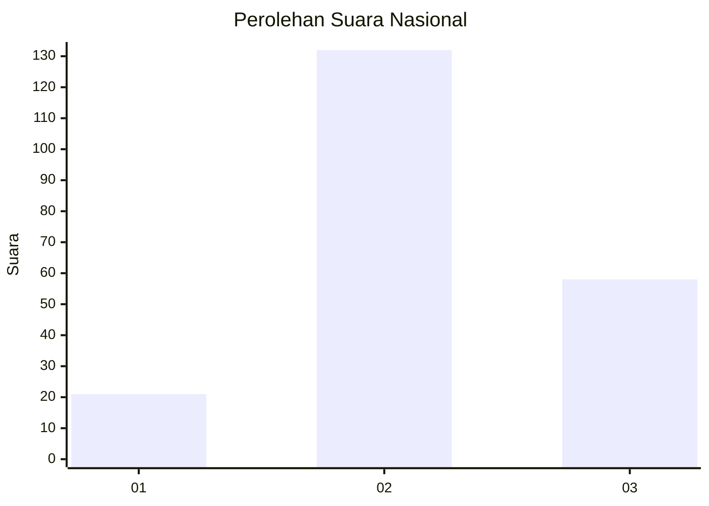
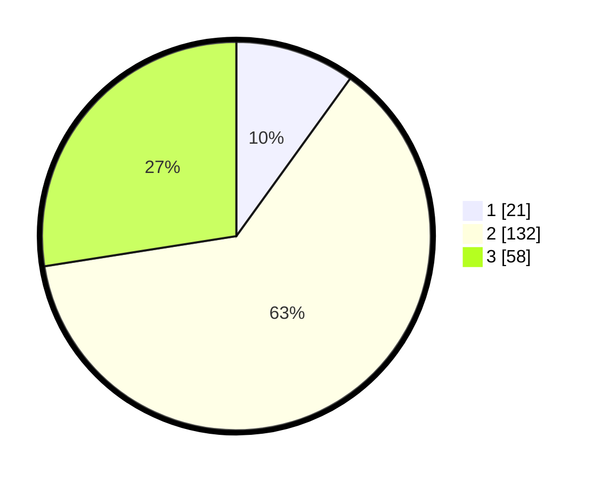

# Hasil

## Grafik

## Tabel

| No. | Nama Paslon    | Suara | Suara (raw) | Persentase |
|:--- |:-------------- | -----:| -----------:| ----------:|
| 1   | ANIES MUHAIMIN | 21    | [21][p-1]   | 9,95       |
| 2   | PRABOWO GIBRAN | 132   | [132][p-2]  | 62,56      |
| 3   | GANJAR MAHFUD  | 58    | [58][p-3]   | 27,49      |

[p-1]: https://github.com/gigit-pemilu/pemilu-2024/blob/main/pilpres/hitung-suara/sub/51-bali/sub/71-kota-denpasar/sub/01-denpasar-selatan/sub/2008-pemogan/sub/030-tps/sub/paslon-1.txt
[p-2]: https://github.com/gigit-pemilu/pemilu-2024/blob/main/pilpres/hitung-suara/sub/51-bali/sub/71-kota-denpasar/sub/01-denpasar-selatan/sub/2008-pemogan/sub/030-tps/sub/paslon-2.txt
[p-3]: https://github.com/gigit-pemilu/pemilu-2024/blob/main/pilpres/hitung-suara/sub/51-bali/sub/71-kota-denpasar/sub/01-denpasar-selatan/sub/2008-pemogan/sub/030-tps/sub/paslon-3.txt

## Foto C Plano

https://sirekap-obj-formc.kpu.go.id/f3d8/pemilu/ppwp/51/71/01/20/08/5171012008030-20240215-014555--58869625-13b7-407b-a887-e722e8f4eb65.jpg

https://sirekap-obj-formc.kpu.go.id/f3d8/pemilu/ppwp/51/71/01/20/08/5171012008030-20240215-014627--96c5f1f5-43c4-406e-b5b9-cab500a2e9c8.jpg

https://sirekap-obj-formc.kpu.go.id/f3d8/pemilu/ppwp/51/71/01/20/08/5171012008030-20240215-014655--a6dbe936-eb81-441b-8d00-f26ef039a500.jpg

## Metadata

| Key        | Value               |
| ---------- | ------------------- |
| Time Stamp | 2024-02-24 22:31:28 |

