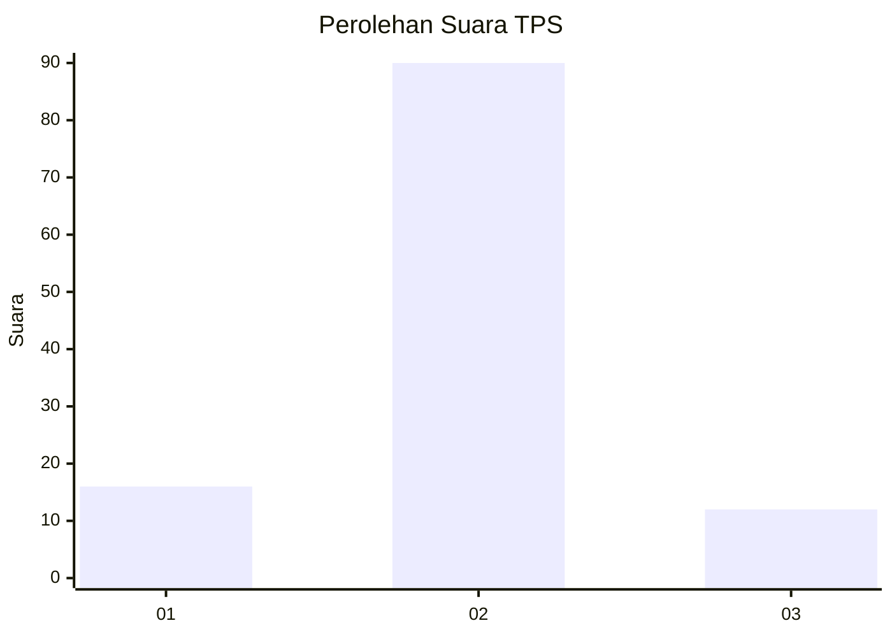
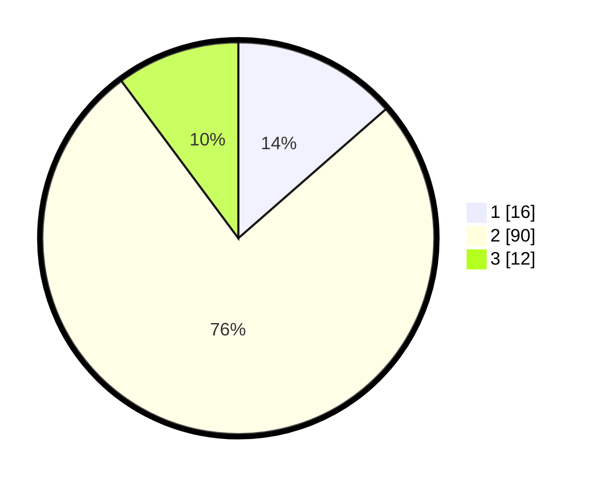

# Hasil

## Grafik

## Tabel

| No. | Nama Paslon    | Suara | Suara (raw) | Persentase |
|:--- |:-------------- | -----:| -----------:| ----------:|
| 1   | ANIES MUHAIMIN | 16    | [16][p-1]   | 13,56      |
| 2   | PRABOWO GIBRAN | 90    | [90][p-2]   | 76,27      |
| 3   | GANJAR MAHFUD  | 12    | [12][p-3]   | 10,17      |

[p-1]: https://github.com/gigit-pemilu/pemilu-2024-51-bali/blob/main/pilpres/hitung-suara/sub/51-bali/sub/71-kota-denpasar/sub/01-denpasar-selatan/sub/2008-pemogan/sub/066-tps/sub/paslon-1.txt
[p-2]: https://github.com/gigit-pemilu/pemilu-2024-51-bali/blob/main/pilpres/hitung-suara/sub/51-bali/sub/71-kota-denpasar/sub/01-denpasar-selatan/sub/2008-pemogan/sub/066-tps/sub/paslon-2.txt
[p-3]: https://github.com/gigit-pemilu/pemilu-2024-51-bali/blob/main/pilpres/hitung-suara/sub/51-bali/sub/71-kota-denpasar/sub/01-denpasar-selatan/sub/2008-pemogan/sub/066-tps/sub/paslon-3.txt

## Foto C Plano

https://sirekap-obj-formc.kpu.go.id/7d5d/pemilu/ppwp/51/71/01/20/08/5171012008066-20240214-221622--aadcd2d7-802a-4401-80ef-2f7986f9c444.jpg

https://sirekap-obj-formc.kpu.go.id/7d5d/pemilu/ppwp/51/71/01/20/08/5171012008066-20240214-221750--1255fad6-73fb-4547-a19b-a626a5b31fee.jpg

https://sirekap-obj-formc.kpu.go.id/7d5d/pemilu/ppwp/51/71/01/20/08/5171012008066-20240215-012300--0a53d2e5-e169-4fa4-860c-235baaad3d0e.jpg

## Metadata

| Key        | Value               |
| ---------- | ------------------- |
| Time Stamp | 2024-02-16 00:30:27 |

## DATA PEMILIH TETAP

Jumlah pemilih dalam DPT: **143**.
 * L: **74**.
 * P: **69**.

## DATA PENGGUNA HAK PILIH

Jumlah pengguna hak pilih dalam DPT: **115**.
 * L: **59**.
 * P: **56**.

Jumlah pengguna hak pilih dalam DPTb: **2**.
 * L: **2**.
 * P: **0**.

Jumlah pengguna hak pilih dalam DPK: **3**.
 * L: **2**.
 * P: **1**.

Jumlah pengguna hak pilih: **120**.
 * L: **63**.
 * P: **57**.

## JUMLAH SUARA SAH DAN TIDAK SAH

JUMLAH SELURUH SUARA SAH: **118**.

JUMLAH SUARA TIDAK SAH: **2**.

JUMLAH SELURUH SUARA SAH DAN SUARA TIDAK SAH: **120**.

